# 有機化学基礎

## 炭化水素の分類

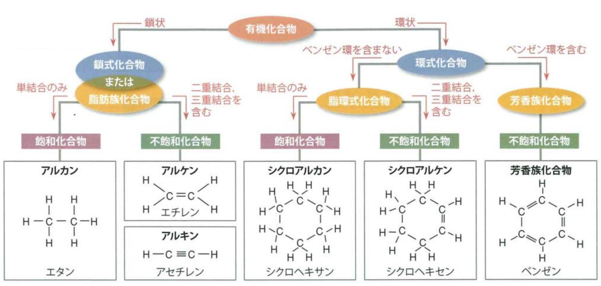

炭化水素：（_烃_）、炭素原子と水素原子のみから構成される有機化合物である。

* **鎖式**炭化水素・脂肪族炭化水素：
  * 飽和：アルカン $\ce{C_nH_{2n+2}}$（_烷烃_）：全て単結合、自由回転できる。
  * 不飽和：
    * アルケン $\ce{C_nH_{2n}}$（*烯烃*）：二重結合 $\ce{C=C}$ が一つある。
    * アルキン $\ce{C_nH_{2n-2}}$（*炔烃*）：三重結合 $\ce{C#C}$ が一つある。
* **環式**炭化水素：
  * 飽和：シクロアルカン $\ce{C_nH_{2n}}$ （*环烷烃*）：環が一つある。
  * 不飽和：
    * シクロアルケン $\ce{C_nH_{2n-2}}$（环烯烃）：環が一つあり、二重結合 $\ce{C=C}$ が一つある。
    * 芳香族炭化水素：ベンゼン環を含む。

飽和：炭素原子どうしの結合がすべて単結合でつながっている。自由回転できる。

不飽和：二重結合や三重結合があり、まだ他の原子を取り込む余地がある。

## 不飽和度

水素不足指数。

分子式 $\ce{C_mH_nN_xO_y}$ の不飽和度 $I$：
$$
I=\dfrac{2m + 2 + x -n}{2}
$$
ハロゲン原子 $\ce{X}$ の場合、$\ce{H}$ 原子と同じ扱い。

飽和の炭化水素にとって、$\ce{H}$ の数は必ず $2m+2$ である。そして、$\ce{-O-}$ は影響がなし、$\ce{-NH-}$ は例外的な $\ce{H}$ を一つつながれる。$\ce{-X}$ は $\ce{-H}$ と同じである。

* $I = 0$：すべて単結合、環なし。
* $I = 1$：二重結合１つまたは環１つ。
* $I = 2$：三重結合１つまたは二重結合・環２つ。
* $I=4$：ベンゼン環がある可能性がある。

炭素原子間の結合距離：

単結合>ベンゼン環の炭素間結合>二重結合>三重結合

## 表記法

* 分子式：分子を構成している原子の種類とその数を表した式。$\ce{C2H4O2}$
* 示性式：分子式から官能基を抜き出して明示した式。$\ce{CH3COOH}$
* 構造式：原子間の結合を価標を用いて表した式。
* 組成式：原子数の比を最も簡単な整数比で表した式。$\ce{CH2O}$

同族体：一般式が同じで、分子数が $\ce{CH2}$ ずつ異なる一群れの化合物。

## 命名法

### 枝分れがない非環式炭化水素

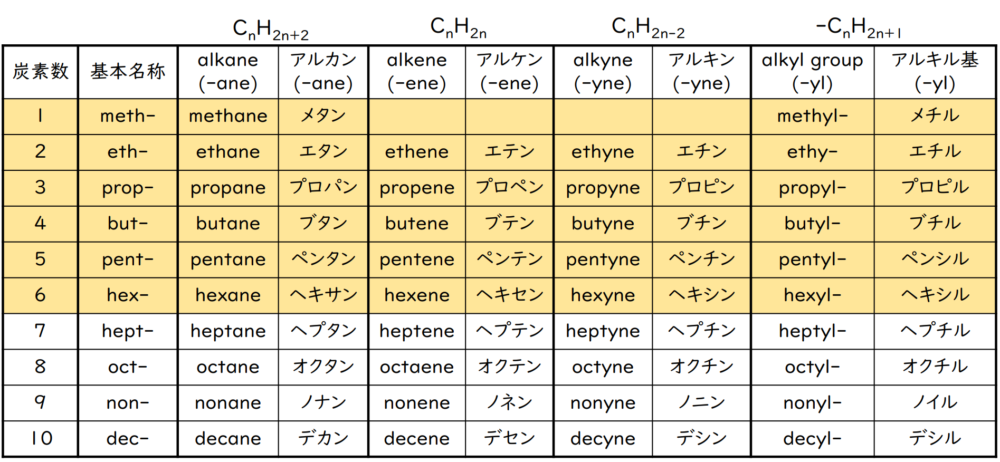

許容慣用名：

* $\ce{CH2=CH2}$：エテン(ethene)——エチレン(ethylene)；
* $\ce{CH3-CH2=CH2}$：プロペン(propene)——プロピレン(propylene)；
* $\ce{CH#CH}$：エチン(ethyne)——アセチレン(acetylene)；
* $\ce{CH2=CH -}$：エテニル基(ethenyl-)——ビニル基(vinyl-)（*乙烯基*）。

### 枝分れがある非環式炭化水素

#### 命名の手順

1. 主基の決定：分子内で最も優先順位の高い官能基（主基）を探す。第二接尾語となる。

2. 主鎖の決定：以下の条件を上から順番に優先して満たす、最も連続した炭素鎖を主鎖とする：

   1. 主基が結合している炭素を含む。
   2. 多重結合をできるだけ多く含む。
   3. 炭素数が最も多い。

   語幹となる。

3. 主鎖の番号付け：主鎖のどちらかの端から番号を振る。以下の順序で位置番号が最小になる方向を選ぶ：

   1. 主基の位置番号が最小になるように振る。
   2. 主基がない場合、二重結合・三重結合の位置番号が最小になるように振る。
   3. 主基がない場合、すべての置換基の位置番号の組み合わせが最小になるように振る。
   4. すべて同じ場合、アルファベット順で先に来る置換基の番号が最小になるように振る。

4. 置換基の命名：主鎖以外の飛び出た部分を置換基として命名する。同じ置換基が複数ある場合は、ギリシャ語の数詞をつける。接頭語となる。

5. 名前の組み立て：置換基（接頭語）をアルファベット順に並べる。数詞はアルファベット順の比較には含めず、英語で本体の名前で比較する。

#### 数量词

1. モノ（mono）；
2. ジ（di）；
3. トリ（tri）；
4. テトラ（tetra）；
5. ペンタ（penta）；
6. ヘキサ（hexa）；
7. へプタ（hepta）；
8. オクタ（octa）；
9. ノナ（nona）；
10. デカ（deca）。

#### 第一接尾語

1. $\ce{C-C}$：-ane アン（*烷*）

2. $\ce{C=C}$：-ene ヱン（*烯*）
3. $\ce{C#C}$：-yne イン（炔）

#### 代表的な官能基

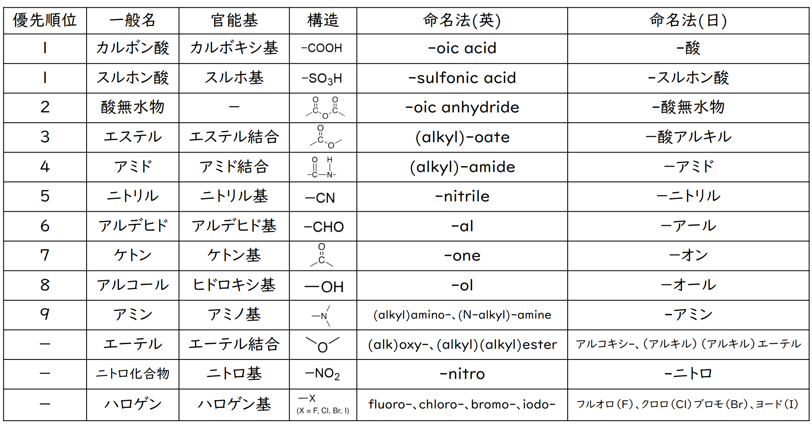

#### IUPAC 命名法

IUPAC：接頭語（置換基）+ 語幹（主鎖の炭素の数）+ 第一接尾語（主鎖の飽和状態）+ 第二接尾語（主基）

例：

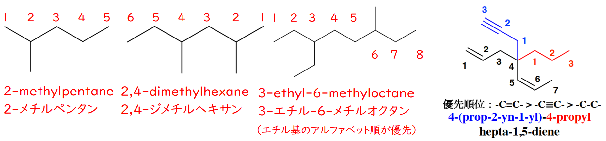

1. 2-メチルペンタン：
   1. 主基の決定：特殊な官能基がないので、第二接尾語はなし。
   2. 主鎖の決定：炭素数は $5$ であって、語幹は**ペンタ**。
   3. 主鎖の番号付け：左から数えると置換基は 2 位。右から数えると 4 位。最小になる左から右を採用します。
   4. 置換基の命名：2 位の炭素に、炭素 1 つのメチル基がついている。接頭語は **2-メチル**。
   5. 名前の組み立て：結合はすべて単結合なので、第一接尾語は**-アン**である。

2. 2,4-ジメチルヘキサン：
   1. 主基の決定：特殊な官能基がないので、第二接尾語はなし。
   2. 主鎖の決定：最も長く連続して繋がっている炭素の数は $6$ 個である。よって、名前の中核となる語幹は**ヘキサ**となる。
   3. 主鎖の番号付け：左端から数えると置換基の位置は 2 位と 4 位の組み合わせ $(2, 4)$ になる。右端から数えると 3 位と 5 位の組み合わせ $(3, 5)$ になる。番号の組み合わせを比較した際、より小さい数字の組み合わせとなる「左から右」の順序を絶対的に採用する。
   4. 置換基の命名：2 位と 4 位の炭素に、それぞれメチル基が結合している。同じ置換基が複数（この場合は $2$ つ）存在する場合、**ジ**を付与しなければならない。位置番号をカンマで区切り、接頭語**2,4-ジメチル**となる。
   5. 名前の組み立て：炭素骨格はすべて単結合で構成されているため、第一接尾語は**-アン**となる。

3. 3-エチル-6-メチルオクタン：
   
   1. 主基の決定： 特殊な官能基がないので、第二接尾語はなし。
   2. 主鎖の決定：最長の炭素鎖は $8$ 個である。語幹は**オクタ**となる。
   3. 主鎖の番号付け： 左から数えると置換基は $(3, 6)$ 位、右から数えても $(3, 6)$ 位となる。完全に同点となった場合のみ「アルファベット順」の特別ルールが発動する。エチル (Ethyl) の E はメチル (Methyl) の M より先に来るため、エチル基に小さな番号の特権を与える。よって、「右から左」の順序を採用し、エチル基を 3 位とする。
   4. 置換基の命名： 3 位にエチル基、6 位にメチル基が存在する。接頭語として並べる際も、数字の大小ではなく必ずアルファベット順に記述しなければならない。よって、接頭語の並びは**3-エチル-6-メチル**となる。
   5. 名前の組み立て： 主幹となる 8 個の炭素鎖はすべて単結合であるため、第一接尾語は**-アン**を用いる。
   
4. 4-(プロパ-2-イン-1-イル)-4-プロピルヘプタ-1,5-ジエン：

   1. 主基の決定： 特殊な官能基がないので、第二接尾語はなし。

   2. 主鎖の決定：「最高優先度の結合（この場合は二重結合）を最大限含む鎖」を主鎖としなければならない。三重結合を含む $6$ 炭素の鎖よりも、二重結合を $2$ つ含む $7$ 炭素の鎖が優先して選ばれる。よって、語幹は**ヘプタとなる**。

   3. 主鎖の番号付け： $2$ つの二重結合に可能な限り小さな番号を与える必要がある。左から数えると 1 位と 5 位、右から数えると 2 位と 6 位となるため、より小さい「左から」の経路を採用する。

   4. 置換基の命名： 4 位の炭素に $2$ つの複雑な枝が結合している。

      右側の枝：単純な 3 炭素の鎖なので、**プロピル基**。

      上側の枝：内部に三重結合を含む 3 炭素の鎖。主鎖と直接つながる炭素を強制的に 1' 位として内部番号を振ると、2' 位に三重結合**-イン**が来る。これが全体として置換基**-イル**になるため、まとまりとして **(プロパ-2-イン-1-イル)** と表記する。これらを並べ、接頭語は **4-(プロパ-2-イン-1-イル)-4-プロピル** となる。

   5. 名前の組み立て： 主鎖には二重結合**-エン**が $2$ つ（1 位と 5 位）存在するため、数詞の「ジ」を組み込む。第一接尾語は**-1,5-ジエン**となる。

## 異性体

### 構造異性体

分子数が同じであるのに、構造式が異なる。

1. 炭素骨格が異なる：n-hexane と 2-methylpentane。
2. 置換基の位置が異なる：2,2-dimethylpentane と 2,3-dimethylpentane。
3. 官能基が異なる：buta-2-one と butanal。

### 幾何異性体

沸点・融点が異なる。

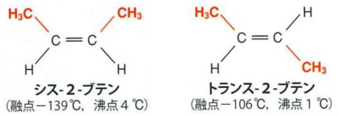

### 鏡像/光学異性体

*手性分子*。

沸点・融点、化学性質が同じ、光学性質/生理作用が異なる。

* イブプロフェン：R 体は効果あり、S 体は効果なし。
* サリドマイド：R 体は催眠作用あり、S 体は催奇性あり。

不斉炭素原子 $\ce{C^*}$：4 つの異なる原子や原子団が結合している炭素原子のこと。右手と左手のように鏡像関係にありながら重ね合わせることができない「鏡像異性体（光学異性体）」の存在に関わる重要な概念である。

# アルカン(alkane) $\ce{C_nH_{2n+2}}$

## 鎖式飽和炭化水素

1. 多くの炭化水素は水に溶けにくい（疎水性）。無極性溶媒に比較的に溶けやすい。

2. 炭素数が増やすにつれて、沸点・融点が高くなる。

3. 直鎖状アルカン、常温常圧で、$\ce{C1\sim C_4}$：気体；$\ce{C5\sim C_17}$：液体；$\ce{C18\sim}$：固体。

   枝分かれが増えると、

   1. 分子間力は弱まり、沸点が下がる；
   2. 対称性が高くなり、融点が下がる（結晶しやすい）。

4. 基本的に反応性が乏しい（$\ce{C-H,C-C}$ 単結合が安定）。

   酸素と燃焼する（燃料として利用される）。

   光を当てると、ハロゲンと置換反応する。
   $$
   \ce{CH4 + Cl2 -> CH3Cl + HCl}\\
   \ce{CH3Cl + Cl2 -> CH2Cl2 + HCl}\\
   \ce{CH2Cl2 + Cl2 -> CHCl3 + HCl}\\
   \ce{CHCl3 + Cl2 -> CCl4 + HCl}
   $$

## メタン(methane) $\ce{CH4}$

### 構造

炭素原子を中心とする**正四面体**構造。

### 製法

脱炭酸反応。酢酸ナトリウム、水酸化ナトリウムを混合し加熱する。
$$
\ce{CH3COONa + NaOH -> CH4 + Na2CO3}
$$
水上置換法で捕集。

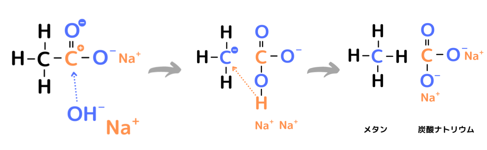

# アルケン(alkene) $\ce{C_nH_{2n}}$

## 鎖式不飽和炭化水素

1. 二重結合 $\ce{C=C}$ のうちの 1 本の結合は弱いため、付加反応しやすい。
2. 臭素 $\ce{Br2}$（赤褐色）が付加すると、脱色される。
3. 過マンガン酸カリウム $\ce{KMnO4}$（赤紫色）が酸化すると、脱色される。

## エチレン(ethylene)・エテン(ethene) $\ce{CH2=CH2}$

### 構造

6 個の原子がすべて同一平面上。自由回転ができない。

### 性質

#### ハロゲン $\ce{X2}$、ハロゲン化水素 $\ce{HX}$ の求電子付加反応

臭素 $\ce{Br2}$（赤褐色）が付加すると、脱色される。

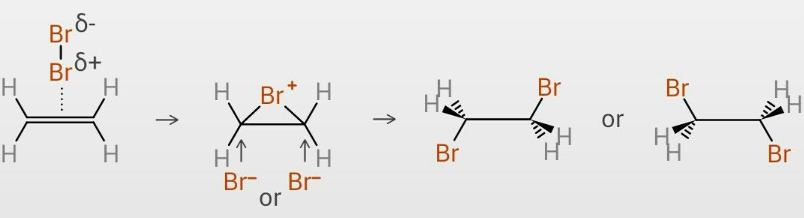

Markovnikov（マルコフニコフ）則：非対称なアルケンに $\ce{HX}$ を付加する場合は、結合する水素原子数の多い方の炭素のほうに、陽性な原子団が結合する。

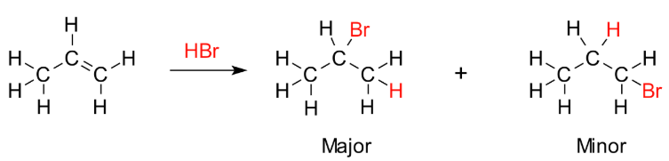

#### 水の求電子付加反応

酸触媒が必要。マルコフニコフ則に従って付加反応が起こて、アルコールが生成する。

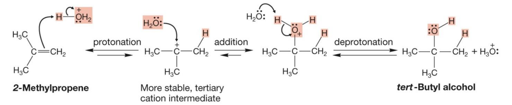

#### 接触水素化

$\ce{Pd/Pt}$ 触媒が必要。

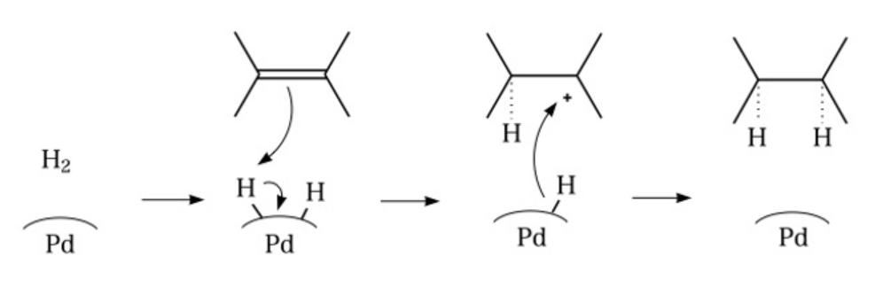

#### 付加重合

* 単量体（モノマー）：$\ce{nCH2=CH2}$；
* 高分子（ポリマー）：$\ce{[-CH2-CH2 -]_n}$。

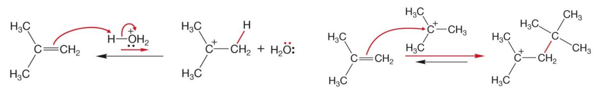

#### オゾン分解

* 開裂後、炭素原子が水素原子とアルキル基に結合している場合、生成物は**アルデヒド**である。

* 開裂後、炭素原子が 2 つのアルキル基に結合している場合、生成物は**ケトン**である。

ケトン—アルデヒドまで。

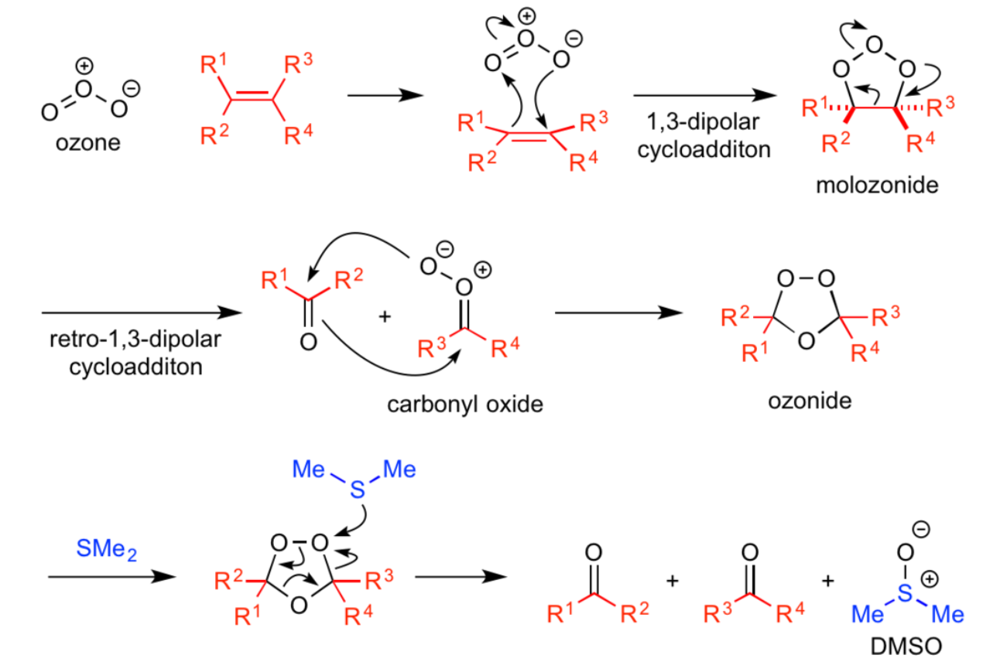

#### 過マンガン酸塩による酸化

* 加熱・酸性、生成物はケトン $\ce{-C=O}$ の場合は、そのまま残す。

* 加熱・酸性、生成物はアルデヒド $\ce{-CHO}$ の場合は、酸化されて、カルボン酸 $\ce{-COOH}$ になる。
* 冷・希薄・中性/塩基性、生成物はジオールである。

ケトン—カルボン酸まで。

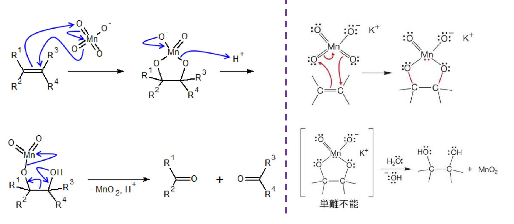

### 製法

分子内脱水。約 $\ce{170^\circ\text{C}}$ で、エタノールを濃硫酸と加熱する。
$$
\ce{CH3CH2OH ->[濃H2SO4] CH2=CH2 + H2O}
$$
水上置換法で捕集。

# シクロアルカン(cycloalkane) $\ce{C_nH_{2n}}$

## 環式飽和炭化水素

1. アルカンと同じ反応性。
2. 炭素数 3,4 の場合、結合角に無理があるため、開環しやすい。
3. 炭素数 5 以上で安定。
4. 命名法：cyclo-（シクロ-）+ 語幹。

# アルキン(alkyne) $\ce{C_nH_{2n-2}}$

## 鎖式不飽和炭化水素

1. $\ce{C#C}$ のうちの2本の結合が弱いため、2 回付加反応が起こる。
2. 臭素 $\ce{Br2}$（赤褐色）が付加すると、脱色される。
3. 過マンガン酸カリウム $\ce{KMnO4}$（赤紫色）が酸化すると、脱色される。

## アセチレン(acetylene)・エチン(ethyne) $\ce{CH_{3} # CH3}$

### 構造

4 個の原子がすべて同一直線上。（自由回転ができない）

### 検出

非常に弱い酸であるため、$\ce{Ag+, Cu^+}$ と**アセチリド**という沈殿が生成する。
$$
\ce{2[Ag(NH3)2]OH + HC#CH -> AgC#CAg + 2H2O + 4NH3}\\
\ce{2[Cu(NH3)2]OH + HC#CH -> CuC#CCu + 2H2O + 4NH3}
$$
$\ce{AgC#CAg}$：銀アセチリド，白。

$\ce{CuC#CCu}$：銅(I)アセチリド，赤褐。

### 性質

#### ハロゲン $\ce{X2}$、ハロゲン化水素 $\ce{HX}$ の**求電子付加反応**

**2 当量**反応できる。

Markovnikov（マルコフニコフ）則に従って付加反応が起こる。1 当量反応する場合、trans体が発生。（立体障害のため、安定性がある。）

三重結合を構成する炭素原子は $\ce{sp}$ 混成軌道を持ち、二重結合を構成する炭素原子は $\ce{sp^2}$ 混成軌道を持つため、**アルケンよりハロゲン化を受けにくい**、アルケンだけに付加させることも可能。

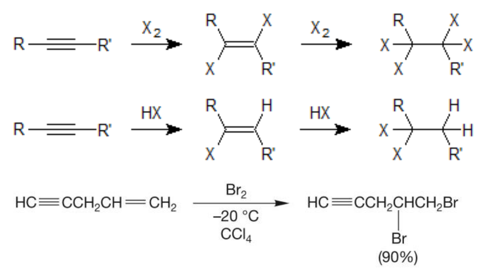

#### 水の求電子付加反応

Markovnikov（マルコフニコフ）則に従って付加反応が起こる。

生成した**ヒドロキシル基**のついたアルケンは、**ビニルアルコール**という。

**不安定のため**、容易に**水素転位**が起こり、**ケトンもしくはアルデヒド**へと変わる。（ケト-エノール互変異性）

* **アセチレン**だけは**アセトアルデヒド** $\ce{CH3CHO}$ に変わる。

* 他のアルキンは**ケトン**に変わる。

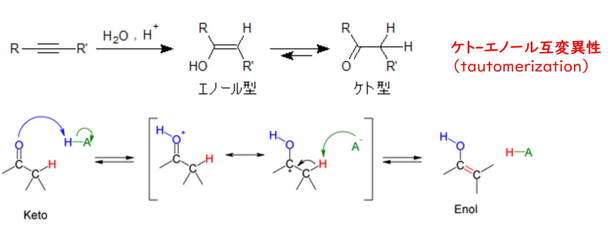

#### 接触水素化

$\ce{Pd/Pt}$ 触媒が必要

アルケンの状態で止めることが出来ず、アルカンにまで還元される。

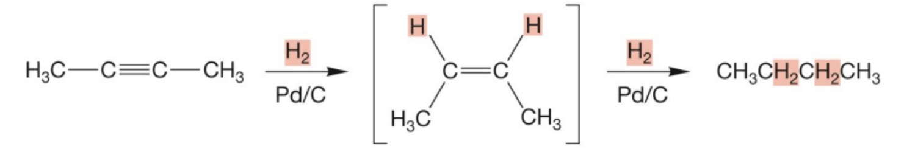

別の触媒を使えば、アルケンまで止めることができる。

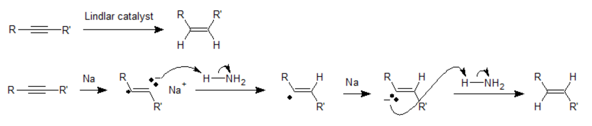

* Lindlar catalyst はシン付加、cis- を生成する。
* $\ce{Na in liquid NH3}$ はアンチ付加、trans- を生成する。

#### 不完全燃焼

燃焼すると、すす（煤、*煤烟*）と光が放出される。

放出される量：$\ce{CH#CH > CH2=CH2 > CH3-CH3}$

分子中の $\ce{C}$ の割合が大きいほど、すすが多く、強り光を出す。
$$
\ce{2CH#CH + 5O2 -> 4CO2 + 2H2O}
$$
十分な酸素を混合して燃焼させると、**酸素アセチレン炎**が発生する。溶接などに利用される。

#### 付加重合

アセチレンの 3 分子重合。$\ce{Fe}$ 触媒が必要。

ベンゼンが生成する。
$$
\ce{3CH#CH ->[Fe] C6H6}
$$

#### 高分子付加重合

ビニル基：$\ce{CH2=CH - }$。

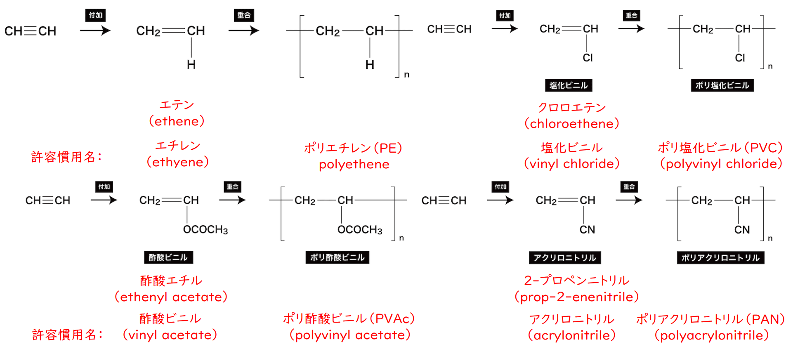

### 製法

炭化カルシウム $\ce{CaC2}$ に水を加える。
$$
\ce{CaC2 + H2O -> Ca(OH2) + C2H2}
$$
水上置換法で捕集。

# シクロアルケン $\ce{C_nH_{2n-2}}$

## 環式不飽和炭化水素

1. アルケンと同じ反応性。
2. 命名法：cyclo-（シクロ-）+ 語幹。

# アルコール (alcohol)

炭化水素の $\ce{H}$ 原子を $\ce{-OH}$ 基（**ヒドロキシ基**）で置換されるもの。

命名法：アルカンの語尾(-e)をオール(-ol)に変え、$\ce{-OH}$ 基の位置番号を示す。

分類：

* 一価、二価、三価：$\ce{-OH}$ 基の数で決まる。
* 第一級、第二級、第三級：$\ce{-OH}$ 基に結合している炭素原子に、他の炭素原子が結合している数で決まる。

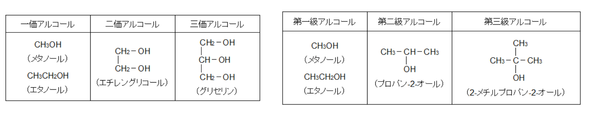

## 性質

1. 極性のある官能基を有するため、水に溶けやすい、沸点が高い。（水素結合）

   アルキル基は疎水性がある。ヒドロキシ基は親水性がある。

   アルキル基が増えると、極性物質に溶けにくくなる。

   $\ce{C1\sim C3}$ は水に溶ける。$\ce{C4}$ から溶けにくい。

2. 水中で電離しにくいため、多くの場合は中性である。

   金属ナトリウム $\ce{Na}$ と反応させると、金属アルコキシド塩が生成する。
   $$
   \ce{2R-OH + 2Na -> 2R-ONa + H2}
   $$
   
