$$
\newcommand\mol{\text{mol}}
\newcommand\kJ{\text{kJ}}
\newcommand\C{\degree\text{C}}
$$

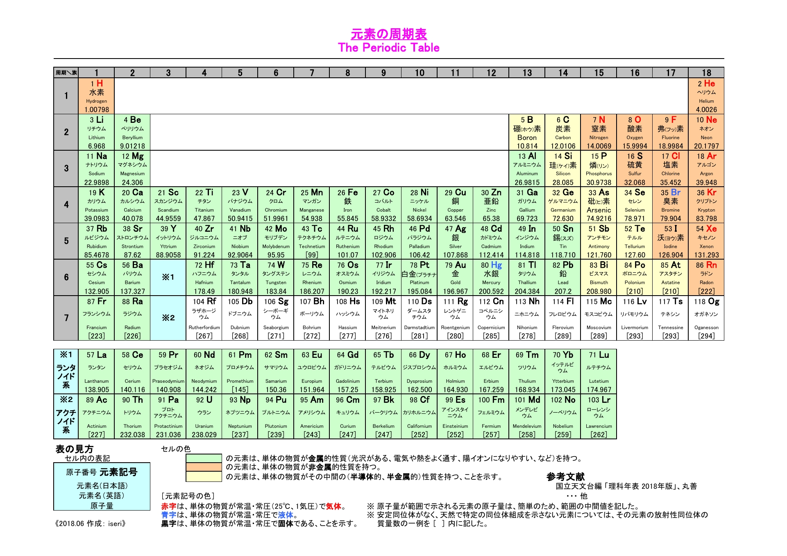

**典型元素**：1族、2族、13族～18族の元素；

**遷移元素**：3族～12族の元素。

（新課程では、3〜12族元素の総称を遷移元素とする。）

# 金属イオン

## 錯イオン

**錯イオン**：金属の陽イオンに分子や陰イオンが配位結合してできたイオン。

**配位子**：結合した分子や陰イオン。

### 主な配位子

* $\ce{NH3}$：アンミン（Ammine）；
* $\ce{H2O}$：アクア（Aqua）；
* $\ce{OH-}$：ヒドロキシド（または：ヒドロキソ、Hydroxido）；
* $\ce{CN-}$：シアニド（または：シアノ、Cyanido）；
* $\ce{Cl-}$：クロリド（または：クロロ、Chlorido）；
* $\ce{S2O3^2-}$：チオスルファト（Thiosulfate）。

### 数量词

1. モノ（mono）；
2. ジ（di）；
3. トリ（tri）；
4. テトラ（tetra）；
5. ペンタ（penta）；
6. ヘキサ（hexa）；
7. へプタ（hepta）；
8. オクタ（octa）；
9. ノナ（nona）；
10. デカ（deca）。

### 命名法

**配位子の数＋配位子の名称＋中心元素の名称＋酸化数＋（酸）イオン。**

（酸）：**錯陰イオンに付す。**

$\ce{[Fe(CN)6]^4-}$：

ヘキサ＋シアニド＋鉄＋(II)＋酸イオン。

### 配位数

* 配位数 $2$：
  * 直線形：$\ce{Ag+:[Ag(NH3)2]+}$。
* 配位数 $4$：
  * 正方形：$\ce{Cu^2+:[Cu(NH3)4]^2+}$；
  * 正四面体形：$\ce{Zn^2+:[Zn(NH3)4]^2+}$。
* 配位数 $6$：
  * 正八面体形：$\ce{Al^3+,Fe^2+,Fe^3+,Ni^3+:[Fe(CN)6]^4-}$。

### 代表的な錯イオン

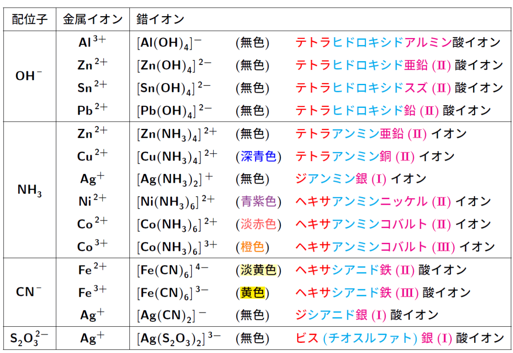

## 金属イオンの沈殿

ほぼ沈殿しないイオン：アルカリ金属イオン、$\ce{NH4+, NO3-, CH3COOH-}$。

|                        イオン | 沈殿するイオン                                               |
| ----------------------------: | :----------------------------------------------------------- |
|      炭酸イオン $\ce{CO3^2-}$ | アルカリ金属イオンと $\ce{NH4+}$ を除くほとんどのイオン      |
|       塩化物イオン $\ce{Cl-}$ | $\ce{Ag+, Pb^2+, Hg+(Hg2Cl2)}$（全て白色）；$\ce{PbCl2}$ のみ熱湯に溶ける |
|      硫酸イオン $\ce{SO4^2-}$ | $\ce{Ba^2+,Ca^2+,Sr^2+,Pb^2+}$（全て白色）；2族の $\ce{Be^2+,Mg^2+}$ は沈殿しない |
| クロム酸イオン $\ce{CrO4^2-}$ | $\ce{Ag+}$（赤）$\ce{Ba^2+, Pb^2+}$（黄）；                  |

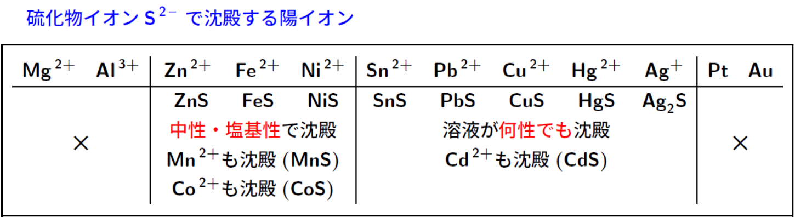

$\ce{ZnS}$（白）$\ce{FeS, NiS}$（黑）$\ce{MnS}$（桃）$\ce{SnS,PbS,CuS,HgS,Ag2S}$（黑）。

### 塩基による沈殿

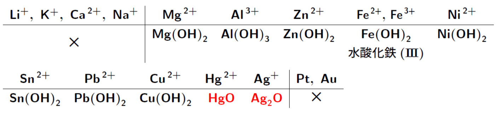

イオン化傾向が小さい $\ce{Hg^2+, Ag+}$ の水酸化物は常温で容易に脱水され、**酸化物**となり沈殿する。
$$
\ce{Hg(OH2) -> HgO + H2O}
$$
$\ce{Fe(OH)3}$ は実在しない。実際には $\ce{Fe2O3\cdot nH2O}$ で表せるいくつかの物質の混合物であり，組成（$n$）が一定ではない。主成分は $n = 1$ に相当する酸化水酸化鉄(III) $\ce{FeO(OH)}$ である。

---

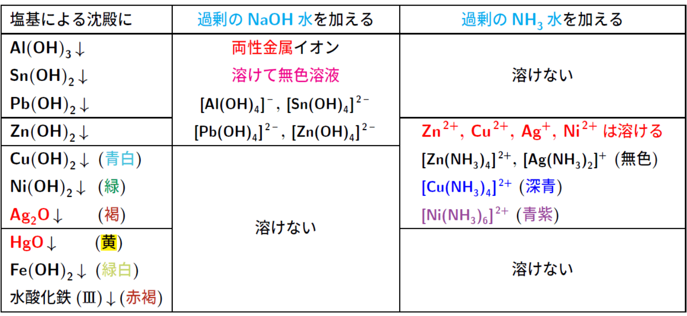

## 金属イオンの系統分析

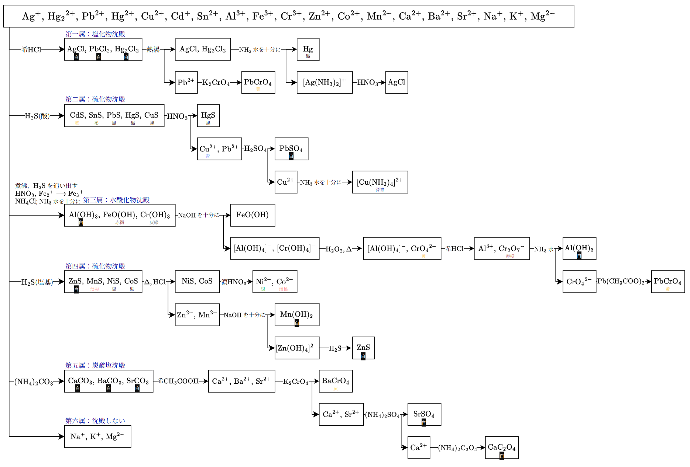

>整体的附加笔记：
>
>1. 分离第一属中，$\ce{PbCl2}$ 会溶解一部分在水中，沉淀不完全，因此会留到第二步。
>
>2. 分离第二属中，利用只在酸性条件下沉淀的条件分理硫化物沉淀。
>
>3. 分离第三属中，先煮沸的原因是让 $\ce{H2S}$ 受热排出。
>
>   加入 $\ce{HNO3}$ 的原因是，上一步加入的 $\ce{H2S}$ 是还原剂，将 $\ce{Fe^3+}$ 还原成了 $\ce{Fe^2+}$。而由于 $\ce{FeO(OH)}$ 的**溶解度积**更小，因此要将添加 $\ce{HNO3}$，将 $\ce{Fe^2+}$ 氧化回 $\ce{Fe^3+}$。如果溶液中同时有 $\ce{Fe^2+}$ 和 $\ce{Fe^3+}$，则应当单独取出测试：
>
>   - $\ce{3Fe^2+ + 2K3[Fe(CN)6] -> Fe3[Fe(CN)6]2 + 6K+}$
>   - $\ce{4Fe^3+ + 3K4[Fe(CN)6] -> Fe4[Fe(CN)6]3 + 12K+}$
>   - $\ce{Fe^3+ + KSCN -> [Fe(SCN)]^2+ + K+}$
>
>   其中 $\ce{Fe3[Fe(CN)6]2}$ 也被称为滕氏蓝，$\ce{Fe4[Fe(CN)6]3}$ 也被称为普鲁士蓝。$\ce{[Fe(SCN)]^2+}$ 是极为明显的**血赤色**。
>
>   随后加入 $\ce{NH4Cl}$ 和 $\ce{NH3}$ 水，则是为了形成**缓冲液**。如果直接加入强碱，则会让 $\ce{Mg(OH)2}$ 等沉淀出现，因此需要控制碱性。而根据勒夏特列原理：$\ce{NH3 + NH4Cl <=> NH4+ + OH-}$，此时平衡向左移动，$\ce{OH-}$ 浓度大大降低，碱性减小。在 $\ce{pH}$ 大约在 $8$ 的情况下，溶解度积小的 $\ce{Al(OH)3, FeO(OH), Cr(OH)3}$ 会沉淀，而溶解度积大的 $\ce{Mg(OH)2, Mn(OH)2}$ 等物质则不会沉淀。
>
>   另外，由于 $\ce{NH3}$ 水过剩，$\ce{Zn^2+, Co^2+, Ni^2+}$ 会形成配离子，继续留在溶液中。
>
>4. 分离第四属中，由于在酸性条件下沉淀的已经沉淀没了，因此只剩下在任何液性都会沉淀的硫化物沉淀。
>
>5. 分离第五属中，加入碳酸根而不是硫酸根的原因是，弱酸盐更容易变回游离的金属离子，方便之后检验。
>
>检验中可以看作核心的是 $\ce{H2S}$，因为金属的硫化物有只沉淀于酸性和任何液性的两个种类，而这正好也是卡在五步中间的二、四步。首先把沉淀于酸性的排除掉，为此需要把溶液调成酸性，在这个过程中顺带把 $\ce{Cl-}$ 只沉淀的 $\ce{Ag+, Pb^2+, Hg2^2+}$ 排掉；在酸性环境下把硫化物沉淀排掉；之后需要调到碱性环境，先把溶液重置（$\ce{H2S}$ 排出，$\ce{Fe^2+}$ 氧化），在调成碱性的过程中，我们还有另一把量尺：基于碱基的沉淀，以及是否容易形成络合离子；调成碱性后，加入 $\ce{H2S}$，排掉剩余的硫化物沉淀；最后发现只剩下碱金属和碱土金属，利用碳酸根排掉碱土金属，碱金属用焰色反应判断即可。

>各属的附加笔记：
>
>1. 第一属：氯化物沉淀。由于只有 $\ce{PbCl2}$ 可以溶于热水，因此可以分离出 $\ce{Pb^2+}$。加入过量的 $\ce{NH3}$ 水可以让 $\ce{Ag}$ 形成配离子，由此分离。亚汞离子反应实际上是 $\ce{Hg2Cl2 + 2NH3 -> Hg + Hg(NH2)Cl + NH4Cl}$ 的歧化反应，其中氨基氯化汞是白色的，因此整体颜色应该是黑灰色。
>2. 第二属：硫化物沉淀。如果原溶液中有 $\ce{Cd^2+, Sn^2+}$，这一步实际也会溶解，但是这里只考虑后面三个元素。$\ce{HgS}$ 只溶于王水，因此会被分离。$\ce{3CuS + 8HNO3 -> 3Cu(NO3)2 + 4H2O + 2NO + 3S}$。
>3. 第三属：氢氧化物沉淀。加入过量氢氧化钠，$\ce{Al^3+, Cr^3+}$ 会形成配离子。之后加入 $\ce{H2O2}$ 并加热，$\ce{Cr^3+}$ 会被氧化成 $\ce{Cr^6+}$。此时将溶液调为酸性，$\ce{[Al(OH)4]^-}$ 会变回 $\ce{Al^3+}$，黄色的 $\ce{CrO4^{2-}}$ 会暂时变成橙色的 $\ce{Cr2O7^{2-}}$。之后加入 $\ce{NH3}$ 水，在若碱性条件下就变成 $\ce{Al(OH)3}$ 沉淀。
>4. 第四属：硫化物沉淀。加热的原因是，$\ce{NiS, CoS}$ 刚沉淀的时候是 $\alpha$ 型晶体，结构松散，如果这时加入稀盐酸，是可以溶解的。因此我们先进行加热（或者放置一段时间），让 $\ce{NiS, CoS}$ 变成致密的 $\beta$ 或 $\gamma$ 型晶体，溶解度积下降，难溶于盐酸。另外，若要区分 $\ce{NiS, CoS}$，需要先加入浓硝酸或王水溶解，使其变回游离的 $\ce{Ni^2+, Co^2+}$。若要鉴定 $\ce{Ni^2+}$，可以加入丁二酮肟（ジメチルグリオキシム，DMG），溶液中会出现**鮮赤色沈殿**。若要鉴定 $\ce{Co^2+}$，加入高浓度的 $\ce{KSCN}$ 或 $\ce{NH4SCN}$，形成 $\ce{[Co(SCN)4]^{2-}}$，溶液会变为深蓝色（青色）。
>5. 第五属：碳酸盐沉淀。加入比碳酸更强的醋酸，让离子变回游离态。
>6. 第六属：不沉淀的离子。$\ce{Na+, K+}$ 可通过焰色反应，$\ce{Mg^{2+}}$：加入 $\ce{Na2HPO4}$ 和 $\ce{NH3}$ 水，会生成白色的 $\ce{MgNH4PO4}$。

# 水素 $\ce{H}$

## 性質

1. 無色、無臭、最も密度が小さく、最も軽い気体。**水上置換法**で捕集。（空気の平均分子量は $29$）

2. 空気中では、ほとんど**無色の炎**を出してよく燃える。
   $$
   \ce{2H2(g) + O2(g) -> 2H2O(l)}\quad \Delta H=-572\kJ/\mol
   $$

3. 高温で還元作用。
   $$
   \ce{CuO + H2 -> Cu + H2O}
   $$

## 用途

1. アンモニア、塩化水素などの合成に利用される。
   $$
   \ce{3H2 + N2 -> 2NH3}\\
   \ce{H2 + Cl2 -> 2HCl}
   $$

2. メタノールなどの有機化合物の合成。
   $$
   \ce{CO + 2H2 -> CH3OH}\\
   \ce{C2H4 + H2 -> C2H6}
   $$

3. 燃料電池。

## 製法

### 実験的

**イオン化傾向が大きい**金属に希酸を加える。（**塩酸**を使うと、揮発するため、不純物が発生する。）
$$
\ce{Zn + H2SO4 -> ZnSO4 + H2 ^}
$$

### 工業的

1. 水の電気分解。
   $$
   \ce{2H2O -> 2H2 + O2}
   $$

2. 天然ガスやナフサ（石油）を水蒸気と反応する。（水蒸気改質*蒸汽重整*）
   $$
   \ce{CH4 + H2O(g) ->[Ni] nCO + 3H2}\\
   \ce{CnH_{2n+2} + nH2O(g) ->[Ni] nCO + }(2n+1)\ce{H2}
   $$

3. **コークス**（*焦炭* $\ce{C}$）と水蒸気からできる**水性ガス**（*水煤气*）から $\ce{H2}$ を分離する。
   $$
   \ce{C + H2O(g) -> CO + H2}
   $$

## 化合物

水素と他の元素との化合物、水素化物ともいう。

### 非金属元素

いずれも分子からなり、常温・常圧では気体のものが多い。$\ce{eg. CH4, NH3, H2O. HF}$。

|    物質    | 分子の形状 |     結合角     |
| :--------: | :--------: | :------------: |
| $\ce{CH4}$ |  正四面体  | $109.5\degree$ |
| $\ce{NH3}$ |  三角錐形  | $106.7\degree$ |
| $\ce{H2O}$ |  折れ線形  | $104.5\degree$ |
| $\ce{HF}$  |   直線形   |                |

$964,575$ と覚える。

### 金属元素

水素は陽性の強い金属元素とも水素化合物をつくる。大部分はイオン結晶である。いずれも水と反応して水素を発生する。
$$
\ce{NaH + H2O -> NaOH + H2}\\
\ce{CaH + 2H2O -> Ca(OH)2 + 2H2}
$$

# 18族・希ガス

## 性質

1. 最外殻の電子は $8$ 個（$\ce{He}$ のみ $2$ 個）で極めて安定している。よって、他の原子と化合物を作ることはほとんどない。
2. 無色無臭で、**単原子分子**であり、**融点・沸点は非常に低い**、空気中に僅かに存在する。
3. 空気の組成：窒素 $78\%$、酸素 $21\%$、アルゴン $0.9\%$、二酸化炭素 $0.04\%$。これ以外の希ガスは極少量、非常に希な気体なので、希ガスと呼ぶ。

## 用途

1. $\ce{He}$ は全気体中、最も理想気体に近く、水素に次いで軽い。また、全物質中**最も沸点が低い**（$-269\degree \text{C}$）ため、超低温冷媒として利用される。
2. $\ce{Ne}$ はネオンランプとして利用される（*霓虹灯/氖灯*）。
3. $\ce{Ar}$ は白熱電球、蛍光灯の封入ガスとして利用される。

## 製法

1. $\ce{He}$ は天然ガスから分離して得られた。
2. $\ce{Ne,Ar,Kr,Xe}$ は液体空気の分留によって得られた。

# 17族・ハロゲン

## 共通性質

1. 価電子数は $7$ であるから、$1$ 価の陰イオンになりやすい。

2. |     単体     |   $\ce{F2}$    |    $\ce{Cl2}$    | $\ce{Br2}$ |  $\ce{I2}$   |
   | :----------: | :------------: | :--------------: | :--------: | :----------: |
   |     常温     |      気体      |       気体       |    液体    |     固体     |
   |      色      |     淡黄色     |      黄緑色      |   赤褐色   |    黒紫色    |
   |    酸化力    |      最強      |        >         |     >      |     最弱     |
   |     毒性     |      有毒      |       有毒       |    有毒    |     有毒     |
   |     沸点     |    $-188\C$    |     $-34\C$      |   $59\C$   |   $184\C$    |
   |     熔点     |    $-220\C$    |     $-101\C$     |   $-7\C$   |   $114\C$    |
   |  水との反応  |   激しく反応   |    一部溶ける    | 少し溶ける |  溶けにくい  |
   | 水素との反応 | 冷暗所で爆発的 | 常温と光で爆発的 | 高温で反応 | 高温でも平衡 |

3. 酸化力は、$\ce{F2 -> I2}$ 弱くなる。

4. 全部は毒性がある。

5. 単体同士の反応：

$$
\ce{F2 + Cl- -> 2F- + Cl2}
$$

---

ハロゲン化水素酸の性質：

| ハロゲン化水素酸 |  $\ce{HF}$   | $\ce{HCl}$ | $\ce{HBr}$ |  $\ce{HI}$   |
| :--------------: | :----------: | :--------: | :--------: | :----------: |
|       常温       |     気体     |    気体    |    気体    |     気体     |
|       液性       |   **弱酸**   |    強酸    |    強酸    |     強酸     |
|       毒性       |     有毒     |    有毒    |    有毒    |     有毒     |
|       臭い       |    刺激臭    |   刺激臭   |   刺激臭   |    刺激臭    |
|       沸点       |    $20\C$    |  $-85\C$   |  $-67\C$   |   $-35\C$    |
|   水溶液の名称   | フッ化水素酸 |    塩酸    | 臭化水素酸 | ヨウ化水素酸 |

## フッ素 $\ce{F}$

### 単体 $\ce{F2}$

#### 性質

1. 反応性が全単体中で最強であり、水と激しく反応して酸素を発生する。
   $$
   \ce{2F2 + 2H2O -> 4HF + O2}
   $$

2. 水素とは冷暗所でも爆発的な反応する。
   $$
   \ce{H2 + F2 -> 2HF}
   $$

#### 製法

ホタル石（$\ce{CaF2}$）や氷晶石などにイオンとして含まれる。

$\ce{HF}$ と $\ce{KF}$ などの融解混合物を電気分解する：
$$
\ce{2HF -> H2 + F2}
$$

### フッ化水素 $\ce{HF}$

#### 性質

1. 無色、刺激臭。

2. **水素結合**するため、ハロゲン化水素の中に**唯一の弱酸**で、沸点が異常に高い。

3. ガラス（$\ce{SiO2}$）を溶かすので、**ポリエチレン容器に保存**。
   $$
   \ce{SiO2 + 6HF(aq) -> H2SiF6 + 2H2O}\\
   \ce{SiO2 + 4HF(aq) -> SiF4 + 2H2O}
   $$
   $\ce{H2SiF6}$：ヘキサフルオロケイ酸（*氟硅酸*）。

#### 実験的製法

蛍石（フッ化カルシウム）に濃硫酸を加えて加熱する。（揮発性酸の遊離）
$$
\ce{CaF2 + H2SO4 ->[\Delta] CaSO4 + 2HF}
$$

### フッ化銀 $\ce{AgF}$

**水に溶ける**。

## 塩素 $\ce{Cl}$

### 単体 $\ce{Cl2}$

#### 性質

1. **強酸化作用**により、**漂白・殺菌作用**を示す。ヨウ化カリウムデンプン紙を青変する。

2. **水に少し溶けて、塩酸と次塩素酸が発生**。
   $$
   \ce{Cl2 + H2O <=> HCl + HClO}
   $$

3. 水素とは常温で光があれば爆発的に反応する。
   $$
   \ce{H2 + Cl2 ->[hv] 2HCl}
   $$

4. 加熱した金属単体と直接反応し、塩化物を生じる。
   $$
   \ce{Cu + Cl2 -> CuCl2}
   $$

#### 工業的製法

食塩水を電気分解する。（イオン交換膜法）
$$
\ce{2NaCl + 2H2O -> 2NaOH + H2 + Cl2}
$$

#### 実験的製法

1. 酸化マンガン(IV)に濃塩酸を加えて加熱する。
   $$
   \ce{MnO2 + 4HCl ->[\Delta] MnCl2 + Cl2 + H2O}
   $$

2. さらし粉に塩酸を加える。
   $$
   \ce{CaCl(ClO).H2O + 2HCl -> CaCl2 + Cl2 + 2H2O}
   $$

3. 

製法１でつくる場合が多い。

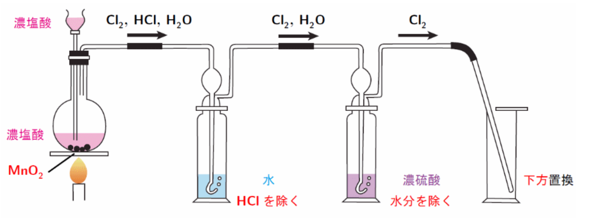

1. 加熱すると、$\ce{Cl2,H2O}$ に加えて**揮発性を持つ** $\ce{HCl}$ も発生する。
2. まず、水に通すことで、**水に可溶な $\ce{HCl}$ を除去する**。
3. 次に、**乾燥剤である濃硫酸**で $\ce{H2O}$ を除去し、$\ce{Cl2}$ を**下方置換**で得る。
4. 後で水に通すと、最終的に水分が取り除けないので、必ず水→濃硫酸の順で通す。

### 塩化水素 $\ce{HCl}$

#### 性質

1. 無色、刺激臭。

2. アンモニアと触れると白煙を生成する。
   $$
   \ce{NH3 + HCl -> HN4Cl}
   $$

#### 工業的製法

水素と塩素を直接化合させる。
$$
\ce{H2 + Cl2 -> 2HCl}
$$

#### 実験的製法

塩化ナトリウムに濃硫酸を加えて加熱する。（揮発性酸の遊離）
$$
\ce{NaCl + H2SO4 ->[\Delta] NaHSO4 + HCl}
$$
酸としての強さ：$\ce{H2SO4 > HCl > HSO4^2- > HF}$

$\ce{H2SO4}$ が $\ce{Na2SO4}$ までいくことはなく、$\ce{NaHSO4}$ で止まる。（ルシャトリエの原理により、反応は右に移動）

### 次亜塩素酸 $\ce{HClO}$

1. 塩素は水に少し溶けて、塩酸と次亜塩素酸が発生。
   $$
   \ce{Cl2 + H2O <=> HCl + HClO}
   $$

2. **強力な酸化剤**であり、**漂白・殺菌作用**を持つ。

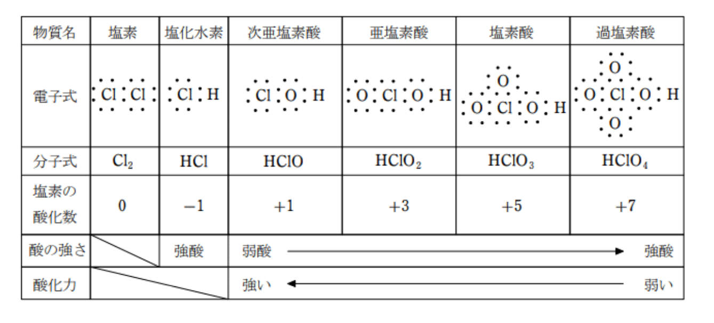

## 臭素 $\ce{Br}$

### 単体 $\ce{Br2}$

#### 性質

1. 水に少し溶けて、臭化水素と次亜臭素酸が発生。
   $$
   \ce{Br2 + H2O <=> HBr + HBrO}
   $$

2. 水素とは高温ならば反応する。
   $$
   \ce{H2 + Br2 -> 2HBr}
   $$

#### 製法

製法臭化マグネシウムを酸化。
$$
\ce{MgBr2 + MnO2 + 2H2SO4 -> MgSO4 + MnSO4 + 2H2O + Br2}
$$

### 臭化銀 $\ce{AgBr}$

1. 淡黄色沈殿である。
2. アンモニア水に少し溶ける。

## ヨウ素 $\ce{I}$

### 単体 $\ce{I2}$

#### 性質

1. **デンプン水溶液**と反応すると**青紫色**となる。（**ヨウ素デンプン反応**）

2. 水素とは高温でも平衡状態になる。
   $$
   \ce{H2 + I2 <=> 2HI}
   $$

3. 水に溶けないが、ヨウ化カリウム水溶液に溶け、**褐色の溶液（ヨウ素溶液）**となる。
   $$
   \ce{I2 + I- <=> I_3-}
   $$
   $\ce{I_3-}$：三ヨウ化物イオン、褐色。

#### 製法

ヨウ化カリウムを酸化。
$$
\ce{2KI + MnO2 + 3H2SO4 -> 2KHSO4 + MnSO4 + 2H2O + I2}
$$

### ヨウ化銀 $\ce{AgI}$

1. 黄色沈殿である。
2. アンモニア水に溶けない。

# 16族

## 酸素 $\ce{O}$

### 単体 $\ce{O2}$

#### 性質

1. 空気中に体積で約 $21\%$。
2. 助燃性あり。
3. 地殻中の元素の存在度 1 位。

#### 工業的製法

1. 液体空気を分留する。

2. 水を電気分解する。
   $$
   \ce{2H2O -> 2H2 + O2}
   $$

#### 実験的製法

1. 過酸化水素に**二酸化マンガン（触媒）**を加える。
   $$
   \ce{2H2O2 ->[MnO2] 2H2O + O2}
   $$

2. 塩素酸カリウムに**二酸化マンガン（触媒）**を加える。
   $$
   \ce{2KClO3 ->[MnO2] 2KCl + 3O2}
   $$

### 単体 $\ce{O3}$

#### 性質

1. **淡青色、特異臭**、水分子と同様折れ線型の分子。

2. **強酸化作用**であり、**漂白・殺菌**で利用できる。
   $$
   \ce{O3 + 2H+ + 2e- -> H2O + O2}\\
   \ce{O3 + 2H2O + 2e- -> 2OH- + O2}
   $$

3. **湿ったヨウ化カリウムデンプン紙を青色にする**。

4. オゾン分解。

   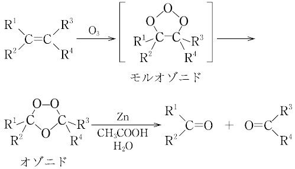

#### 実験的製法

酸素に紫外線を当たり、無声放電で得られる。
$$
\ce{3O2 <=> 2O3}
$$

### 水 $\ce{H2O}$

#### 性質

1. 溶媒として働く。水分子の熱運動による衝突でイオン結晶を電離させます。その後、生じたイオンは水分子に取り囲まれる（水和）によって安定化し、水に溶解します。
2. 特異的に高い沸点がある。
3. 液体より固体の密度が小さい。
4. 固体に圧力を加えると液体になる。

### 過酸化水素 $\ce{H2O2}$

#### 性質

1. 酸化剤としても、還元剤としても働く。
   $$
   \ce{H2O2 + 2H+ + 2e- -> 2H2O}\\
   \ce{H2O2 - 2e- -> O2 + 2H+}
   $$

2. **殺菌・漂白**作用がある。

3. 酸素の代わりにロケットの燃料（酸化剤）として用いられていた時期もある。

4. 過酸化水素分解酵素（カタラーゼ）はオキシドールを水と酸素に分解できる。

## 硫黄 $\ce{S}$

### 単体 $\ce{S}$

#### 性質

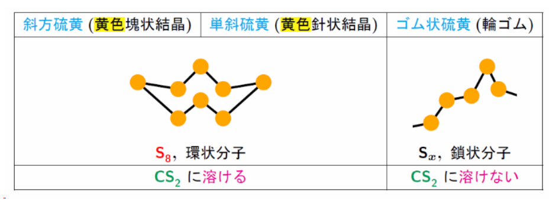

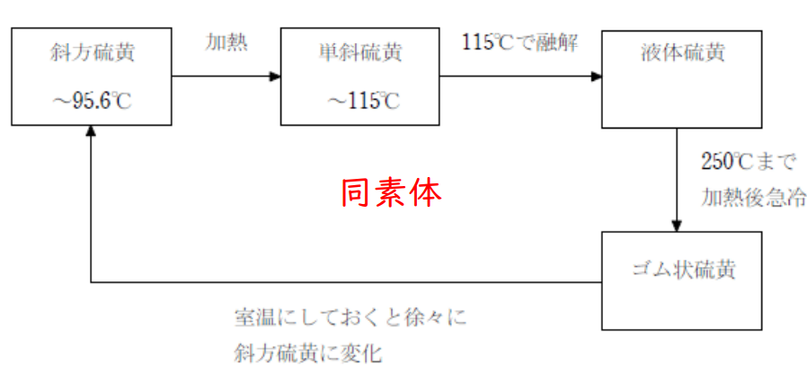

### 硫化水素 $\ce{H2S}$

#### 性質

1. 水に溶けり、弱酸性がある。

2. **還元性**あり、殺菌・漂白作用を持つ。

3. 有毒気体であり、腐卵臭がある。

4. 水溶液中の金属イオンの硫化物として沈殿。
   $$
   \ce{Zn^2+ + S^2- -> ZnS(酸性条件下)}
   $$

#### 実験的製法

硫化鉄(II)に希硫酸を加える。（弱酸の遊離）
$$
\ce{FeS + H2SO4 -> FeSO4 + H2S}
$$

### 二酸化硫黄 $\ce{SO2}$

#### 性質

1. 水に溶ける、**弱酸性**がある。

2. 酸化性、還元性あり。
   $$
   \ce{SO2 + 4H+ + 4e- -> S + 2H2O}\\
   \ce{SO2 + 2H2O -> SO_4^2- + 4H+ + 2e-}
   $$

3. 有毒気体である。

4. 水と反応し亜硫酸を得る。
   $$
   \ce{SO2 + H2O -> H2SO3}
   $$

#### 工業的製法

1. 亜硫酸水素ナトリウムに希硫酸を加える。 （弱酸の遊離）
   $$
   \ce{NaHSO3 + H2SO4 -> NaHSO4 + SO2 + H2O}
   $$

2. 銅に濃硫酸を加えて加熱する。 （酸化還元反応）‘
   $$
   \ce{Cu + H2SO4 ->[\Delta] CuSO4 + SO2 + 2H2O}
   $$

#### 実験的製法

硫黄や黄鉄鉱（主成分 $\ce{FeS2}$）を燃焼させる。
$$
\ce{S + O2 -> SO2}\\
\ce{4FeS2 + 11O2 -> 2Fe2O3 + 8SO2}
$$

### 硫酸 $\ce{H2SO4}$

#### 希硫酸の性質

強い酸性のみ、次のような反応が起こる。
$$
\ce{Zn + H2SO4 -> ZnSO4 + H2}
$$

#### 濃硫酸の性質

濃硫酸とは、濃度 $90\%$ 以上の硫酸である。

1. 不揮発性酸である。
   $$
   \ce{NaCl + H2SO4 -> NaHSO4 + HCl}
   $$

2. 加熱で強い酸化力がある。
   $$
   \ce{Cu + 2H2SO4 ->[\Delta] CuSO4 + SO2 + 2H2O}
   $$

3. 脱水性・吸湿性がある。
   $$
   \ce{C2H5OH ->[濃H2SO4] C2H4 + H2O}
   $$

4. 溶解性が大きく、粘性が高く、密度が大きい。**水に濃硫酸を**少しずつ加えて希釈できる。

#### 工業的製法（接触法）

$$
\begin{align*}
&\ce{S + O2 -> SO2}\\
&\ce{2SO2 + O2 ->[V2O5] 2SO3}\\
&\ce{SO3 + H2O -> H2SO4}
\end{align*}
$$

$\ce{SO3}$ を直接に水を加えると、激しい発熱が生じて危険である。

よって、実際には $\ce{SO3}$ を濃硫酸に吸収させて**発煙硫酸**とした後、希硫酸で薄める。

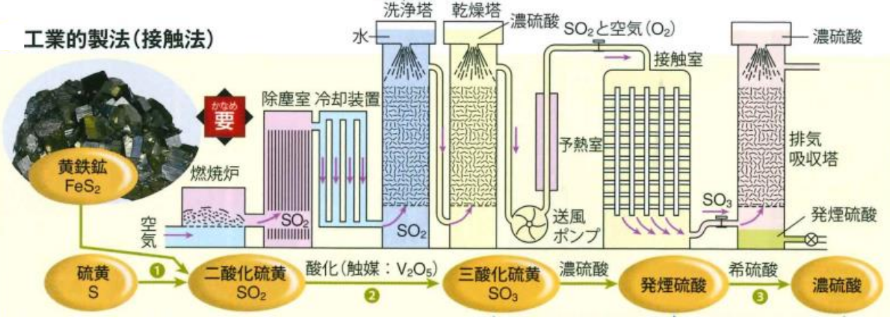

# 15族

## 窒素 $\ce{N}$

### 単体 $\ce{N2}$

#### 性質

1. 空気中に体積で約 $78\%$ である。
2. 無色無臭の気体である。
3. 三重結合の結合エネルギーが大きいため、希ガスに次いで反応性が乏しい。
4. 液体窒素は冷却剤として利用される。

#### 実験的製法

亜硝酸アンモニウム水溶液を加熱する。
$$
\ce{NH4NO2 ->[\Delta] N2 + H2O}
$$

#### 工業の製法

液体空気の分留で得る。

### アンモニア $\ce{NH3}$

#### 性質

1. 分子間の水素結合のため、沸点が異常に高い。

2. 無色、刺激臭。

3. 水溶液は**弱塩基性**。

4. 二酸化炭素と反応し尿素が得る。
   $$
   \ce{2NH3 + CO2 -> (NH2)2CO + H2O}
   $$

#### 実験的製法

塩化アンモニウムと水酸化カルシウムを加熱する。（弱塩基遊離）
$$
\ce{2NH4Cl + Ca(OH2) ->[\Delta] CaCl2 + 2NH3 + 2H2O}
$$

#### 工業的製法

**ハーバー・ボッシュ法**。

窒素と水素に四酸化三鉄を触媒として加える。
$$
\ce{N2 + 3H2 ->[Fe3O4] 2NH3}
$$

### 一酸化窒素 $\ce{NO}$

#### 性質

1. 無色、無臭の有毒気体である。

2. 水に難溶である。

3. 空気中で直ちに $\ce{NO2}$ に変化する。
   $$
   \ce{2NO + O2 -> 2NO2}
   $$

#### 製法

銅に**希硝酸**を加える。
$$
\ce{3Cu + 8HNO3 -> 3Cu(NO3)2 + 2NO + 4H2O}
$$

### 二酸化窒素 $\ce{NO2}$

#### 性質

1. **赤褐色**の有毒気体。

2. 水に溶け、$\ce{NHO3}$ を生成する。
   $$
   \ce{3NO2 + H2O -> 2HNO3 + NO}
   $$

3. 常温では無色の四酸化二窒素と平衡状態している。
   $$
   \ce{2NO <=> N2O4}
   $$

#### 製法

銅に**濃硝酸**を加える。
$$
\ce{Cu + 4HNO3 -> Cu(NO3)2 + 2NO2 + 2H2O}
$$

### 硝酸 $\ce{HNO3}$

#### 性質

1. **強酸**であり、**強い酸化力**がある。

2. 濃硝酸は $\ce{Al, Fe, Ni}$ を**不動態**にする。

3. 濃硝酸は光や熱で分解するので、**褐色瓶**に入れ、冷暗所で保存する。
   $$
   \ce{4HNO3 ->[hv/\Delta] 4NO2 + 2H2O +O2}
   $$

4. **褐色環反応**（$\ce{NO3-}$ の検出）

   $\ce{FeSO4}$ を加えて濃硫酸を静かに入れると、濃硫酸と水溶液の境界面に**褐色の輪**が生じる。
   $$
   \ce{NO3- + 4H+ + Fe^2+ -> NO + 3Fe^3+ + 2H2O}\\
   \ce{Fe[(H2O)6]^2+ + NO -> Fe[(H2O)5(NO)]^2+ + H2O}
   $$
   $\ce{Fe[(H2O)6]^2+}$：ヘキサアクア鉄(II)イオン。

   $\ce{Fe[(H2O)5(NO)]^2+}$：ペンタアクアニトロシル鉄(II)イオン。

#### 実験的製法

硝酸ナトリウムに濃硫酸を加えて加熱する。（揮発性酸の遊離）
$$
\ce{NaNO3 + H2SO4 ->[\Delta] NaHSO4 + HNO3}
$$

#### 工業的製法

オストワルト法。
$$
\ce{4NH3 + 5O2 ->[Pt] 4NO + 6H2O}\\
\ce{2NO + O2 -> 2NO2}\\
\ce{3NO2 + H2O -> 2HNO3 + NO}
$$
$\ce{NO}$ は再利用できる。

全反応式：
$$
\ce{NH3 + 2O2 -> HNO3 + H2O}
$$

## リン $\ce{P}$

### 単体 $\ce{P4, P_x}$

#### 性質

|  黄リン $\ce{P4}$   |     赤リン $\ce{P_x}$      |
| :-----------------: | :------------------------: |
| 淡黄色・ろう状固体  | 赤褐色・粉末（マッチの横） |
|        猛毒         |            無毒            |
| 自然発火・水中保存  |       自然発火しない       |
| $\ce{CS2}$ に溶ける |   $\ce{CS2}$ に溶けない    |
|    正四面体構造     |        網目状高分子        |

#### 黄リンの製法

リン鉱石（主成分 $\ce{Ca3(PO4)2}$）にケイ砂とコークス $\ce{C}$ を混ぜて、電気炉に加熱する。
$$
\ce{Ca3(PO4)2 <=> P4O10 + 3CaO}\\
\ce{SiO2 + CaO -> CaSiO3}\\
\ce{P4O10 + 10C -> 10CO + P4}
$$
全反応式：
$$
\ce{Ca3(PO4)2 + 6SiO2 + 10C -> 6CaSiO3 + 10CO + P4}
$$

### 十酸化四リン $\ce{P4O10}$

#### 性質

1. **吸湿性・脱水性**の強い白色結晶であり、強力な**酸性乾燥剤**。

2. **昇華性**を持つ。

3. 水と激しく反応して、**中程度の酸のリン酸**を生じる。
   $$
   \ce{P4O10 + 6H2O -> 4H3PO4}
   $$

#### 製法

リンを空気中で燃焼させる。
$$
\ce{P4 + 5O2 -> P4O10}
$$

### リン酸 $\ce{H3PO4}$

#### 性質

1. **潮解性**を持つ無色結晶である。
2. 水に溶けて**中程度の酸性**を示す。
3. $\ce{K+, Na+, NH4+}$ 以外の塩は 水に溶けにくい。

# 14族

## 炭素 $\ce{C}$

### 単体 $\ce{C}$

* ダイアモンド：4 つの価電子が全て共有結合した**正四面体**構造。
* 黒鉛：3 つの価電子が全て共有結合した**正六角形の平面**、分子間力で**層状**に重なる。1 つの余った電子は自由電子のように振舞い、電気伝導性を示す。
* 無定形炭素：活性炭（表面積増大による吸着力が高い、脱色剤・脱臭剤として利用される。）

### 一酸化炭素 $\ce{CO}$

#### 性質

1. 無色、無臭の有毒気体。

2. 水に難溶。

3. 点火すると青い炎を出して、酸化して $\ce{CO2}$ になる。
   $$
   \ce{2CO + O2 -> 2CO2}
   $$

4. 高温で還元力を持つ。
   $$
   \ce{CuO + CO -> Cu + CO2}\\
   \ce{Fe2O3 + 3CO -> 2Fe + 3CO2}
   $$

#### 実験的製法

1. ギ酸に濃硫酸（触媒）を加えて加熱する。
   $$
   \ce{HCOOH ->[\Delta][H2SO4] CO + H2O}
   $$

2. シュウ酸に濃硫酸（触媒）を加えて加熱する。
   $$
   \ce{(COOH)2 ->[\Delta][H2SO4] CO + CO2 + H2O}
   $$

#### 工業的製法

加熱したコークスと水を反応させる。
$$
\ce{C + H2O -> CO + H2}
$$

### 二酸化炭素 $\ce{CO2}$

#### 性質

1. 水に溶けて弱酸性を示す。
   $$
   \ce{CO2 + H2O -> H+ + HCO3-}
   $$

2. 石灰水（水酸化カルシウム水溶液）を白濁する。
   $$
   \ce{Ca(OH)2 + CO2 -> CaCO3 + H2O}
   $$
   二酸化炭素を通じ続けると、透明になる。
   $$
   \ce{CaCO3 + CO2 + H2O -> Ca(HCO3)2}
   $$
   透明になった水溶液を加熱すると、
   $$
   \ce{Ca(HCO3)2 ->[\Delta] CaCO3 + CO2 + H2O}
   $$

3. $\ce{K+, Na+, NH4+}$ 以外の塩は水に溶けにくい。

## ケイ素 $\ce{Si}$

### 単体 $\ce{Si}$

#### 性質

1. 正四面体構造の共有結合結晶である。
2. **金属光沢**がある。
3. 半導体であり、集積回路、太陽電池に利用される。

#### 製法

単体は天然に存在しない。$\ce{SiO2}$ をコークスで還元する。
$$
\ce{SiO2 + 2C -> Si + 2CO}
$$

### 二酸化ケイ素 $\ce{SiO2}$

#### 性質

1. **石英**として天然に存在する。その透明な結晶は**水晶**、砂状のものは**ケイ砂**という。

2. 共有結合の結晶、**融点が高い、硬い**。

3. 水に溶けないが、**フッ化水素**には反応して溶ける。
   $$
   \ce{SiO2 + 6HF(aq) -> H2SiF6 + 2H2O}
   $$

4. 塩基と反応して水ガラス（ケイ酸ナトリウム）を得る。
   $$
   \ce{SiO2 + 2NaOH ->[\Delta] Na2SiO3 + H2O}\\
   \ce{SiO2 + Na2CO3 ->[\Delta] Na2SiO3 + CO2}
   $$

5. 水ガラスに塩酸を加えると、ゲル状のケイ酸が沈殿。
   $$
   \ce{Na2SiO3 + 2HCl -> H2SiO3 + 2NaCl}
   $$

6. ケイ酸を加熱・脱水すると**シリカゲル**を得る。乾燥剤・吸着剤として利用される。

### ケイ酸塩鉱物

1. **ガラス**：構成粒子の配列が不規則で、加熱すると軟化し、一定の融点が示さない。 **非晶質**、**アモルファス**という。

2. 土器、陶器、磁器：粘土などの原料を水で練って成形し、焼き固めるもの。

3. **セメント**（*水泥*）：水や液剤などにより水和や重合をし、硬化する粉体。

   ポルトランドセメント：$\ce{SiO2, CaO, Al2O3, Fe2O3}$ に水を入れて、水和より硬化。

# 1族・アルカリ金属

$$
\ce{Li, Na, K, Rb, Cs}
$$

## 性質

1. 反応性が非常に高く、天然には単体として存在しない。

2. 空気中ですぐに酸化され光沢が消えるため、石油中に保存する。

3. 柔らかく、密度が小さい。（軽金属，密度 $< 4$~$5 \text{g/cm}^3$）$\ce{Li, Na, K}$ は水に浮く。

4. 単体の融点は、原子番号の小さいほど高い。（$\ce{Li > Na > K > Rb > Cs}$）

5. 常温で水と激しく反応して、水素が発生し、強塩基水溶液が生成する。
   $$
   \ce{2Na + 2H2O -> 2NaOH + H2}
   $$

6. 炎色反応：$\ce{Li}$ 赤、$\ce{Na}$ 黄、$\ce{K}$ 赤紫。

## 製法

溶融塩電解（融解塩電解）。
$$
\ce{2NaCl ->[通電] 2Na + Cl2}
$$

## 水酸化ナトリウム $\ce{NaOH}$

### 性質

1. 白色の固体、水に溶けて強塩基性を示す、発熱反応である。

2. 潮解性（空気中の水分を吸収して溶ける）がある。

3. 二酸化炭素をよく吸収して、炭酸塩を形成する。
   $$
   \ce{2NaOH + CO2 -> Na2CO3 + H2O}
   $$
   さらに二酸化炭素を吸収させると、炭酸水素塩を生成する。
   $$
   \ce{Na2CO3 + CO2 + H2O -> 2NaHCO3}
   $$

### 製法

$\ce{NaCl}$ 水溶液の電気分解。（イオン交換膜法）
$$
\ce{2NaCl + 2H2O -> 2NaOH + H2 + Cl2}
$$

## 炭酸ナトリウム $\ce{Na2CO3}$

### 性質

1. 水によく溶け、塩基性を持つ。
   $$
   \ce{CO3^2- + H2O <=> HCO3- + OH-}
   $$

2. 強酸を加えると、$\ce{CO2}$ を発生。
   $$
   \ce{CO3^2- + 2H+ -> CO2 + H2O}
   $$

3. 無色結晶 $\ce{Na2CO3.10H2O}$ のは、風解性を持ち、白色粉末 $\ce{Na2CO3.H2O}$ になる。

### 工業的製法

アンモニアソーダ（ソルベー）法。
$$
\begin{align}
主反応1:\quad&\ce{NaCl + NH3 + CO2 + H2O -> NH4Cl + NaHCO3}\\
主反応2:\quad&\ce{2NaHCO3 ->[\Delta] Na2CO3 + CO2 + H2O}\\
副反応3:\quad&\ce{CaCO3 ->[\Delta] CaO + CO2}\\
副反応4:\quad&\ce{CaO + H2O -> Ca(OH)2}\\
副反応5:\quad&\ce{Ca(OH)2 + 2NH4Cl -> CaCl2 + 2NH3 + 2H2O}\\
\end{align}
$$
全反応式：
$$
\ce{CaCO3 + 2NaCl → Na2CO3 + CaCl2}
$$
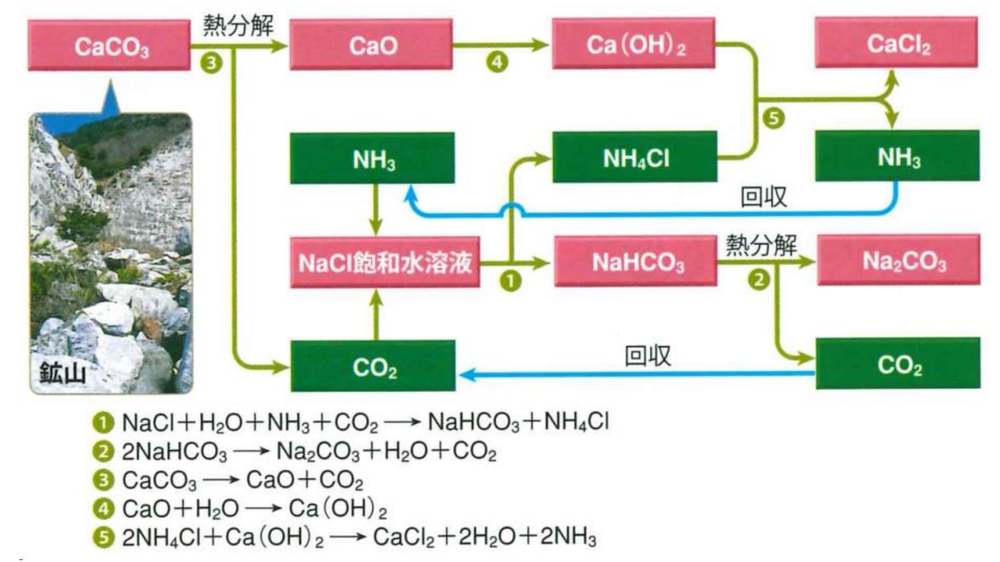

## 炭酸水素ナトリウム $\ce{NaHCO3}$

### 性質

1. 水に少し溶け、塩基性を持つ。
   $$
   \ce{HCO3- + H2O <=> H2CO3 + OH-}
   $$

2. 加熱すると、$\ce{CO2}$ を発生。
   $$
   \ce{2NaHCO3 ->[\Delta] Na2CO3 + H2O + CO2}
   $$

3. 強酸を加えると、$\ce{CO2}$ を発生。
   $$
   \ce{HCO3- + H+ -> CO2 + H2O}
   $$

4. 胃腸薬、ベーキングパウダーなどに利用される。

5. 重炭酸曹達（重曹）も呼ぶ。

### 工業的製法

アンモニアソーダ（ソルベー）法。
$$
\ce{NaCl + NH3 + CO2 + H2O -> NH4Cl + NaHCO3}
$$

# 2族・アルカリ土類金属

## 性質

1. $\ce{Be}$ は水と反応しない、$\ce{Mg}$ は熱水と反応して $\ce{H2}$ を発生する。$\ce{Ca, Sr, Ba}$ は常温で水と反応して $\ce{H2}$ を発生する。
   $$
   \ce{Ca + 2H2O -> Ca(OH)2 + H2}
   $$

2. アルカリ金属の次いで反応性が大きい。
   $$
   \ce{2Mg + O2 -> 2MgO}
   $$
   （強熱と明るい光を発生する。）

3. $\ce{Mg}$ は二酸化炭素と反応できる。
   $$
   \ce{2Mg + CO2 -> 2MgO + C}
   $$

4. 炎色反応：$\ce{Be, Mg}$（示さない）、$\ce{Ca}$（橙赤）、$\ce{Sr}$（赤）、$\ce{Ba}$（黄緑）。

## 製法

溶融塩電解（融解塩電解）。
$$
\ce{CaCl2 ->[通電] Ca + Cl2}
$$

## 酸化カルシウム $\ce{CaO}$

生石灰も呼ぶ。

1. 塩基性酸化物、水と反応すると強塩基の $\ce{Ca(OH)2}$ となる。
   $$
   \ce{CaO + H2O -> Ca(OH)2}
   $$

2. コークスと混合して加熱すると、炭化カルシウムが得られる。
   $$
   \ce{CaO + 3C -> CaC2 + CO}
   $$
   それに水を加えると、消石灰とアセチレンが発生する。
   $$
   \ce{CaC2 + 2H2O -> Ca(OH)2 + C2H2}
   $$

3. 乾燥剤、携帯用食品に付属する発熱材として利用される。

## 水酸化カルシウム $\ce{Ca(OH)2}$

消石灰も呼ぶ。

1. 水に少し溶け、水溶液は強い塩基性を示す。飽和水溶液は石灰水と呼ぶ。

2. 石灰水に二酸化炭素を通じると、白色沈殿が生じる。
   $$
   \ce{Ca(OH)2 + CO2 -> CaCO3 + H2O}
   $$
   さらに加えると、白濁が消える。
   $$
   \ce{CaCO3 + CO2 + H2O-> Ca(HCO3)2}
   $$
   加熱すると白濁が再生する。
   $$
   \ce{Ca(HCO3)2  ->[\Delta] CaCO3 + CO2 + H2O}
   $$

3. 湿った消石灰は塩素を吸収し、さらし粉を生成する。
   $$
   \ce{Ca(OH)2 + Cl2 -> CaCl(ClO).H2O}
   $$

4. 安価な塩基で、酸性土壌の中和剤として利用される。

## 炭酸カルシウム $\ce{CaCO3}$

石灰石も呼ぶ。

1. 貝殻、卵殻などに含まれ、自然界に多く存在する。

2. 水に溶けない。

3. 塩酸のような強酸を加えると、分解して $\ce{CO2}$ を発生する。
   $$
   \ce{CaCO3 + 2HCl -> CaCl2 + H2O + CO2}
   $$

4. 加熱すると分解し、生石灰と二酸化炭素を生じる。
   $$
   \ce{CaCO3 ->[\Delta] CaO + CO2}
   $$

5. 鍾乳石の主成分である。

## 塩酸カルシウム $\ce{CaCl2}$

1. 潮解性あり、乾燥剤、融雪剤として利用される。

## さらし粉 $\ce{CaCl(ClO).H2O}$

1. 水酸化カルシウムに低温で塩素を吸収させて生成する。
   $$
   \ce{Ca(OH)2 + Cl2 -> CaCl(ClO).H2O}
   $$
   強い酸化性、殺菌、漂白作用を示す。

## 硫酸カルシウム $\ce{CaSO4}$

1. 水に溶けにくい白色固体である。

2. 二水和物 $\ce{CaSO4.2H2O}$ は石膏（セッコウ）という。

3. 加熱すると、液体状の焼きセッコウ $\ce{CaSO4.\dfrac{1}{2}H2O}$ を得る。
   $$
   \ce{CaSO4.\dfrac{1}{2}H2O + \dfrac{3}{2}H2O <=>[\text{硬化}][\text{加熱}] CaSO4.2H2O}
   $$

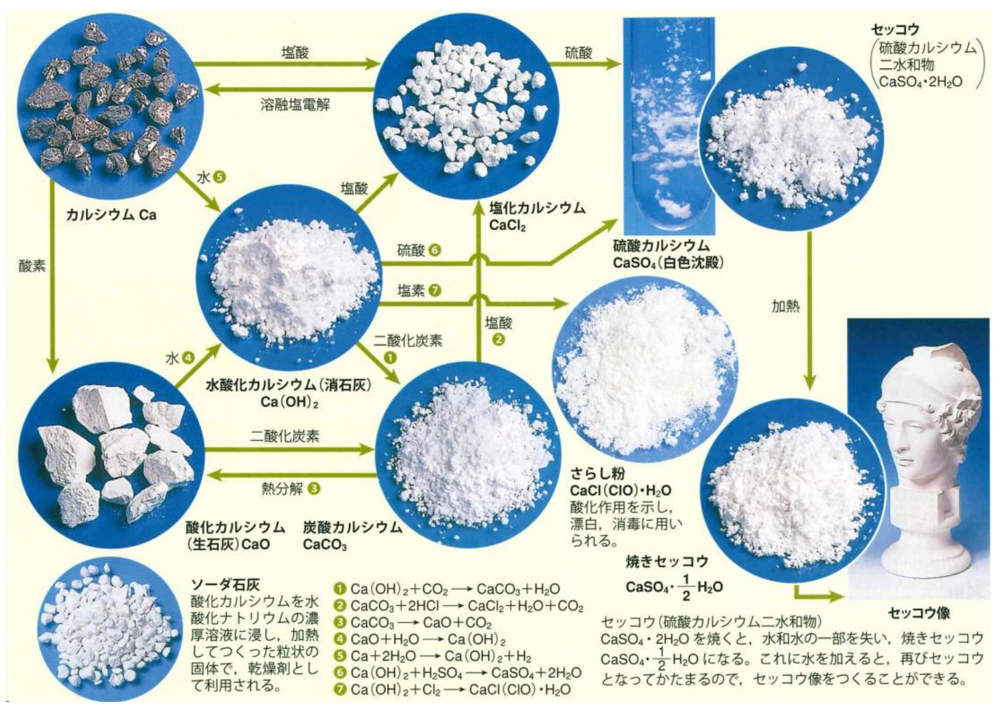

## 塩化マグネシウム $\ce{MgCl2}$

1. 潮解性あり、にがり（苦汁）の主成分である。

2. 水酸化マグネシウムに塩酸を加えて得られる。
   $$
   \ce{Mg(OH)2 + 2HCl -> MgCl2 + 2H2O}
   $$

## 酸化マグネシウム $\ce{MgO}$

1. 融点が高く、耐火レンガとして利用される。

2. マグネシウムを燃焼して得られる。
   $$
   \ce{2Mg + O2 -> 2MgO}
   $$

3. 水酸化マグネシウム、炭酸マグネシウムの熱分解で得られる。
   $$
   \ce{Mg(OH)2 -> MgO + H2O}\\
   \ce{MgCO3 -> MgO + CO2}
   $$

## 硫酸バリウム $\ce{BaSO4}$

1. 水に溶けにくい白色固体である。
2. X 線の造影剤として利用される。

# 両性金属

$$
\ce{Al, Zn, Sn, Pb}
$$

## アルミニウム $\ce{Al}$

### 単体 $\ce{Al}$

#### 性質

1. 銀白色の軽金属、展性・延性、電気伝導性が高い。

2.  強い光とともに激しく燃焼する。（金属中最大の燃焼熱）
   $$
   \ce{4Al + 3O2 -> 2Al2O3}\quad \Delta H=-3314\kJ/\mol
   $$

3. 高温で水蒸気と反応して、水素を発生する。
   $$
   \ce{2Al + 6H2O -> 2Al(OH)3 + 3H2}
   $$

4. 両性金属、酸にも塩基にも水素を発生して溶ける。
   $$
   \ce{2Al + 6HCl → 2AlCl3 + 3H2}\\
   \ce{2Al + 2NaOH + 6H2O → 2Na[Al(OH)4] + 3H2}
   $$

5. 濃硝酸や濃硫酸には不動態となる。（表面に緻密な酸化被膜 $\ce{Al2O3}$）

6. $\ce{Fe2O3}$ とアルミニウムの粉末を混合したものに点火すると、激しい光と熱を発生して融解した鉄が生成する。（テルミット反応）
   $$
   \ce{2Al + Fe2O3 -> Al2O3 + 2Fe}
   $$

#### 製法

ボーキサイト（*铝土矿*）：$\ce{Al2O3, Fe2O3, SiO2}$ の混合物。

1. バイヤー法（アルミナ精製）：
   $$
   \ce{Al2O3 + 2NaOH + 3H2O → 2Na[Al(OH)4]}\\
   \ce{Na[Al(OH)4] → NaOH + Al(OH)3}\\
   \ce{2Al(OH)3 → Al2O3 + 3H2O}
   $$

2. ホール・エルー法（融解塩電解）：
   $$
   \begin{align}
   \text{陽極：}&\ce{C + O2- -> CO + 2e-}\\
   &\ce{C + 2O^2- -> CO2 + 4e-}\\
   \text{陰極：}&\ce{Al^3+ + 3e- -> Al}
   \end{align}
   $$
   $\ce{Al2O3}$ の融点は高いから、融点を下げるため、アルミナ $\ce{Al2O3}$ を氷晶石 $\ce{Na3AlF6}$ と共に融解するのは必要である。

### アルミニウムイオン $\ce{Al^3+}$

#### 性質

1. 塩基加えると、白色ゲル状の水酸化アルミニウム $\ce{Al(OH)3}$ が生じる。
   $$
   \ce{Al^3+ + 3OH- -> Al(OH)3}
   $$
   さらにNaOHを過剰に加えると、沈殿は溶解する。
   $$
   \ce{Al(OH)3 + OH- -> Al[(OH)4]-}
   $$

2. $\ce{Al(OH)3}$ を加熱すると、脱水して $\ce{Al2O3}$ になる。
   $$
   \ce{2Al(OH)3 ->[\Delta] Al2O3 + 3H2O}
   $$

3. アルミニウムイオンは水酸化物イオンを錯イオンを作る**テトラヒドロキシドアルミン酸イオン** $\ce{[Al(OH)4]-}$は、**配位数 $6$、八面体形である。**（実際には $\ce{[Al(OH4)(H2O)2]-}$）

### 他の化合物

1. ミョウバン $\ce{AlK(SO4)2.12H2O}$：明礬、硫酸カリウムアルミニウム十二水和物である。正八面体結晶である。
2. アルミナ $\ce{Al2O3}$：酸化アルミニウム。ルビーとサファイアと同じ成分である。
3. 塩化アルミニウム $\ce{AlCl3}$。
4. 硫化アルミニウム $\ce{Al2(SO4)3}$。

## 亜鉛 $\ce{Zn}$

### 単体 $\ce{Zn}$

#### 性質

1. 銀白色の金属、電気伝導性が高い。

2. 空気中で燃焼する。
   $$
   \ce{2Zn + O2 -> 2ZnO}
   $$

3. 両性金属であり、酸にも強塩基の水溶液にも水素を発生して溶ける。
   $$
   \ce{Zn + 2HCl -> ZnCl2 + H2}\\
   \ce{Zn + 2NaOH + 2H2O -> Na2[Zn(OH)4] + H2}
   $$

4. 塩基性条件、$\ce{H2S}$ を通じると、白色の沈殿 $\ce{ZnS}$ が生じる。
   $$
   \ce{Zn^2+ + S^2- -> ZnS}
   $$
   

#### 製法

$\ce{ZnS}$ を酸化して酸化亜鉛とした後、炭素で還元することで得られる。
$$
\ce{2ZnS + 3O2 -> 2ZnO + 2SO2}\\
\ce{ZnO + C -> Zn + CO}\\
(\ce{2ZnO + C -> 2Zn + CO2})
$$

### 酸化亜鉛 $\ce{ZnO}$

1. 白色固体、水に不溶。

2. 両性化合物であり、酸にも強塩基の水溶液にも溶解する。
   $$
   \ce{ZnO + 2HCl -> ZnCl2 + H2O}\\
   \ce{ZnO + 2NaOH + H2O -> Na2[Zn(OH)4]}
   $$

3. 亜鉛華と呼ばれ、医薬品や化粧品の原料となる。

### 水酸化亜鉛 $\ce{Zn(OH2)}$

1. 白色固体、水に難溶。

2. 両性化合物であり、酸にも強塩基の水溶液にも溶解する。
   $$
   \ce{Zn(OH)2 + 2HCl -> ZnCl2 + 2H2O}\\
   \ce{Zn(OH)2 + 2NaOH -> Na2[Zn(OH)4]}
   $$

3. 過剰のアンモニアを加えると沈殿が溶解する。
   $$
   \ce{Zn(OH)2 + 4NH3 -> [Zn(NH3)4](OH)2}
   $$

## スズ $\ce{Sn}$

1. 銀白色の金属、常温でも比較的安定でさびにくい。

2. 両性金属であり、酸にも強塩基の水溶液にも水素を発生して溶ける。
   $$
   \ce{Sn + 2HCl -> SnCl2 + H2}\\
   \ce{Sn + 2NaOH + 2H2O -> Na2[Sn(OH)4] + H2}
   $$

3. $\ce{Sn^2+} $と $\ce{Sn^4+}$：$\ce{Sn^4+}$ の方が安定、$\ce{Sn^2+}$ は強い還元性を持つ。

## 鉛 $\ce{Pb}$

1. 灰色の金属光沢を持ち、軟らかくて、密度の大きい金属。

2. 水素よりイオン化傾向が大きいので、酸に溶ける。

   しかし、表面が不溶の $\ce{PbCl2, PbSO4}$ が生じるため、$\ce{HCl, H2SO4}$ に溶解しない。

3. 沈殿が作りやすい。
   $$
   \ce{Pb^2+ + 2Cl- -> PbCl2}\\
   \ce{Pb^2+ + SO4^2- -> PbSO4}\\
   \ce{Pb^2+ + CrO4^2- -> PbCrO4}\\
   \ce{Pb^2+ + S^2- -> PbS}
   $$

4. 鉛蓄電池。
   $$
   (-) \ce{Pb + SO4^2- → PbSO4 + 2e-}\\
   (+) \ce{PbO2 + SO4^2- + 4H+ + 2e- → PbSO4 + 2H2O}
   $$
   

# 遷移元素

$$
\ce{Fe, Co, Ni, Cu, Ag, Cr, Mn, Hg}
$$

## 共通性質

1. 周期表の第 3 族~ 11 族の元素、最外殻の電子数が 1 個または 2 個。
2. 単体、イオン、沈殿が有色のものが多い。典型元素に比べて密度が高く、融点が高くて硬いものが多い。
3. 複数の酸化数を示す元素が多い。高い酸化数の原子を持つ物質は酸化剤になる。
4. 単体や化合物には、触媒として働くことが多い 。$\ce{Pt, V2O5, MnO2}$。
5. 単体や化合物には、強磁性を持つものがある。$\ce{Fe, Co, Ni}$。
6. 様々な配位子と安定した錯イオンを作りやすい。

## 鉄 $\ce{Fe}$

### 性質

1. 希酸を加えると $\ce{H+}$ を発生して溶ける。
   $$
   \ce{Fe + 2H+ -> Fe^2+ + H2}
   $$
   濃硝酸や濃硫酸を加えると、表面に緻密な酸化被膜が生じる（不動態）。

2. $\ce{Fe^2+}$ の水溶液を放置しておくと徐々に黄色く変色する。

3. アルカリを加えると、それぞれ**緑白色**の $\ce{Fe(OH)2}$ と**赤褐色**の $\ce{Fe(OH)3}$ が生じる。過剰に加えても沈殿は溶解しない。
   $$
   \ce{Fe^2+ + 2OH- -> Fe(OH)2}\\
   \ce{Fe^3+ + 3OH- -> Fe(OH)3}
   $$

4. シアン化物イオンとは、正八面体の錯イオンを作る。
   $$
   \begin{align}
   \ce{Fe^2+ + [Fe(CN)6]^3- + K+ -> KFe[Fe(CN)6]}&\text{(濃青色の沈殿)}\\
   \ce{Fe^3+ + [Fe(CN)6]^4- + K+ -> KFe[Fe(CN)6]}&\text{(濃青色の沈殿)}\\
   \ce{Fe^2+ + [Fe(CN)6]^4- + 2K+ -> K2Fe[Fe(CN)6]}&\text{(青白色の沈殿)}\\
   \ce{Fe^3+ + [Fe(CN)6]^3- -> Fe[Fe(CN)6]}&\text{(暗褐色の溶液)}\\
   \end{align}
   $$

   フェロシアン酸カリウム：$\ce{K4[Fe(CN)6]}$，*黄血盐*。

   フェリシアン酸カリウム：$\ce{K3[Fe(CN)6]}$，*赤血盐*。

5. $\ce{Fe^3+}$ を含む水溶液に $\ce{KSCN}$ 水溶液を加えると**血赤色の溶液**が生じる。

   チオシアン酸カリウム：$\ce{K+(S-C#N)-}$。

6. $\ce{Fe^2+}$ は中性・塩基性にして $\ce{H2S}$ を通じると黒色の $\ce{FeS}$ が沈殿する。
   $$
   \ce{Fe^2+ + S^2- -> FeS}
   $$

### 製法

単体は強磁性、鉱石は赤鉄鉱（$\ce{Fe2O3}$）、磁鉄鉱（$\ce{Fe3O4}$）。

コークスや石灰石を強熱して生じる一酸化炭素よって段階的に還元する 。（間接還元）
$$
\ce{3Fe2O3 + CO -> 2Fe3O4 + CO2}\\
\ce{Fe3O4 + CO -> 3FeO + CO2}\\
\ce{FeO + CO -> Fe + CO2}
$$
全反応式：
$$
\ce{Fe2O3 + 3C -> 2Fe + 3CO2}
$$
一部はコークスと接触し還元される。（直接還元）
$$
\ce{2Fe2O3 + 3C -> 4Fe + 3CO2}\\
\ce{Fe2O3 + 3C -> 2Fe + 3CO}
$$

## コバルト $\ce{Co}$・ニッケル $\ce{Ni}$

1. 銀白色の金属、強磁性体。

2. 希酸に溶けて $\ce{Co^2+}$（淡赤色）、$\ce{Ni^2+}$（緑色）となる。
   $$
   \ce{Co + 2HCl -> CoCl2 + H2}\\
   \ce{Ni + 2HCl -> NiCl2 + H2}
   $$

3. 濃硝酸や濃硫酸を加えると、表面に緻密な酸化被膜が生じる。（不動態）

4. 塩化コバルト紙：水に触れると、淡赤色になる。（水の検出）

   赤色リトマス紙：アルカリ性の物質に触れると、青色になる。

   青色リトマス紙：酸性の物質に触れると、赤色になる。

## 銅 $\ce{Cu}$

### 性質

1. **赤色**の金属光沢、展性・延性に富む、電気伝導性が高い。

2. 希酸に溶けない、酸化力のある硝酸、熱濃硫酸、硫酸酸性 $\ce{H2O2}$ には溶ける。
   $$
   \ce{3Cu + 8HNO -> 3Cu(NO3)2 + 2NO + 4H2O}\\
   \ce{Cu + 4HNO3 -> Cu(NO3)2 + 2NO2 + 2H2O}\\
   \ce{Cu + 2H2SO4 -> CuSO4 + SO2 + 2H2O}\\
   \ce{Cu + H2O2 + H2SO4 -> CuSO4 + 2H2O}
   $$

3. 水溶液中で**青色、青緑色**の炎色反応を示す。

4. アルカリを加えると**青白色沈殿**が生じる。
   $$
   \ce{Cu^2+ + 2OH- -> Cu(OH)2}
   $$
   多量のアンモニアを加えると、沈殿が溶解。（**深青色溶液**）
   $$
   \ce{Cu(OH)2 + 4NH3 -> [Cu(NH3)4](OH)2}
   $$

5. $\ce{Cu(OH)2}$ の沈殿を加熱すると、黒色の $\ce{CuO}$ を生じる。
   $$
   \ce{Cu(OH)2 ->[\Delta] CuO + H2O}
   $$

6. $\ce{Cu^2+}$ は $\ce{S^2-}$ と結びつきやすく、$\ce{CuS}$ の難溶性黒色沈殿を生じる。

7. アルデヒドの還元性：

   * 銀鏡反応：

     アンモニア性硝酸銀水溶液に、アルデヒド $\ce{R-CHO}$ を加えて加熱すると、鏡のような $\ce{Ag}$ 単体を生じる。
     $$
     \ce{R-CHO + 2[Ag(NH3)2]+ + 3OH- -> R-COO- + 4NH3 + 2Ag + 2H2O}
     $$

   * フェーリング反応：

     フェーリング液（A：$\ce{CuSO4}$；B：酒石酸カリウムナトリウム、$\ce{NaOH}$）に、アルデヒド $\ce{R-CHO}$ を加えて加熱すると、酸化銅(I) $\ce{CuO}$ の**赤色沈殿**を生じる。
     $$
     \ce{R-CHO + 2Cu^2+ + 5OH- -> R-COO- + Cu2O + 3H2O}
     $$

### 製法

電解精錬。
$$
\begin{align}
\text{陽極：}&\ce{Cu -> Cu^2+ + 2e-}\\
\text{陰極：}&\ce{Cu^2+ + 2e- → Cu}
\end{align}
$$

## 銀 $\ce{Ag}$

1. 銀色の金属光沢、展性・延性に富む、電気伝導性が非常に高い。

2. 希酸に溶けないが、熱濃硫酸、希硝酸、濃硝酸には溶ける。
   $$
   \ce{3Ag + 4HNO3 -> 3AgNO3 + NO + 2H2O}\\
   \ce{Ag + 2HNO3 -> AgNO3 + NO2 + H2O}\\
   \ce{Ag + 2H2SO4 -> Ag2SO4 + SO2 + H2O}
   $$

3. $\ce{Ag+}$ を含む水溶液に、アルカリを加えると**褐色沈殿**を生じる。
   $$
   \ce{2Ag+ + 2OH- -> Ag2O + H2O}
   $$
   $\ce{Ag2O}$ に過剰量の $\ce{NH3}$ 水溶液を加えると錯イオンとなって溶解する。
   $$
   \ce{Ag2O + H2O + 4NH3 -> 2[Ag(NH3)2]OH}
   $$
   しかし、過剰量の $\ce{NaOH}$ 水溶液を加えても錯イオンは形成されない。

4. $\ce{Ag2O}$ を強熱すると、容易に分解して $\ce{Ag}$ を遊離する。
   $$
   \ce{2Ag2O -> 4Ag + O2}
   $$

5. $\ce{Ag+}$ は酸性条件でも $\ce{H2S}$ 水溶液によって $\ce{Ag2S}$ の**黒色沈殿**を作る。
   $$
   \ce{2Ag+ + S^2- -> Ag2S}
   $$

6. ハロゲン化銀：

   |                   |     $\ce{AgF}$     |    $\ce{AgCl}$     |    $\ce{AgBr}$     |   $\ce{AgI}$   |
   | :---------------: | :----------------: | :----------------: | :----------------: | :------------: |
   |        色         |         黄         |         白         |        淡黄        |       黄       |
   |      水溶性       |    **溶解する**    |     溶解しない     |     溶解しない     |   溶解しない   |
   |      感光性       |        あり        |        あり        |        あり        |  赤外線で感光  |
   | $\ce{NH3}$ 水溶液 | $\ce{[Ag(NH3)2]+}$ | $\ce{[Ag(NH3)2]+}$ | $\ce{[Ag(NH3)2]+}$ | **溶解しない** |

## クロム $\ce{Cr}$

1. 銀色の金属光沢、融点が高い。

2. **希酸に溶ける**、濃硫酸、濃硝酸には不動態を作るため溶けない。
   $$
   \ce{2Cr + 6HCl -> 2CrCl3 + H2}
   $$

3. 酸化数 +II、+III、+VI の化合物が存在し、+III の化合物が最も安定。

4. 二クロム酸イオン：$\ce{Cr2O7^2-}$（赤橙色）、クロム酸イオン：$\ce{CrO4^2-}$（黄色）。

   酸性条件下強い酸化力を示し、$\ce{Cr^3+}$（暗緑色）へ変化する。
   $$
   \ce{Cr2O7^2- + 14H+ + 6e- -> 2Cr^3+ + 7H2O}
   $$

5. 二クロム酸イオンとクロム酸イオンの平衡：
   $$
   \ce{Cr2O7^2- + OH- <=> 2CrO4^2- + H+}
   $$

6. 