$$
\newcommand\mol{\text{mol}}
\newcommand\kJ{\text{kJ}}
$$
# 物質の構成

## 原子と元素

### 物質の分類

* **純物質**：$1$ 種類の成分からなる物質。
  * **単体**：$1$ 種類の元素からなる純物質。
  * **化合物**：$2$ 種類以上の元素からなる純物質。
* **混合物**：$2$ 種類以上の純物質が混ざり合った物質。

### 同位体・同素体

**同位体**，*中文同位素*。原子番号（陽子数）が同じで、質量数（中性子数）が異なる原子。

**同素体**，*中文同素异形体*。同じ元素の単体で、性質や構造が異なるもの。

### 元素の周期表

## 物質の分離と精製

* **分離**：混合物から目的の純物質を取り出す操作。
* **精製**：分離した物質から不純物を取り除き、純度を高める操作。

### ろ過

**ろ過**，*中文过滤*，液体とそれに溶けていない固体を、**ろ紙**などを用いて分離する操作。

用いる器具：

* **ビーカー**：*烧杯 beaker*；
* **ろうと**：*漏斗*；
* **ろ紙**：*滤纸*；
* **ガラス棒**：*玻璃棒*。

### 蒸留

**蒸留**：*中文蒸馏*，溶液を加熱して沸騰させ、生じた蒸気を冷却して液体にすることで、揮発しやすい成分（溶媒など）を分離する操作。

用いる器具：

* **フラスコ**（枝付き）：*圆底烧瓶 flask*；
* **リービッヒ冷却器**：*直型冷凝管*；
* **アダプター**：*adapter*。内部の圧力が上昇して爆発するのを防ぐため、受器との接続部を**密栓してはいけない**。
* **沸騰石**：**突沸**（突然の激しい沸騰）を防ぐために入れる。

### 分留

**分留**：*中文分馏*，沸点の違いを利用して、2種類以上の液体の混合物を分離する操作。（例：原油の精製）

### 再結晶

**再結晶**：*中文析出*，温度による溶解度の差を利用して、不純物を含んだ結晶から純粋な結晶を析出させて分離する操作。

### 抽出

**抽出**：*中文萃取*，目的の物質を、それが溶けやすい溶媒（特定の液体）に溶かし出して分離する操作。通常、水溶液から有機溶媒（エーテルやベンゼンなど）を用いて分離する際に用いられる。

### 昇華

**昇華**：*中文升华*。昇華しやすい物質（ヨウ素やナフタレンなど）を、固体から直接気体にして分離する操作。

### クロマトグラフィー

**クロマトグラフィー**：*中文层析*，Chromatography，ろ紙や吸着剤への吸着力の違いや、溶媒（展開液）による移動速度の違いを利用して物質を分離する操作。

## 成分元素の検出

### 炎色反応

物質を炎の中に入れたとき、成分元素特有の色を示す反応。

* $\ce{Li}$：赤
* $\ce{K}$：赤紫
* $\ce{Ba}$：黄緑
* $\ce{Na}$：黄
* $\ce{Ca}$：橙赤
* $\ce{Cu}$：青緑
* $\ce{Sr}$：赤

### 沈殿反応

水溶液中でのイオン反応による沈殿生成。無機化学の金属元素分野で重要（詳細は後述）。

## 物質の状態変化

* **融解**：固体→液体。$1\mol$ の固体が液体になるときに**吸収**する熱量を**融解熱**という。
* **凝固**：液体→固体。$1\mol$ の液体が固体になるときに**放出**する熱量を**凝固熱**という。
* **蒸発**：液体→気体。液体の表面から気化する現象。$1\mol$ の液体が気体になるときに**吸収**する熱量を**蒸発熱**という。
* **沸騰**：液体→気体。液体の内部からも気泡が発生して気化する現象。
* **凝縮**：気体→液体。$1\mol$ の気体が液体になるときに**放出**する熱量を**凝縮熱**という。
* **昇華**：固体→気体。$1\mol$ の固体が気体になるときに**吸収**する熱量を**昇華熱**という。
* **凝華**：気体→固体。新課程で追加された用語。一般的には逆方向もまとめて「昇華」と呼ばれることが多い。

##  原子の構造

### 原子

**原子核**と**電子**からなり、原子核はさらに**陽子**と**中性子**からなる。

陽子は正の電荷、中性子は電荷を持たず、電子は負の電荷を持つ。

陽子と中性子の質量はほぼ等しく、電子の質量は陽子の約 $\dfrac{1}{1840}$ である。
$$
^{4}_{2}\ce{He}
$$
ここで、$4$ は**質量数**（陽子数＋中性子数）、$2$ は**原子番号**（陽子数＝電子数）を表す。

### 放射性物質

* $\alpha$ 崩壊：$\ce{^4_2He}$ の原子核（ヘリウム核）を放出する。質量数が $-4$、原子番号が $-2$ 変化する。

  $\ce{^{266}_{88}Ra->^{262}_{86}Rn + ^4_2He}$；

* $\beta$ 崩壊：電子を放出する。中性子が陽子と電子に変わるため、質量数は変わらず、原子番号が $+1$ 変化する

  $\ce{^{14}_{6}C->^{14}_{7}N + ^0_{-1}e}$；

* $\gamma$ 崩壊：高エネルギーの電磁波（ガンマ線）を放出する。質量数、原子番号ともに変化しない。

### 電子配置

$\ce{K,L,M,N,\dots}$ の各**電子殻**には、最大 $2n^2$ 個の電子が入る。

### 価電子

原子の最外殻にある電子を**価電子**という。ただし、希ガス（18族）の価電子は $0$ とする。

### イオン化エネルギー

**イオン化エネルギー**，*中文第一电离能*，原子から電子1個を取り去り、1価の陽イオンにするために必要なエネルギー。

周期表において、一般に左下から右上へ行くほど大きくなる。

同一周期では、右に行くほど原子核の正電荷が増し、電子を引きつける力が強くなるため大きくなる。

同一族では、下に行くほど最外殻電子が原子核から遠くなるため、クーロン力が弱まり小さくなる。

> 同周期でイオン化エネルギーは概ね増加傾向にあるが、単調増加ではない。例えば $\ce{B, O, Al, S}$ などでは、電子配置が閉殻（満杯）や半閉殻（半分）などの安定構造に関係して、例外的に低下する箇所がある。

### 電子親和力

**電子親和力**，*中文电子亲和能*，原子が電子1個を受け取り、1価の陰イオンになるときに**放出**されるエネルギー。 （一般的に、この値が大きいほど陰イオンになりやすい。ハロゲンは最大、希ガスは負または $0$ に近い）

### 電気陰性度

**電気陰性度**，*中文电负性*，原子が共有電子対を自分の方へ引き寄せる強さの尺度。ポーリングやマリケンの定義がある。

周期表において、一般に左下から右上へ行くほど大きくなる（$\ce{F}$ が最大）。

> 注意：希ガス元素には通常、電気陰性度は定義されない。

### 極性

電気陰性度が異なる原子間では、共有電子対を引き寄せる力が異なる。そのため、電気陰性度の差が大きい原子が結合すると、電子対が片方に偏り、電荷の偏りが生じる。これを**極性**という。

極性を持つ分子を**極性分子**という。

2つの原子間の電気陰性度の差によって、結合の性質は次のように分類される：

* $<0.5$：**非極性共有結合**；
*  $\geq0.5,\leq1.9$：**極性共有結合**；
*  $>1.9$：**イオン結合**。

### 原子半径・イオン半径

クーロン力（原子核の電荷と電子殻の数）によって決まる。

* 同族：原子番号が大きいほど、電子殻が増えるため半径は大きくなる。
* 同周期：原子番号が大きいほど、原子核の正電荷が増し、電子を強く引くため半径は小さくなる。
* 陽イオン：電子殻が減るため、元の原子より小さくなる。
* 陰イオン：電子同士の反発が増えるため、元の原子より大きくなる。

## 結合

### イオン結合

**イオン結合**，*中文离子键*，陽イオンと陰イオンの間の静電気力（クーロン力）による結合。

イオン結合でできた化合物（イオン結晶）の性質：

1. 一般に硬いが、もろい（特定の面に沿って割れやすい）。融点・沸点が高い。
2. 強い衝撃を加えると、結晶の層がずれて反発し合い、特定方向に割れる（**へき開性**）。
3. 固体は電気を通さないが、融解状態（液体）や水溶液にすると電気を通す。

### 金属結合

**金属結合**，*中文金属键*。金属原子が集まり、その価電子が特定の原子に固定されず、全原子で共有されている状態。この電子を**自由電子**という。

金属の性質：

1. 熱伝導性・電気伝導性が高い。**展性**（薄く広がる）・**延性**（細く伸びる）がある。
2. 特有の金属光沢を持つ。
3. 単位体積あたりの自由電子数が多いほど、また原子半径が小さいほど結合が強く、融点・沸点・硬度が高くなる傾向がある。

### 共有結合

**共有結合**，*中文共价键*。2つの原子が互いの**価電子（不対電子）**を出し合って共有し、安定な電子配置となって作る結合。

電子対反発則（*价层电子对互斥理论*）などにより、分子は特定の立体構造をとる。

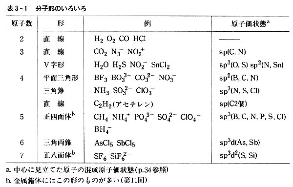

### 配位結合

**配位結合**，*中文配位键*，一方の原子が非共有電子対（ローンペア）を提供し、もう一方の原子と共有することでできる結合。

一度形成されれば、通常の共有結合と区別がつかない。

## 結晶構造

**結晶格子**：*中文晶格*，結晶中の構成粒子の規則正しい空間配列。

**単位格子**：*中文晶胞*，結晶格子を構成する最小の繰り返し単位。

**格子定数**：単位格子の辺の長さ。

**配位数**：ある粒子に最も近い（接している）他の粒子の数。

**充填率**：単位格子の体積に対する、原子が占める体積の割合。

### 金属結晶

#### 体心立方格子

代表例：アルカリ金属（碱金属）・鉄。

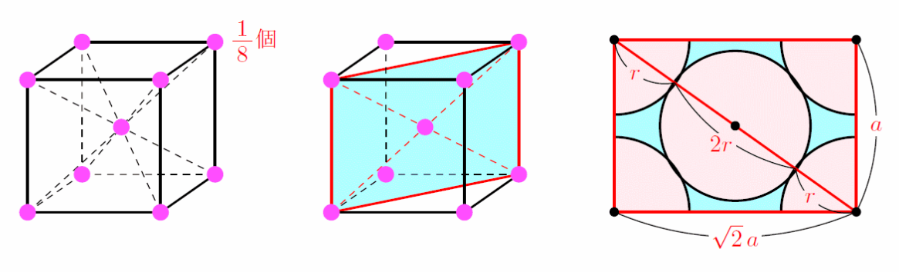

原子数：$2$；

配位数：$8$；

原子半径：$r=\dfrac{\sqrt{3}}{4}a$；

充填率：$68\%$。

#### 面心立方格子

代表例：アルミニウム・銅・銀・金。

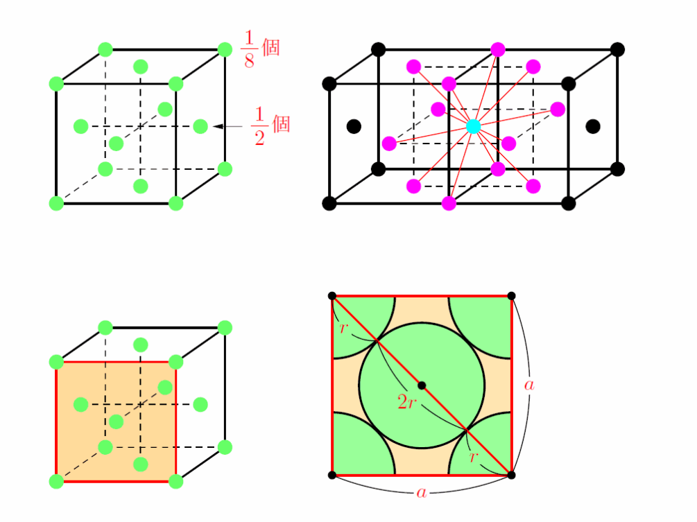

原子数：$4$；

配位数：$12$；

原子半径：$r=\dfrac{\sqrt{2}}{4}a$；

充填率：$74\%$。

#### 六方最密構造

代表例：マグネシウム・亜鉛。

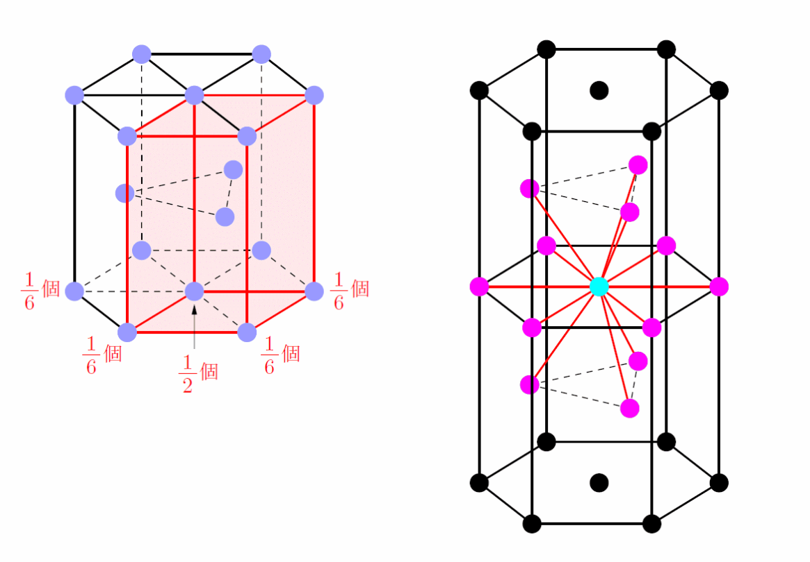

原子数：$2$；

配位数：$12$；

充填率：$74\%$。

### イオン結晶

#### $\ce{NaCl}$ 型構造

代表例： $\ce{NaCl,MgO,CuO,NaBr}$ など。

面心立方配置をとる**陰イオン**の隙間（八面体空隙）に陽イオンが入った構造。（またはその逆）

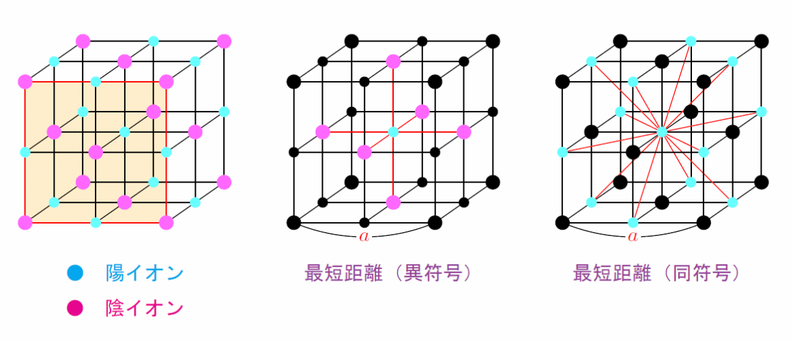

イオン数：陽イオン $4$，陰イオン $4$；

最近接粒子数：异符号 $6$，同符号 $12$；

イオン間最短距離：异符号 $\dfrac{1}{2}a$，同符号 $\dfrac{\sqrt{2}}{2}a$。

限界半径比：陽イオンが小さすぎて陰イオン同士が接触してしまう不安定な限界は $\dfrac{r_+}{r_-}=\sqrt{2}-1$。

#### $\ce{CsCl}$ 型構造

代表例：$\ce{CsCl, CsBr, NH4Cl}$ など。

単純立方配置をとる**陰イオン**の中心に陽イオンが入った構造。

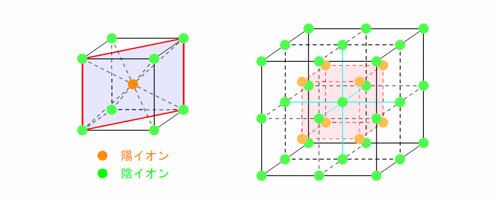

イオン数：陽イオン $1$，陰イオン $1$；

最近接粒子数：异符号 $8$，同符号 $6$；

イオン間最短距離：异符号 $\dfrac{\sqrt{3}}{2}a$，同符号 $a$。

限界半径比：陽イオンが小さすぎて陰イオン同士が接触してしまう不安定な限界は $\dfrac{r_+}{r_-}=\sqrt{3}-1$。

#### $\ce{CaF2}$ 型構造

**蛍石型構造**とも呼ばれる。

面心立方配置の**陽イオン**の内部にある8つの四面体空隙すべてに陰イオンが入った構造。$\ce{NaCl}$ 型と異なる点は、陰イオンが格子の辺（稜）上ではなく、単位格子を8等分した小立方体の中心に位置していることだ。陰イオンと近接する4つの陽イオンは、正四面体構造を作っている。

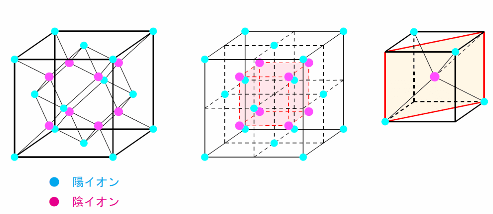

イオン数：陽イオン $4$，陰イオン $8$；

**異符号**最近接粒子数：

* 陽イオン：$8$ 個の陰イオンに囲まれる。
* 陰イオン：$4$ 個の陽イオンに囲まれる（正四面体構造）。

陽イオンと陰イオンの最短距離：$\dfrac{\sqrt{3}}{4}a$。

#### $\ce{ZnS}$ 型構造

**閃亜鉛鉱型構造**とも呼ばれる。

面心立方配置の**陰イオン**の内部にある8つの四面体空隙のうち、半分の4つに陽イオンが入った構造。$\ce{CaF2}$ 型と異なる点は、陽イオンは半分に充填する。

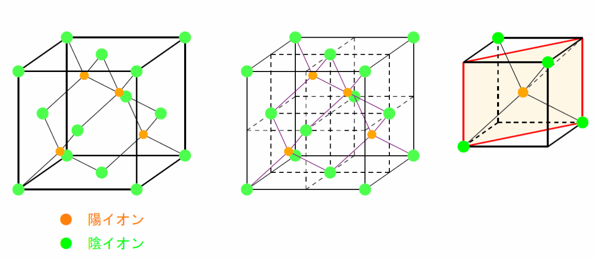

イオン数：陽イオン $4$，陰イオン $4$；

**異符号**最近接粒子数：

* 陽イオン：$4$ 個の陰イオンに囲まれる。
* 陰イオン：$4$ 個の陽イオンに囲まれる。

陽イオンと陰イオンの最短距離：$\dfrac{\sqrt{3}}{4}a$。

#### $\ce{Cu2O}$ 型構造

**赤銅鉱型構造**とも呼ばれる。

体心立方配置の**陰イオン**（酸素）によって作られる隙間に陽イオン（銅）が入った構造。酸素イオンは体心立方配置、銅イオンは正四面体配置をとる。

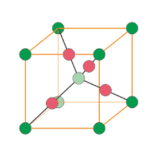

イオン数：陽イオン $4$，陰イオン $2$；

**異符号**最近接粒子数：

* 陽イオン：$2$ 個の陰イオンに囲まれる。
* 陰イオン：$4$ 個の陽イオンに囲まれる。

陽イオンと陰イオンの最短距離：$\dfrac{\sqrt{3}}{4}a$。

### 共有結合の結晶

原子が共有結合によって網目状に繋がった巨大な結晶，*中文原子结晶*。

一般に、**融点が極めて高く**、**硬度が高く**、**電気を通さない**。 ただし例外：黒鉛は層状構造のため柔らかく、電気を通す。

共有結合の結晶を作る主な物質：$\ce{C}$（ダイヤモンド）、$\ce{Si}$（ケイ素）、$\ce{SiO2}$（二酸化ケイ素・石英・水晶）、$\ce{SiC}$（炭化ケイ素）。

ダイヤモンドの結晶構造：$\ce{ZnS}$ 型と同じ配置だが、すべての原子が炭素である。

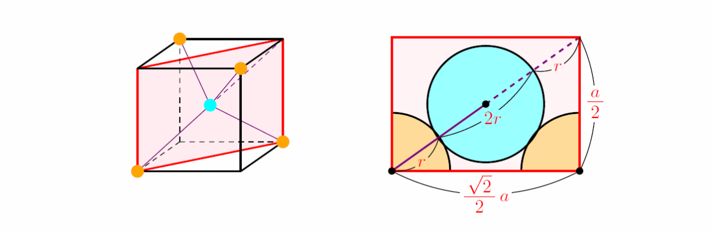

（上图非单位格子）

原子数：$8$；

配位数：$4$；

原子半径：$r=\dfrac{\sqrt{3}}{8}a$；

充填率：$34\%$。

### 分子結晶

分子が分子間力によって規則正しく配列した結晶。

分子間力は弱いため、分子結晶は**柔らかく**、**融点・沸点が低く**、**昇華性**を持つものがある（ヨウ素、ドライアイス、ナフタレンなど）。

### 分子間力

分子間に働く引力の総称、化学結合（共有・イオン・金属）よりはるかに弱い。

一般に、分子間力が強いほど物質の沸点は高くなる。

分子間力には、**ファンデルワールス力**や**水素結合**など、いくつかの種類がある。

#### ファンデルワールス力

中文范德华力。又分为：

* **配向力**，*中文取向力*，永久双極子を持つ極性分子間に働く引力。
* **誘起力**，*中文诱导力*，永久双極子と、それによって誘起された誘起双極子との間に働く引力。
* **分散力**，*中文色散力*，電子の揺らぎによって生じる瞬間双極子間に働く引力。すべての分子間に存在する。

> *注：关于分子间力以及范德华力的分类与描述，中国和日本教材描述不同，日本多数教材没有涉及范德华力的细分，有的教材则将極性分子間に働く静電気的な引力单列出来，有的教材将范德华力细分出库仑力。本文中按照中国高等教育出版社《无机化学》叙述。*

* 分散力：分子の形状が似ている場合、分子量が大きい（電子数が多い）ほど分散力は強くなる。また、分子量と極性が同程度の場合、直線形の分子の方が（接触面積が大きいため）分散力が強く働く。

* 配向力（極性引力）：分子量が同程度の場合、極性が大きい分子ほど配向力が強く働く。

#### 水素結合

*中文氢键*，$\ce{X-H\bond{~}Y}$ のように表される。。

水素結合は、電気陰性度の非常に大きい原子（主に $\ce{F, O, N}$）と共有結合している水素原子（$\ce{X-H}$）において、電気陰性度の差が大きいために強い極性が生じ、隣接する分子の電気陰性度の大きい原子（$\ce{Y}$）の非共有電子対を引きつけることで形成される。

> *氢键是由于 $\ce{X-H}$ 键（通常有 $\ce{F-H},\ce{O-H},\ce{N-H}$）中电负性相差过大，导致整体有很强的极性，继续吸引其他部分形成的。*

水素結合は一種の二次的な結合であり、原子間距離は化学結合とファンデルワールス力の中間に位置するが、明確な境界はない。一般に、水素結合の結合エネルギーはファンデルワールス力よりも強く、化学結合（共有結合やイオン結合）よりも弱い。

### まとめ

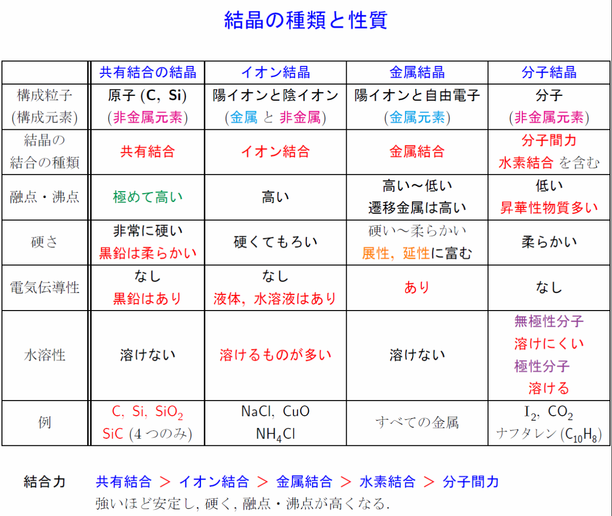

## 物質量

### 原子の相対質量

質量数 $12$ の炭素原子 $\ce{^{12}C}$ 1個の質量を $12$ と定めたときの、各原子の相対的な質量。

### 原子量

各元素の同位体の相対質量に、その天然存在比をかけて加重平均した値。

### 分子量

分子を構成する原子の原子量の総和。

例：$\ce{H2O}$ の分子量：$18$。

### 式量

イオン式や組成式に含まれる原子の原子量の総和。

例：$\ce{NaCl}$ の式量：$58.5$。

### アボガドロ数

質量数 $12$ の $\ce{^{12}C}$ $12\text{g}$ に含まれる原子の数。約 $6.02\times 10^{23}$ 個。

### 物質量

*中文物质的量*，粒子の個数を基準として表した物質の量。単位は**モル** $\mol$。

### アボガドロ定数

$1\mol$ あたりの粒子の個数。$N_A=6.02\times10^{23}/\mol$。

### ファラデー定数

電子 $1\mol$ が持つ電気量の大きさ。$F = 9.65 \times 10^4/\mol$。

### モル質量

物質 $1\mol$ あたりの質量。原子量・分子量・式量に単位 $\text{g/mol}$ をつけたものに等しい。

### モル体積

気体 $1\mol$ が占める体積。標準状態において、気体の種類によらず約 $22.4\text{L/mol}$。

標準状態：$0\degree \text{C} (273\text{K}), 1.013\times 10^5\text{Pa} (1\text{atm})$。

### 質量パーセント濃度

**溶液**の質量に対する**溶質**の質量の割合。*考虑质量百分比浓度常用来在已经知道某个溶液的情况下算其中有效物质的值，可以根据这个记忆。*
$$
\text{質量パーセント濃度[\%]}=\dfrac{\text{溶質[g]}}{\text{溶液[g]}}
$$

### モル濃度

単位体積の**溶液**中に含まれる**溶質**の物質量。*可以记忆为体積モル濃度，即每体积内モル的量。同样注意分母是溶液。*
$$
\text{モル濃度[mol/L]}=\dfrac{\text{溶質[mol]}}{\text{溶液[L]}}
$$

### 質量モル濃度

単位質量の**溶媒**中に含まれる**溶質**の物質量。**分母が「溶液」ではなく「溶媒」であることに特に注意が必要である。**
$$
\text{質量モル濃度[mol/kg]}=\dfrac{\text{溶質[mol]}}{\textbf{溶媒[kg]}}
$$

# 酸・塩基の反応

## 酸と塩基

### アレニウスの定義

*阿仑尼乌斯酸碱体系。*

酸：水に溶けて電離し、水素イオン $\ce{H+}$ を生じる物質。

塩基：水に溶けて電離し、水酸化物イオン $\ce{OH-}$ を生じる物質。

問題点：水以外の溶媒中での反応や、アンモニアのように $\ce{OH}$ を持たない物質の塩基性を説明できない。

### ブレンステッドの定義

*酸碱质子理论。*

酸：相手に水素イオン $\ce{H+}$を与える物質（プロトン供与体）。

塩基：相手から水素イオン $\ce{H+}$ を受け取る物質（プロトン受容体）。

酸・塩基の性質は絶対的なものではなく、相手との関係で決まる相対的なものであるとした。

## 代表的な酸と塩基

| 価数 | 強酸                                                         | 弱酸                                                         | 強塩基                                                       | 弱塩基                              |
| :--: | ------------------------------------------------------------ | ------------------------------------------------------------ | ------------------------------------------------------------ | ----------------------------------- |
| １価 | 塩酸 $\ce{HCl}$；硝酸 $\ce{HNO3}$；臭化水素 $\ce{HBr}$；ヨウ化水素 $\ce{HI}$ | 酢酸 $\ce{CH3COOH}$；フッ化水素酸 $\ce{HF}$                  | 水酸化ナトリウム $\ce{NaOH}$；水酸化カリウム $\ce{KOH}$      | アンモニア $\ce{NH3}$               |
| ２価 | 硫酸  $\ce{H2SO4}$；                                         | 炭酸 $\ce{H2CO3}$；シュウ酸 $\ce{H2C2O4}$；硫化水素 $\ce{H2S}$ | 水酸化バリウム $\ce{Ba(OH)2}$；水酸化カルシウム $\ce{Ca(OH)2}$ | $\ce{Mg(OH)2}$；$\ce{Cu(OH)2}$ など |
| ３価 | なし                                                         | なし                                                         | なし                                                         | $\ce{Al(OH)3}$；$\ce{Fe(OH)3}$ など |

３価中程度の酸：$\ce{H3PO4}$ リン酸。

塩基は、分子のアンモニアを除けばすべてイオン化合物であるため、水に溶けると一段階で電離するものがほとんどである。

$\ce{Ba(OH)2->Ba^2+ + 2OH-}$

 一方、酸はすべて分子であり、多価の酸は多段階で電離する。

$\ce{H2SO4->H+ + HSO4-}$

$\ce{HSO4-<=>H+ +SO4^2-}$

## 電離度

$$
\text{電離度}\alpha=\dfrac{\text{電離した酸・塩基の物質量}}{溶かした酸・塩基の物質量}
$$

強酸・強塩基は $\alpha \approx 1$。 弱酸・弱塩基は $\alpha \ll 1$。
$$
\ce{CH3COOH + H2O <=> CH3COO- + H3O+}
$$
濃度が薄いほど、電離度は大きくなる（オストワルトの希釈律）。

温度が高いほど、電離度は大きくなる（電離は吸熱反応）。

## 水のイオン積

*水的离子积*：
$$
K_w=[\ce{H+}][\ce{OH-}]=1.0\times10^{-14}\;(25\degree \text{C})
$$
水溶液中では、温度が一定であれば、水素イオン濃度と水酸化物イオン濃度の積は一定である。

純水では水素イオンと水酸化物イオンの濃度が等しく、この状態を中性と呼ぶ。
$$
\text{pH}=-\log_{10}[\ce{H+}]\\
$$
溶液の pH を計算する際に特に注意すべき点：中性に近い希薄な水溶液では、水の電離を無視することができない！

## 塩

### 塩の種類

* **正塩**：化学式中に酸の $\ce{H}$ も塩基の $\ce{OH}$ も含まない塩。$\ce{NaCl, NH4Cl, CH3COONa}$ など。
* **酸性塩**：化学式中に酸の $\ce{H}$ を含む塩。$\ce{KHSO4, NaHCO3}$ など。
* **塩基性塩**：化学式中に塩基の $\ce{OH}$ を含む塩。$\ce{MgCl(OH), CaCl(OH)}$ など。

正確には、水に溶けた後に電離して $\ce{H+}$ を生じうる水素原子があるかどうかで判断する。

塩の種類と、その塩の水溶液の液性（酸性・塩基性）は関係がない。

### 正塩の水溶液の性質

強酸＋強塩基からなる正塩：中性。

強酸＋弱塩基からなる正塩：酸性。

弱酸＋強塩基からなる正塩：塩基性。

## 中和滴定

**中和滴定**：中和反応の量的関係を利用して、濃度のわからない酸や塩基の濃度を求めること。
$$
\text{酸が出す}\ce{H+}\text{の物質量}\ce{=}\text{塩基が出す}\ce{OH-}\text{の物質量}
$$

### 実験道具

* **ホールピペット**：vollpipette，*移液管*，溶液を滴下する器具であるため、**共洗い**を行い、**濡れたまま使用**する。
* **ビュレット**：burette，*滴定管*，溶液を滴下する器具であるため、**共洗い**を行い、**濡れたまま使用**する。
* **メスフラスコ**：messkolben，*容量瓶*，溶液を受ける器具であるため、**蒸留水で洗浄**し、**濡れたまま使用**する。加熱乾燥させてはいけない。
* **コニカルビーカー**：conical beaker，*锥形瓶*，溶液を受ける器具であるため、**蒸留水で洗浄**し、**濡れたまま使用**する。

**メスシリンダー**：measuring cylinder，*量筒*，精度が低いため、中和滴定には使用しない。

### pH 指示薬

* **フェノールフタレイン**：phenolphthalein，*酚酞*，変色域は**無色** $8.0\ce{<->}9.8$ **赤色**。
* **メチルオレンジ**：methyl orange，*甲基橙*，変色域は**赤色** $3.1\ce{<->}4.4$ **黄色**。
* **メチルレッド**：methyl red，*甲基红*，変色域は**赤色** $4.2\ce{<->}6.2$ **黄色**。
* **ブロモチモールブルー**：bromothymol blue，*溴百里酚蓝*，変色域は**黄色** $6.2\ce{<->}7.0$ **緑色** $\ce{<->} 7.6$ **青色**。

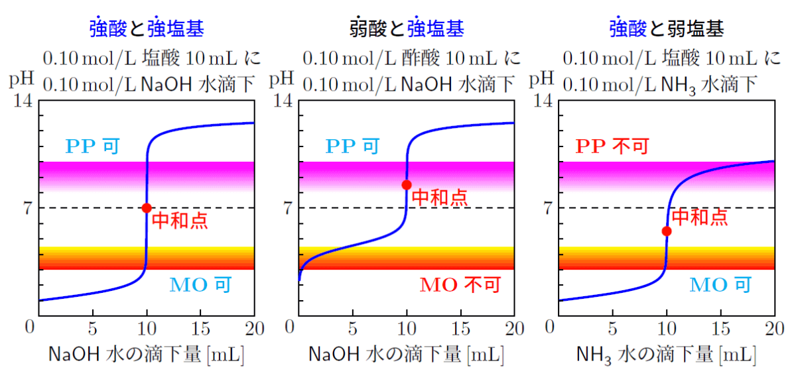

### 二段階滴定

炭酸ナトリウムを塩酸で滴定する場合、順に2つの反応が起こる：
$$
\ce{Na2CO3 + HCl -> NaCl + NaHCO3}\\
\ce{NaHCO3 + HCl -> NaCl + H2O + CO2}
$$
2つの段階の滴定量は等しくなるはずである。また、第1段階の指示薬にはフェノールフタレイン（塩基性側）、第2段階にはメチルオレンジ（酸性側）を用いる必要がある。

### 逆滴定

気体や固体を滴定する場合は、逆滴定を採用する必要がある。

例えば、アンモニアガスを滴定する場合、以下の方式を採用できる：

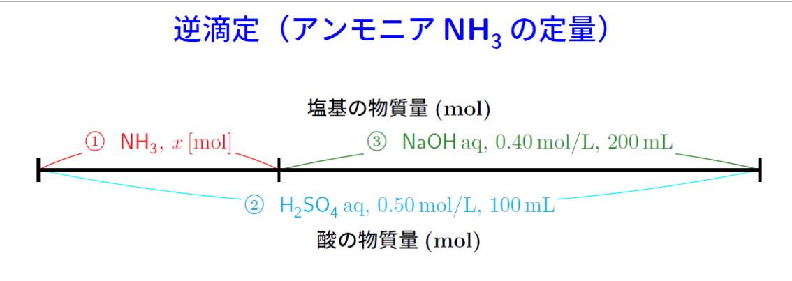

## 酸化物

### 分類

**酸化物**，*中文氧化物*，以下の2つに分類できる：

* **非金属の酸化物**：**酸性酸化物**，$\ce{NO2,CO2,SO2,SO3}$ など。
* **金属の酸化物**：**塩基性酸化物**，$\ce{Na2O,K2O,CaO,BaO}$ など。

### 中和反応

* $\text{塩基性酸化物}+\text{酸}\ce{->}\text{塩}+\text{水}$
  * $\ce{Na2O + 2HCl->2NaCl + H2O}$
  * $\ce{CaO + H2SO4 -> CaSO4 + H2O}$
  * $\ce{CuO + 2HCl -> CuCl2 + H2O}$
* $\text{酸性酸化物}+\text{塩基}\ce{->}\text{塩}+\text{水}$
  * $\ce{CO2 + Ca(OH)2 -> CaCO3 + H2O}$
  * $\ce{SiO2 + 2NaOH -> Na2SiO3 + H2O}$
* $\text{酸性酸化物}+\text{塩基性酸化物}\ce{->}\text{塩}$
  * $\ce{CO2 + CaO -> CaCO3}$
  * $\ce{SO2 + Na2O -> Na2SO3}$

## 弱酸・弱塩基の遊離反応

### 強酸による弱酸の遊離反応

*即强酸制弱酸*。$\text{弱酸由来の塩}+\text{強酸}\ce{->}\text{強酸由来の塩}+\text{弱酸}$。

* $\ce{ZnS + 2HCl -> ZnCl2 + H2S}$
* $\ce{CaCO3 + 2HCl -> CaCl2 + CO2 + H2O}$
* $\ce{Na2SO3 + H2SO4 -> Na2SO4 + SO2 + H2O}$

### 強塩基による弱塩基の遊離反応

*即强碱制弱碱*。$\text{弱塩基由来の塩}+\text{強塩基}\ce{->}\text{強塩基由来の塩}+\text{弱塩基}$。

* $\ce{NH4Cl + NaOH -> NaCl + NH3 + H2O}$

# 酸化還元反応

## 酸化と還元

**定義：電子の授受が起こる反応、酸化と還元は必ず同時に起こる。**

*即氧化还原反应*。

* **酸化剤：電子を奪い、相手を酸化する、自身は還元される。**
* **還元剤：電子を与え、相手を還元する、自身は酸化される。**

### 代表的な酸化剤

|            酸化剤            |                   反応前後の物質                    |
| :--------------------------: | :-------------------------------------------------: |
|  過マンガン酸イオン（酸性）  |                $\ce{MnO4- -> Mn2+}$                 |
| 過マンガン酸イオン（塩基性） |                $\ce{MnO4- -> MnO2}$                 |
|       二クロム酸イオン       |              $\ce{Cr2O7^2- -> Cr^3+}$               |
|            濃硝酸            |                 $\ce{HNO3 -> NO2}$                  |
|            希硝酸            |                  $\ce{HNO3 -> NO}$                  |
|           熱濃硫酸           |                 $\ce{H2SO4 -> SO2}$                 |
|         ハロゲン単体         | $\ce{Cl2 -> Cl-}\\ \ce{Br2 -> Br-}\\ \ce{I2 -> I-}$ |
|       次亜塩素酸イオン       |                 $\ce{ClO- -> Cl-}$                  |
|         塩素酸イオン         |                 $\ce{ClO3- -> Cl-}$                 |
|          過酸化水素          |                 $\ce{H2O2 -> H2O}$                  |
|          二酸化硫黄          |                   $\ce{SO2 -> S}$                   |
|             酸素             |                  $\ce{O2 -> H2O}$                   |
|            オゾン            |                $\ce{O3 -> H2O + O2}$                |

### 代表的な還元剤

|     還元剤     |      反応前後の物質       |
| :------------: | :---------: |
|      水素      |      $\ce{H2 -> H+}$      |
|    硫化水素    |      $\ce{H2S -> S}$      |
|   過酸化水素   |     $\ce{H2O2 -> O2}$     |
|   二酸化硫黄   |   $\ce{SO2 -> SO4^2-}$    |
|    シュウ酸    |   $\ce{(COOH)2 -> CO2}$   |
| ヨウ化物イオン |      $\ce{I- -> I2}$      |
|  鉄(Ⅱ)イオン   |   $\ce{Fe^2+ -> Fe^3+}$   |
| スズ(Ⅱ)イオン  |   $\ce{Sn^2+ -> Sn^4+}$   |
| チオ硫酸イオン | $\ce{S2O3^2- -> S4O6^2-}$ |

## 半反応式

以下の手順に従って半反応式を完成させる：

1. 反応前後の物質を並べる：$\ce{MnO4- -> Mn^2+}$；
2. 酸化数の変化に基づいて電子を加える：$\ce{MnO4- + 5e^- -> Mn^2+}$；
3. 電荷の保存に基づいて水素イオンまたは水酸化物イオンを補う：$\ce{MnO4- + 8H+ + 5e- -> Mn^2+}$；
4. 元素の保存に基づいて水を補う：$\ce{MnO4- + 8H+ + 5e- -> Mn^2+ + 4H2O}$。

## 金属のイオン化傾向

*金属的离子化倾向（金属的活泼性）*：
$$
\ce{Li K Ba Sr Ca Na Mg Al Mn Zn Cr Fe Co Ni Sn Pb (H2) Cu Hg Ag Pt Au}
$$
左から右へ行くにつれて、イオン化傾向は徐々に低下する。イオン化傾向が高いほど、電子を失う傾向が強い。

イオン化傾向がより大きい元素だけが酸化され得る。例：$\ce{Zn + 2H+ -> Zn^2+ +H2}$。

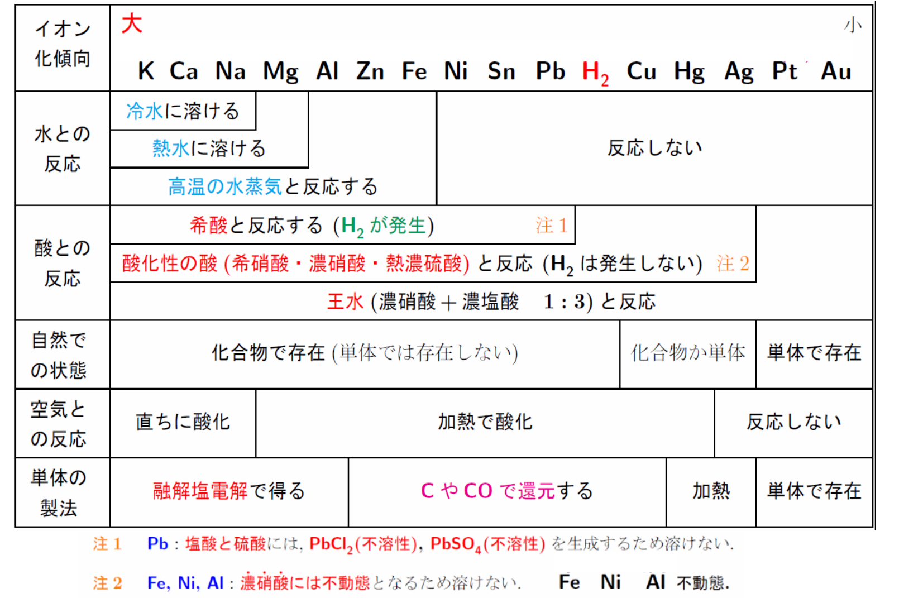

### 鉄の防食

* **トタン**：*铁镀锌。*
  * 鉄の表面に亜鉛をめっきしたもので、バケツなどによく使われる。
  * $\ce{Zn > Fe}$ であるため、酸性の液体に触れた際、$\ce{Zn}$ が電池の負極となって $\ce{Fe}$ に電子を放出し、$\ce{Fe}$ が酸化されるのを防ぐ。
  * *中文也叫：牺牲阳极保护法。*
* **ブリキ**：*铁镀锡。*
  * 鉄の表面にスズをめっきしたもので、缶詰によく使われる。
  * $\ce{Fe > Sn}$ であるため、一旦めっき層が破損すると、$\ce{Fe}$ が負極として溶解し、酸化が激しく進む。

## 電池

**電池**：*中文原电池*，酸化還元反応が自発的に起こり、化学エネルギーを電気エネルギーに変換する装置。

基本構成：電解液中にイオン化傾向の異なる2種類の金属を入れると、イオン化傾向の差が大きいほど電圧が高くなる。

|     **負極**     |     **正極**     |
| :--------------: | :--------------: |
| イオン化傾向：大 | イオン化傾向：小 |
|    電子を放出    |    電子を収容    |
|      還元剤      |      酸化剤      |
|     酸化反応     |     還元反応     |

### ボルタ電池

**ボルタ電池**，*中文伏打电堆*，**起電力** $1.0 \text{V}$。
$$
\ce{(-)Zn | H2SO4(aq) | Cu(+)}
$$

負極：

$$
\ce{Zn -> Zn^2+ + 2e-}
$$

正極：
$$
\ce{2H+ + 2e- -> H2}
$$
全反応式：
$$
\ce{Zn + 2H+ -> Zn^2+ + H2}
$$

現象：負極の亜鉛板が溶解し、正極で水素が発生する。

水素ガスが正極の銅板を包み込んでしまう（分極）ため、電圧が低下しやすく実用性はない。

### ダニエル電池

**ダニエル電池**，*中文丹尼尔电池*，**起電力** $1.1 \text{V}$。
$$
\ce{(-)Zn | ZnSO4(aq) | CuSO4(aq) | Cu(+)}
$$
2つの溶液の間にあるのは**素焼き板**で、**塩橋**と同じ役割を果たし、以下の2つの作用がある：

1. 溶液の隔離：異なる電解液が混ざるのを防ぐ。
2. イオンの通過：イオンを通過させ、両側の溶液の電荷バランスを保ち、閉回路を形成する。

負極：
$$
\ce{Zn -> Zn^2+ +2e-}
$$
正極：
$$
\ce{Cu^2+ + 2e- -> Cu}
$$
全反応式：
$$
\ce{Zn + Cu^2+ -> Zn^2+ + Cu}
$$
現象：負極の亜鉛板が溶解し、正極に銅の単体が析出する。

### 鉛蓄電池（二次電池）

**鉛蓄電池**，**起電力** $2.0 \text{V}$。
$$
\ce{(-)Pb | H2SO4(aq) | PbO2(+)}
$$
負極：
$$
\ce{Pb + SO4^2- -> PbSO4 + 2e-}
$$
正極：
$$
\ce{PbO2 + 4H+ + 2e- + SO4^2- -> PbSO4 + 2H2O}
$$
全反応式：
$$
\ce{Pb + 2H2SO4 + PbO2 <=>[放電][充電]　2PbSO4 + 2H2O}
$$
現象：放電中は、正極と負極の両方の質量が増加し、電解液の密度と濃度は減少する。

充電中は、正極同士、負極同士が接続されます。

### 水素ー酸素燃料電池

#### リン酸型燃料電池

**リン酸型燃料電池**（PAFC），**起電力** $1.2 \text{V}$。
$$
\ce{(-)Pt \cdot H2 | H3PO4(aq) | O2 \cdot Pt(+)}
$$
負極：
$$
\ce{H2 -> 2H+ + 2e-}
$$
正極：
$$
\ce{O2 + 4e- + 4H+ -> 2H2O}
$$
全反応式：
$$
\ce{2H2 + O2 -> H2O}
$$
注意点として、リン酸形燃料電池は触媒として $\ce{Pt}$ を使用する必要があり、$\ce{CO}$は $\ce{Pt}$ 表面に吸着してしまうため、$\ce{CO}$ を含んではいけない（被毒する）。

#### アルカリ型燃料電池

**アルカリ型燃料電池**（AFC），**起電力** $1.2 \text{V}$。
$$
\ce{(-)H2 | KOH(aq) | O2(+)}
$$
負極：
$$
\ce{H2 + 2OH- -> 2H2O + 2e-}
$$
正極：
$$
\ce{O2 + 2H2O + 4e- -> 4OH-}
$$
全反応式：
$$
\ce{2H2 + O2 -> H2O}
$$
依然として触媒に金属が必要だが、安価な金属を選ぶことができる。

ただし、空気の純度に対する要求が高く、$\ce{CO2}$ があると $\ce{KOH}$ と反応してしまい、電池の劣化を招く。

## 電気量とファラデー定数

$$
Q[\text{C}]=I[\text{A}]\times t[\text{s}]
$$

C：クーロン、電荷の単位。

A：アンペア、電流の単位。
$$
F=eN_A=96500[\text{C/mol}]
$$
$F$：ファラデー定数、電子 $1\text{mol}$ 当たりの電気量。

## 電気分解

外部電源から電流を流して自然には起こらない方向に強制的に酸化還元反応を起こす。

電池とは逆に、電気エネルギーが化学エネルギーに変換する。

|          |   $\oplus$極   |  $\ominus$極   |
| :------: | :------------: | :------------: |
|   電池   | 正極、還元反応 | 負極、酸化反応 |
| 電気分解 | 陽極、酸化反応 | 陰極、還元反応 |

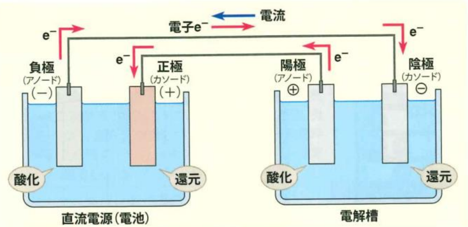

### 電極で起こる反応の優先順位

| 優先順位 | 陽極（電源の正極側）酸化反応                                 |
| -------: | :----------------------------------------------------------- |
|     １位 | 電極が $\ce{Ag,Cu}$ なら、電極自身が溶け出す。$\ce{Ag->Ag+ + e-}\\\ce{Cu->Cu^2+ +2e-}$ |
|     ２位 | 水溶液中に $\ce{Cl-,Br-,I-}$ があるなら、単体が生成する。$\ce{2Cl- -> Cl2 ^ +2e-}\\ \ce{2I- -> I2 + 2e-}$ |
|     ３位 | 酸素 $\ce{O2}$ が発生する（$\text{pH}$ が下がる）$\text{酸性・中性：}\ce{2H2O -> O2 ^ + 4H+ + 4e-}\\ \text{塩基性：}\ce{4OH- -> O2 ^ + 2H2O + 4e-}$ |

| 優先順位 | 陰極（電源の負極側）還元反応                                 |
| -------: | :----------------------------------------------------------- |
|     １位 | 水溶液中に $\ce{Ag+,Cu^2+}$ があるなら、単体が析出する。$\ce{Ag+ + e- ->Ag}\\\ce{Cu^2+ +2e- ->Cu}$ |
|     ２位 | 水素 $\ce{H2}$ が発生する。$\text{酸性：}\ce{2H+ + 2e- -> H2 ^}\\ \text{塩基性・中性：}\ce{2H2O + 2e- -> H2 ^ + 2OH-}$ |

### 溶融塩電解

イオン化傾向の大きさが $\ce{Al}$ 以上の金属の単体は、水溶液を電解分解しても得られない。金属よりも先に水溶液中の水が還元されてしまうからである。

そこで、結晶そのものを直接加熱融解した水がない状態で電気分解することになる。

### 銅の電解精錬

* イオン化傾向大きい金属：電解液に溶け出す。
* イオン化傾向小さい金属：陽極の下に沈殿する（陽極泥）。

陽極泥：

* $\ce{Cu}$ よりイオン化傾向小さい金属（$\ce{Au,Pt,Ag}$）単体が析出。
* $\ce{Cu}$ よりイオン化傾向大きい金属（$\ce{Zn,Fe,Ni}$）電解液に溶け出す。
* $\ce{Pb}$ はイオン化傾向大きいが、$\ce{PbSO4}$ となり、陽極泥になる。

陽極：$\ce{Cu -> Cu^2+ + 2e-}$。

陰極：$\ce{Cu^2+ + 2e- -> Cu}$。

# 物質の状態と平衡

## 粒子の拡散と熱運動

拡散：物質の粒子が自動的に散らばって全体に広がる現象。

熱運動：物質を構成する個々の粒子の無秩序な運動、高温ほど激しい。

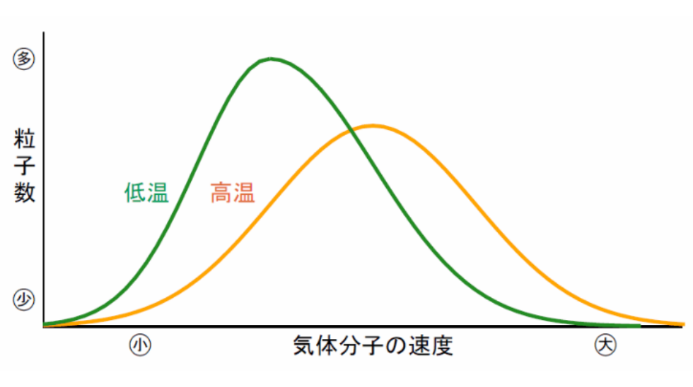

低温でも非常に速い速度の分子から非常に遅い速度の分子までが幅広く分布している。

高温になるほどこの分布がより高速側に移動する。

粒子数は変わらないから、図の曲線と横軸で囲ま れた面積は常に同じである。

高温になるほど全ての粒子の平均速度も大きくなる。

## 蒸気圧

### 飽和蒸気圧

液体を密閉容器に入れて一定温度に保つと、やがて液体の蒸発が見かけ上停止する。この状態を**飽和状態**という。

**飽和蒸気圧**：飽和状態のときの気体（蒸気）が示す圧力。単に蒸気圧ともいう。**一定温度では、容器の体積に関係なく、一定値を示す。**

**飽和状態**：单位時間に蒸発する分子の数と凝縮する分子の数が等しい。そのため、見かけ上変化が停止する。このような状態を**平衡状態**といい、気体と液体の間で成り立つ平衡状態を**気液平衡**という。

### 大気圧の測定

水銀で満たされたガラス管を水銀の入った容器に倒立させ、**760mm**の高さの水銀柱ができ、ガラス管内の上部 はほぼ真空状態になる（トリチェリー真空：水銀の蒸気圧があるため、完全な真空とは言えない）。

これは、水銀面に働く大気圧と760mmの水銀柱の 圧力が**釣り合う**ことを意味している。

よって、$1\text{atm}=760\text{mmHg}=1.013\times 10^5 \text{Pa}$。

水銀を使うのは、常温で液体の金属で密度が大きいためである。

### 蒸気圧曲線

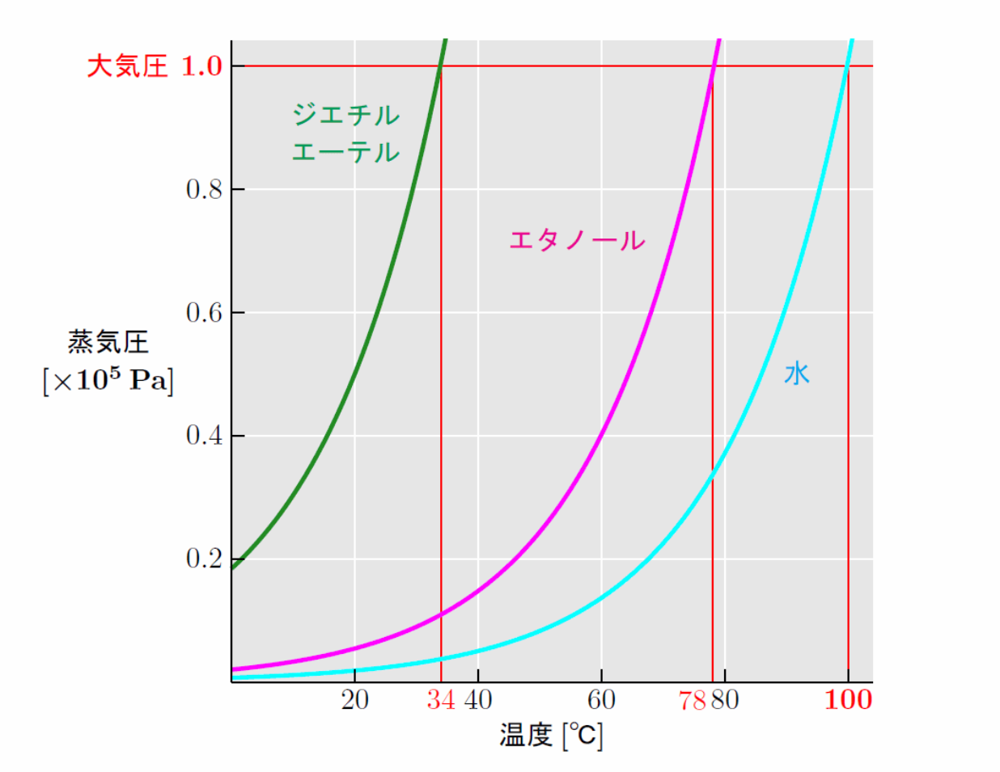

同じ温度では、蒸気圧の大きい物質ほど蒸発しやすい。蒸気圧の大きい物質では、分子間に働く引力が弱く、気体になりやすい。

### 液体の存在の判別

全ての気体と仮定したときの圧力の理論値は $P$ ならば、その温度での蒸気圧を$P_0$、とすると、

* $P\leq P_0$ の場合は、液体が存在せず、分圧は $P$。
* $P>P_0$ の場合は、液体が存在し、分圧は $P_0$。

## 物質の三態

* 固体：物質の構成粒子が互いに決まった位置にある。 一定の形をもち、体積がある。
* 液体：物質の構成粒子が互いの位置を自由に変えられる。 形をもたないが、体積がある。
* 気体：物質の構成粒子がそれぞれ自由に高速で運動している。形をもたず、体積もない。

### 水の状態変化

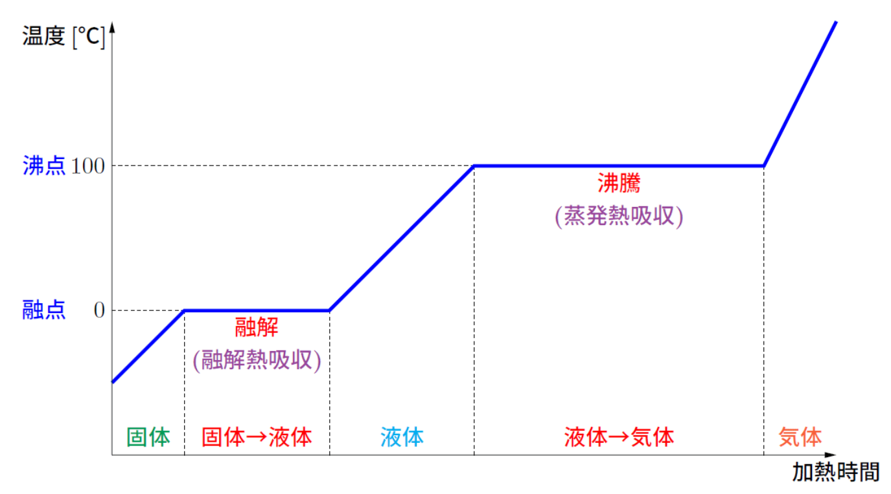

1. 固体(0℃未満)の水を加熱していく、（熱エネル ギーを加えていく）、温度が上昇していく。
2.  0℃になったところで融解が始まる。融解の間は加えた熱エネルギーが全て状態変化（固体から液体への変化）に使われる。 よって、水分子の運動エネルギー（速度）は増えず、融解が終わるまで水の温度は上昇しなくなる。
3. 融解が終わると再び温度が上昇し始める。
4. 100度になったところで沸騰が始まる、融解と同様に沸騰が終わるまでは温度上昇せず。
5. 沸騰が終わると再び温度が上昇し始める。

蒸発熱は融解熱に比べてかなり大きい理由：融解では分子間力を完全に断ち切る必要はなく、互いの位置が変化できるようになりさえすればよい。蒸発では分子間力を無視して分子が自由に運動できるようにするため、大きなエネルギーを要する。

### 状態図

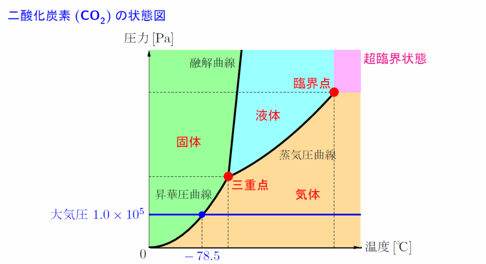

**三重点**：固体・液体・気体の三態が共存できる唯一の点。

**超臨界状態**：**臨界点**を超え、液体と気体が区別できなくなった状態。この状態の物質を**超臨界流体**という

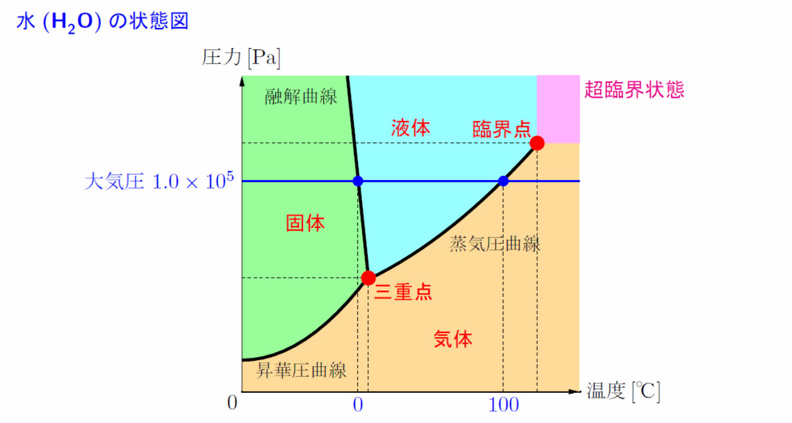

水は例外的に融解曲線が**右下がり**の曲線 となる。

水は、例外的に固体（氷）よりも液体（水）の 方が**体積が小さい**（密度が大きい）物質である。

氷は**水素結合の方向性**のせいで隙間の多い**正四面体構造**しかとれず、密度が液体の水よりも小さい。

## 気体の状態方程式

### ボイル・シャルルの法則

*波义耳-马略特定律*。

#### ボイルの法則

気体の物質量と温度が一定のとき、$P_1V1=P_2V_2$。物質量と温度が一定ならば、圧力と体積は**反比例**する。

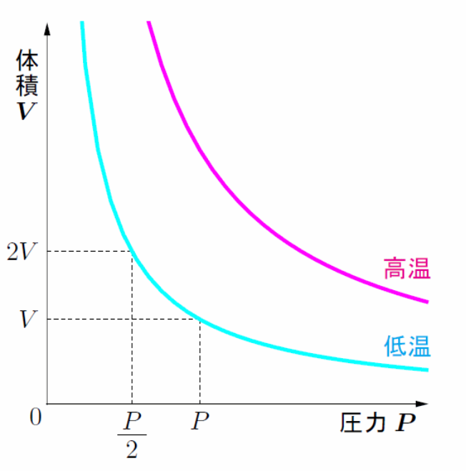

#### シャルルの法則

気体の物質量と圧力が一定のとき、$\dfrac{V_1}{T_1}=\dfrac{V_2}{T_2}$。物質量と圧力が一定ならば、温度と体積は**比例**する。

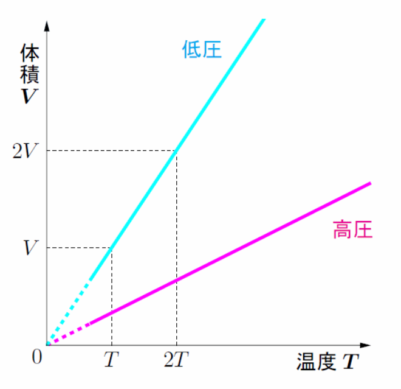

注意：これの $T$ は必ず**絶対温度**である。

#### ボイル・シャルルの法則

気体の物質量が一定のとき、$\dfrac{P_1V_1}{T_1}=\dfrac{P_2V_2}{T_2}$。

### アボガドロの法則

温度・圧力一定のとき、気体の体積は物質量に比例する。
$$
PV=nRT
$$
気体定数 $R=8.3\times 10^3 \text{Pa}\cdot\text{L/}(\text{K}\cdot \text{mol})$。

気体定数は、気体の種類によらない定数である。

### 混合気体

* 全圧：混合気体全体が示す圧力。
* 分圧：混合気体の全体積を各成分気体が単独で占めるときに示す圧力。各成分気体の分圧は共存する他の気体に影響されない。
* ドルトンの分圧の法則：混合気体の全圧は各成分気体の分圧の和に等しい。

$$
PV=(n_A+n_B)RT\\
P_AV=n_ART\\
P_BV=n_BRT
$$

### 実在気体

分子の体積と分子間力による影響を補正すると、実在気体でも成り立つ状態方程式を得る。
$$
\left(P_{実測}+\dfrac{n^2}{V^2_{実測}}a\right)\left(V_{実測}-nb\right)=nRT
$$
$a$ は分子間力による比例定数であり、$b$ は分子自身の体積による分子 $1\text{mol}$ の体積である。

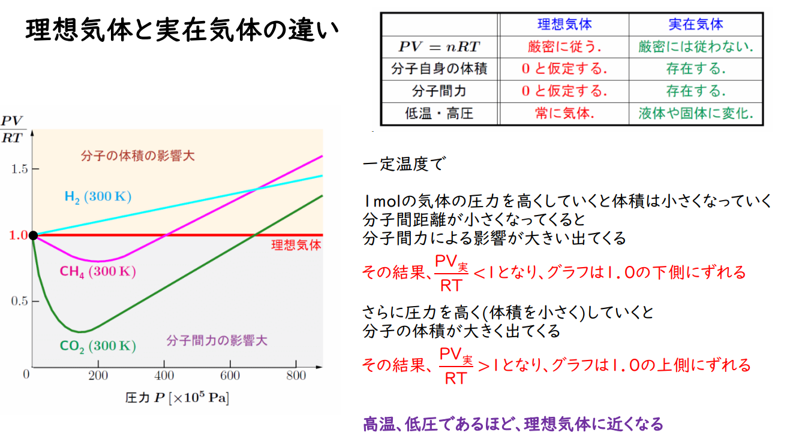

* 高温ほど、分子間力の効果が小さいため、理想気体に近い振る舞いをする。
* 分子間力は大きいほど大きくなり、$1.0$ の下側にずれる。
* 分子量が近くの場合、極性が大きいほど、分子間力が大きいため、より下側にずれる。

## 溶解度

### 固体の溶解度

**飽和溶液**：溶媒に溶質が限界まで溶けた溶液。

**溶解平衡**：溶解の速さと析出の速さが等しくなり、見かけた上、溶解や析出が停止した状態。

飽和溶液では溶解平衡が成立している。

**固体の溶解度**：**溶媒** $100\text{g}$ に溶けうる溶質の最大**質量**。

---

溶解度を $S$ とする飽和溶液に関して成り立つ比例式：
$$
\dfrac{\text{溶質の質量}}{\text{溶液の質量}}=\dfrac{S}{100+S}
$$

$$
\dfrac{\text{溶質の質量}}{\text{溶媒の質量}}=\dfrac{S}{100}
$$

### 水和物の溶解度

水和物を水に溶かしたとき、水和水が溶媒扱えとなり、溶媒が増える。

### 気体の溶解度

一定の圧力下では、高温になるほど、気体の溶解度が小さくなる。

溶媒は**反応せず**、溶解度が比較的に小さい気体に対し、**ヘンリーの法則**が成立する。（水に溶けやすい気体：$\ce{NH3,HCl}$ は成立しない。）

#### ヘンリーの法則

* 圧力による表現：一定温度で一定量の溶媒に溶ける気体の**物質量**は、その気体の**圧力（分圧）**に比例する。
* 体積による表現：一定温度で一定量の溶媒に溶ける気体の、 その圧力下の体積は、圧力に関係なく一定である。（ただし、**最初の圧力下に換算すると圧力と比例する**。）

## 蒸気圧降下

不揮発性の物質が溶けた溶液の蒸気圧は、**純溶媒の蒸気圧より小さくなる**。

溶液の場合、溶媒分子の蒸発が溶質により、阻害されるためである。

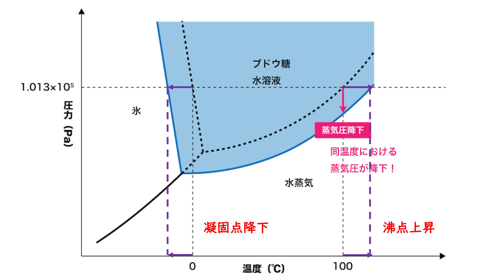

### ラウールの法則

* $P_0$：純溶媒の蒸気圧；
* $P$：不揮発性の溶質が溶解した希薄溶液の蒸気圧；
* $n$：溶質粒子の物質量；
* $N$：溶媒粒子の物質量；
* $M$：溶媒粒子の分子量；
* $X_\text{溶媒}$：溶媒のモル分率；
* $m$：溶媒の質量モル濃度。

$$
P=\dfrac{N}{N+n}P_0=X_\text{溶媒}P_0\\
\Delta P=P_0-P=\dfrac{n}{N+n}P_0\approx\dfrac{n}{N}P_0=km
$$

希薄溶液では $N$ は $n$ より十分大きいので、$N+n\approx N$ と近似することができる。

$k$ は溶媒に**固有の定数**。

### 沸点上昇と凝固点降下

* **沸点上昇**：不揮発性の物質が溶けた溶液の沸点は、純溶媒より**高く**なる。
* **凝固点降下**：不揮発性の物質が溶けた溶液の凝固点は、純溶媒より**低く**なる。
* 質量モル濃度 $m$：**溶媒** $1kg$ あたりの溶質の物質量。

---

$\Delta t$ は、溶質の種類によらず、**全溶質粒子数**に比例する。

非電解質の希薄溶液の場合、$\Delta t$ は質量モル濃度 $m$ に比例する。

電解質の希薄溶液の場合、 $\Delta t$ は**電離して生じるイオンなどの合計質量モル濃度** $m$ に比例する。

$K_b$：**モル沸点上昇定数**。$\Delta t_b=K_bm$；

$K_f$：**モル凝固点降下定数**。$\Delta t_f=K_fm$。

### 電離度と会合度

水のモル凝固点降下を $K_f$、**電離度** $\alpha$ の電解質 $\ce{X2Y}$ の質量モル濃度を $m$、 とすると：

| $\ce{mol/kg}$ |  $\ce{X2Y}$   |  $\ce{X+}$  | $\ce{Y^{2-}}$ |
| :-----------: | :-----------: | :---------: | :-----------: |
|    電離前     |      $m$      |     $0$     |      $0$      |
|    反応量     |  $\alpha m$   | $2\alpha m$ |  $\alpha m$   |
|    電離後     | $(1-\alpha)m$ | $2\alpha m$ |  $\alpha m$   |

$\Delta t=K_fm(1+2\alpha)$

ベンゼン $\ce{C6H6}$ のモル凝固点降下を $K_f'$、酢酸の質量モル濃度を $m'$、**会合度** $\gamma$、とすると：

| $\ce{mol/kg}$ | $\ce{CH3COOH}$ |    $\ce{(CH3COOH)2}$    |
| :-----------: | :------------: | :---------------------: |
|    会合前     |      $m'$      |           $0$           |
|    反応量     |  $\gamma m'$   | $\dfrac{1}{2}\gamma m'$ |
|    会合後     | $(1-\gamma)m'$ | $\dfrac{1}{2}\gamma m'$ |

$\Delta t=K_f'm'\left(1-\dfrac{1}{2}\gamma\right)$

## 冷却曲線

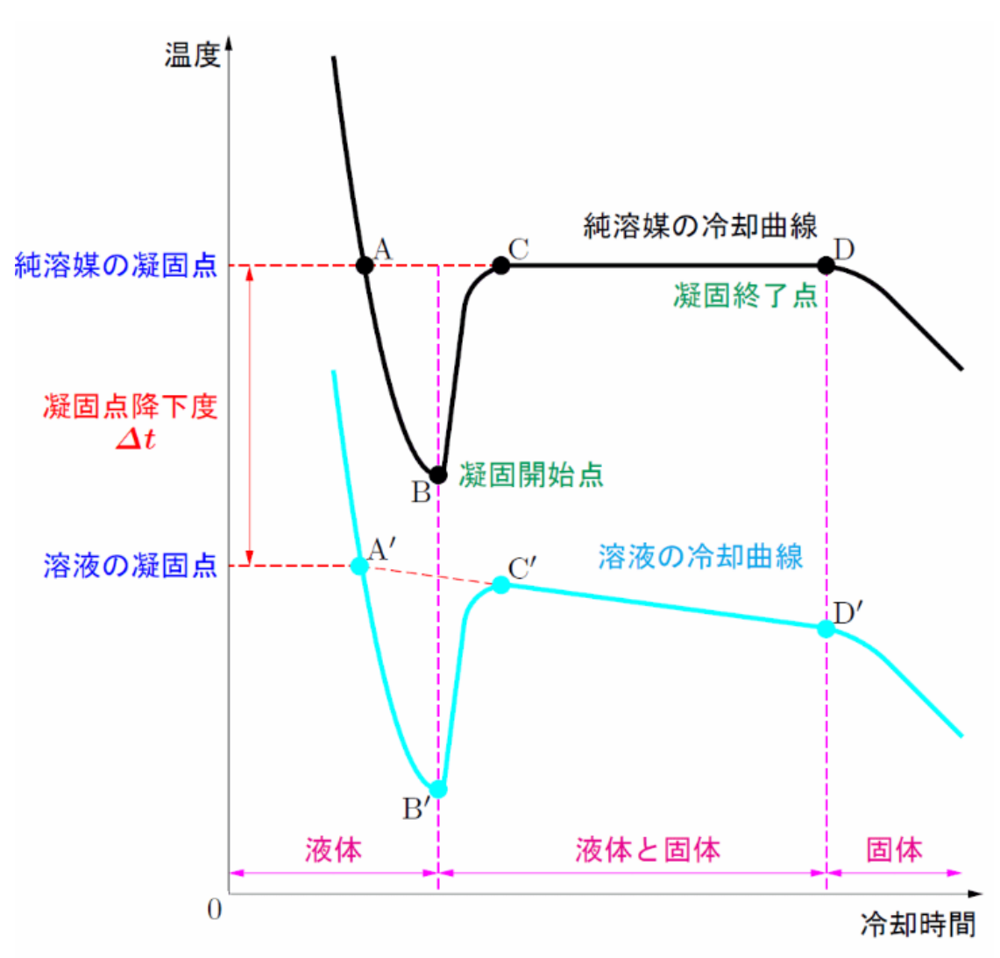

* $A\rightarrow B$：結晶核を作るため、液体が凝固点に達しても直ちに凝固が始まらず、更なる温度低下が続く。この状態を**過冷却**という。
* $B\rightarrow C$：凝固が始まると、凝固熱が一気に放出され、温度が上がる。（冷却されるエネルギー＜凝固熱）
* $C\rightarrow D$：冷却による吸熱と凝固による発熱が釣り合って、一定の温度を保つ。（冷却されるエネルギー＝凝固熱）過冷却しないと仮定してときに、凝固が始まるはずの点 $A$ が**凝固点**である。
* $D\rightarrow$：溶媒の凝固が終わると凝固熱が発生しなくなる。
* $C'\rightarrow D'$：溶液では溶媒のみが凝固していくので、残りの溶液の濃度 $m$ が上昇していく、すると、凝固点降下度 $K_f$ が濃度に比例して大きくなり、$\Delta t=K_fm$ で、温度が減少していく。過冷却しないと仮定してときに、凝固が始まるはずの点 $A'$ が凝固点である。

## 浸透圧

* **半透膜**：大きい溶質粒子を通さず、小さい溶媒分子のみを通す膜。
* **浸透**：半透膜を通って溶媒分子が溶液の濃度が均一になる方向へ拡散する現象。
* **浸透圧**：
  1. 半透膜を通って溶媒が溶液側に浸透しようとする圧力；
  2. 溶媒と溶液の液面差 $h$ の溶液の圧力；
  3. 溶媒と溶液の液面を等しくするために必要な圧力。

* 逆浸透法：溶液側に浸透圧以上の圧力を加えると、溶液側の溶媒分子が溶媒側に移動。

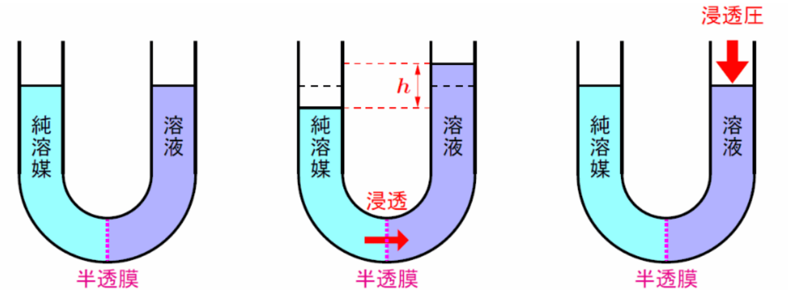

### ファントホッフの法則

*范特霍夫渗透压定律*。

浸透圧 $\Pi$ は、溶液のモル濃度 $c$ と絶対温度 $T$ に比例する、**溶媒や溶質の種類によらない**。

* $R$：気体定数；
* $n$：溶質の物質量；
* $w$：溶質の質量；
* $M$：溶質の分子量、

とすると、
$$
\Pi=cRT\\
\Pi V=nRT\\
\Pi V=\dfrac{w}{M}RT
$$

* **非電解質**の希薄溶液の場合、 浸透圧 $\Pi$ は溶液のモル濃度 $c$ に比例する。
* **電解質**の希薄溶液の場合、 浸透圧 $\Pi$ は**電離して生じるイオンなどの合計**モル濃度 $c$ に比例する。

沸点上昇・凝固点降下と同じである。

---

浸透圧 $\Pi$ は「溶質分子が溶媒中に拡散しようとする圧力」。

気体の圧力 $p$ は「気体分子が真空（という溶媒）中に拡散しようとする圧力」。

## コロイド

* **コロイド粒子**：直径が **$10^{-9}$ ～ $10^{-7}\text{m}$** の粒子、半透膜に通らないがろ紙に通る大きさ。
  * **分散質**：コロイド粒子として分散している物質（溶質に相当）；
  * **分散媒**：コロイド粒子を分散している物質（溶媒に相当）。

### 分類

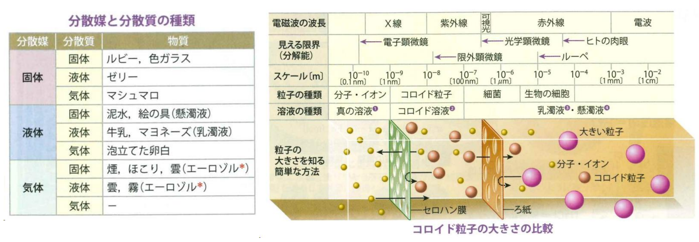

#### 流動性

* **ゾル**：*溶胶*。流動性のあるコロイド溶液（分散系が液体）。例：各コロイド溶液；
* **ゲル**：*凝胶*。ゾルが加熱や冷却で固化したもの。例：豆腐、こんにゃく；
* **キセロゲル**：*干凝胶*。ゲルを乾燥させて分散媒を除いたもの。例：シリカゲル。

#### 構造

* **分子コロイド**：*分子胶体*。$1$ 個の高分子化合物がコロイド粒子。例：デンプン水溶液、タンパク質水溶液；
* **会合コロイド**（ミセルコロイド）：*缔合胶体（胶束胶体）*。多数の分子が会合してできたコロイド粒子。例：セッケン水；
* **分散コロイド**：*分散胶体*。水に不溶の粒子が集まってできたコロイド粒子。例：水酸化鉄（III）、金、泥。

#### 水和性

* **疎水コロイド**：水和しにくい、少量の電解質で容易に沈殿する（凝析）。 例：金属の水酸化物、粘土、主に無機物質；
* **親水コロイド**：水和しやすい、多量の電解質でようやく沈殿する（塩析）。例：デンプン、タンパク質、主に有機物質；
* **保護コロイド**：水に不溶の粒子が集まってできたコロイド粒子。例：墨汁（にかわ「膠」「親水コロイド」が炭素「疎水コロイド」を保護）。

### コロイド溶液の性質

* **チンダル現象**：*丁达尔效应*。コロイド溶液に横から光を当てると、光の進路が明るく見える現象。（コロイド粒子によって光が散乱されるためである。）
* **ブラウン運動**：*布朗运动*。チンダル現象を限外顕微鏡で見たときのコロイド粒子の不規則な運動。（熱運動する溶媒分子がコロイド粒子に不規則な衝突するためである。）
* **電気泳動**：*电泳*。コロイド溶液に直流電圧を加えると、**反対符号**の電極へ移動する。（コロイド粒子が正または負に帯電しているためである。）
  * 負コロイド粒子：デンプン、硫黄、粘土など。
  * 正コロイド粒子：タンパク質、水酸化鉄（Ⅲ）、水酸化アルミニウムなど。
* **透析**：*渗析*。小さい不純物を含むコロイド溶液を半透膜で包み、流水につける。（不純物が半透膜を通って拡散し、半透膜中にコロイド粒子が精製される。）

# 熱化学

## 温度と熱量

* **温度**：物質の温かさや冷たさの度合い。
* **熱**：**高温物質**から**低温物質**へ移動するエネルギー、その量を熱量という。
* **比熱** $c[\text{J/(g}\cdot\text{K)}]$：物質 $1\text{g}$ を $1\text{K}$ 温度上昇させるのに必要な熱量 $\text{[J]}$。
  * 質量 $m$、比熱 $c$ 、上昇した温度 $\Delta t$、吸収した熱量 $Q$。
  * $Q=cm\Delta t$。

---

* **反応の温度変化の測定**：

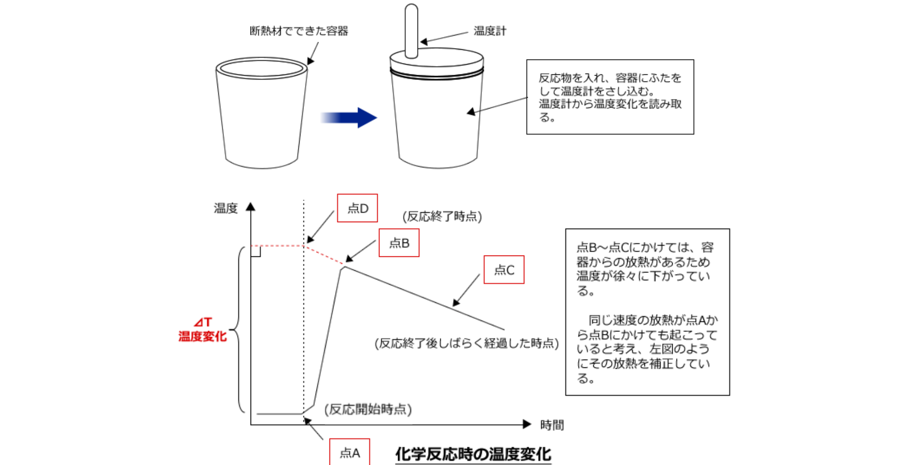

## 反応エンタルピー

### 反応熱と反応エンタルピー

* **反応系**：反応に関わる物質の集まりを反応系。
* **外界**：反応系の外側の世界を外界という。
* **反応熱** $Q$：**外界のエネルギー量**の増減。
* **反応エンタルピー** $\Delta H$：**反応系のもつエネルギー量**の増減。

$$
\Delta H=H_\text{生成物}-H_\text{反応物}\\
Q=-\Delta H
$$

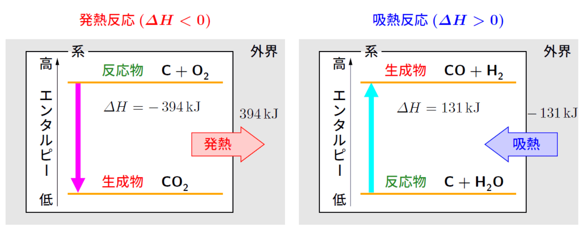

### 熱化学方程式

* **化学エネルギー**：化学結合や状態にに由来する物質固有のエネルギー。
* 反応エンタルピー：着目物質 $1\text{mol}$ あたりのエンタルピーの変化量。
* **熱化学方程式**：化学反応式にエンタルピー変化 $\Delta H$ を付けた式。

$$
\ce{C(黒鉛) + O2(g) -> CO2(g)}\quad \Delta H=-394\text{kJ}
$$

$$
\ce{\dfrac{1}{2}N2(g) + \dfrac{1}{2}O2(g) -> NO(g)}\quad \Delta H=90\text{kJ}
$$

$$
\ce{H2SO4(l) + aq -> H2SO4 aq}\quad \Delta H=-95\text{kJ}
$$

他の物質の係数を分数にしてでも**着目物質の係数を $1$ **にする。各物質の状態「(固)、(液)、(気)」を化学式に付記する。同素体が存在する物質は同素体の種類を示す。

---

発熱反応：熱を外部に放出する反応。反応物のエンタルピー $>$ 生成物のエンタルピー。
$$
\ce{C(黒鉛) + O2(g) -> CO2(g)}\quad \Delta H=-394\text{kJ}
$$
吸熱反応：熱を外部から吸収する反応。反応物のエンタルピー $<$ 生成物のエンタルピー。
$$
\ce{C(黒鉛) + H2O(g) -> CO(g) + H2(g)}\quad \Delta H=131\text{kJ}
$$

### 様々な反応エンタルピー

#### 燃焼エンタルピー $\Delta_c H$

$1\mol$ の物質が完全燃焼するときにの反応エンタルピー。**必ず発熱反応、符号は $-$** である。

エタン $\ce{C2H6(g)}$ の燃焼エンタルピーが $-1561 \kJ/\mol$ である。
$$
\ce{C2H6(g) + O2(g) -> 2CO2(g) + 3H2O(l)}\quad\Delta H=-1561\kJ
$$

#### 生成エンタルピー $\Delta_f H$

単体から $1\mol$ の物質を生成するときの反応エンタルピー。左辺は必ず単体である、なお、**単体の生成エンタルピーは $0$ とする**。

二酸化炭素 $\ce{CO2(g)}$ の生成エンタルピーが $-394 \kJ/\mol$ である。
$$
\ce{C(黒鉛) + O2(g) -> CO2(g)}\quad\Delta H=-394\kJ
$$
エチレン $\ce{C2H4(g)}$ の生成エンタルピーが $52 \kJ/\mol$ である。
$$
\ce{2C(黒鉛) + 2H2(g) -> C2H4(g)}\quad\Delta H=52\kJ
$$

#### 中和エンタルピー $\Delta_nH$

酸と塩基の中和反応により、$1\mol$ の水が生成するときの反応エンタルピー。強酸と強塩基の希薄溶液の中和エンタルピーは酸と塩基の種類によらず約 $56\kJ$。**必ず発熱反応、符号は $-$** である。

塩酸と水酸化ナトリウム水溶液の中和エンタルピーが $-56 \kJ/\mol$ である。
$$
\ce{HCl aq + NaOH aq -> NaCl aq + H2O(l)}\quad \Delta H=-56\kJ
$$

#### 溶解エンタルピー $\Delta_{sol}H$

$1\mol$ の物質が多量の溶媒に溶解するときの反応エンタルピー。

水酸化ナトリウム $\ce{NaOH(s)}$ の水への溶解エンタルピーが $-44.5 \kJ/\mol$ である。
$$
\ce{NaOH(s) + aq -> NaOH aq}\quad \Delta H=-44.5\kJ
$$
硝酸カリウム $\ce{KNO3(s)}$ の水への溶解エンタルピーが $34.9 \kJ/\mol$ である。
$$
\ce{KNO3(s) + aq -> KNO3 aq}\quad \Delta H=34.9\kJ
$$

#### 水和エンタルピー $\Delta_{hyd}H$

気体状のイオン $1\mol$ が多量の水中で水和イオンになるときの反応エンタルピ一。**必ず発熱反応、符号は $-$** である。

ナトリウムイオン $\ce{Na+(g)}$ の水和エンタルピ一が $-403\kJ/\mol$ である。
$$
\ce{Na+(g) + aq -> Na+ aq}\quad \Delta H=-403\kJ
$$

### 状態変化によるエンタルピー変化

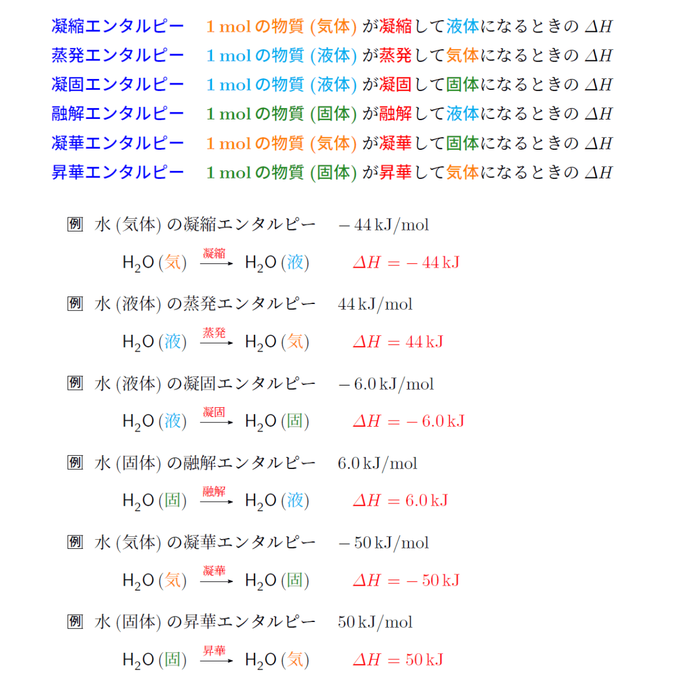

## ヘスの法則

ヘスの法則（総熱量保存の法則）：

**反応エンタルピーの総和は、反応前後の物質の種類と状態のみで決まり、変化の経路にはよらない**。

**反応エンタルピー = 生成物の生成エンタルピーの総和 - 反応物の生成エンタルピーの総和**

例：
$$
\begin{align}
\ce{2C(黒鉛) + 2H2(g) -> C2H4(g)}&\quad \Delta H=52\kJ\tag{1}\\
\ce{C(黒鉛) + O2(g) -> CO2(g)}&\quad \Delta H=-394\kJ\tag{2}\\
\ce{H2(g) + \dfrac{1}{2}O2(g) -> H2O(l)}&\quad \Delta H=-286\kJ\tag{3}
\end{align}
$$
エチレン $\ce{C2H4}$ の燃焼エンタルピーを求め。
$$
\ce{C2H4(g) + 3O2(g) -> 2CO2(g) + 2H2O(l)} \quad\Delta H=x\kJ\tag{4}
$$
$(4)=(1)\times(-1)+(2)\times 2+(3)\times 2$ であるから、
$$
x=52 \times(-1)+(-394)\times 2+(-286)\times 2=-1412\kJ
$$

---

熱化学方程式はエンタルピーの保存を表す等式である。 したがって、化学反応式を数学の方程式とみなし、化学式を代数変数として扱うことができる。化合物を単体と生成エンタルピーに置き換えることができる。
$$
\begin{align}
\ce{2C(黒鉛) + 2H2(g) + 52\kJ &-> C2H4(g)}\\
\ce{C(黒鉛) + O2(g)  - 394\kJ&-> CO2(g)}\\
\ce{H2(g) + \dfrac{1}{2}O2(g) - 286\kJ& -> H2O(l)}
\end{align}
$$
目的の式へ代入すると、
$$
\begin{align}
\ce{2C + 2H2 + 52\kJ + 3O2 &-> 2C + 2O2 - 788\kJ + 2H2 + O2 -572\kJ}\\
\ce{52\kJ &-> -1360\kJ}
\end{align}
$$

$$
\Delta H=-1360\kJ-52\kJ=-1412\kJ
$$

---

単体の生成エンタルピーは $0$ であるという定義を利用し、物質の生成エンタルピーを、そのままその物質の持ちエンタルピー値とみなす。
$$
\begin{align}
\ce{C2H4(g) = 52\kJ}\\
\ce{CO2(g) = -394\kJ}\\
\ce{H2O(l) = -286\kJ}
\end{align}
$$
目的の式へ代入すると、
$$
\ce{52\kJ -> - 788\kJ - 572\kJ}
$$

$$
\Delta H=-1360\kJ-52\kJ=-1412\kJ
$$

## 様々なエネルギー

### 結合エネルギー

気体分子内の共有結合 **$1\mol$** を切断するのに必要なエネルギー。**必ず吸熱反応**である。

$\ce{H-H}$ の結合エネルギーが $432\kJ/\mol$ である。
$$
\ce{H2(g) -> 2H(g)}\quad \Delta H=432\kJ
$$

### 解離エネルギー

気体分子内の**すべての共有結合**を切断するのに必要なエネルギー。**必ず吸熱反応**である。

$\ce{CH4}$ の解離エネルギーが $1664\kJ/\mol$ であり、

$\ce{C-H}$ の結合エネルギーが $\dfrac{1664\kJ/\mol}{4}=416\kJ/\mol$ である。
$$
\ce{CH4(g) -> C(g) + 4H(g)}\quad \Delta H=1664\kJ
$$

### 格子エネルギー

イオン結晶 $1\mol$ を気体状態のイオンにするのに必要なエネルギー。**必ず吸熱反応**である。

### ボルン・ハーバーサイクル

イオン結晶を気体状態のイオンにして直接格子エネルギーを測定することは困難である。そこで、関連する他の反応熱を測定して、ヘスの法則を利用して、格子エネルギーを求ることになる。

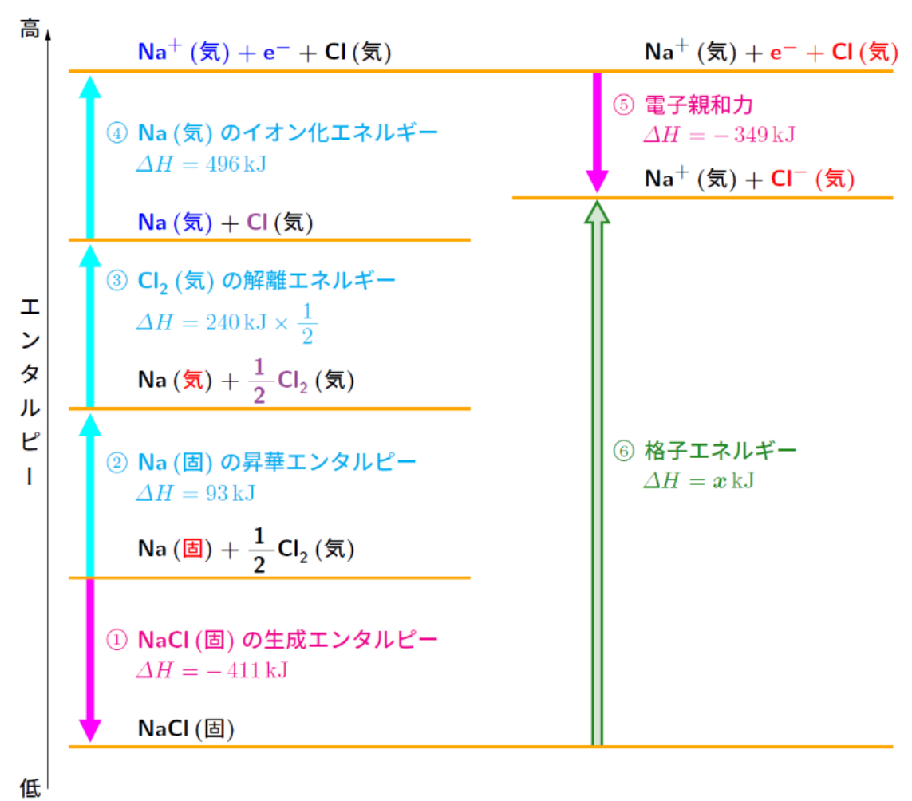

# 化学平衡

## 化学反応の仕組み

### 活性化

* **活性化状態**：化学反応の途中に経由するエネルギーの高い不安定な状態。
* **活性化エネルギー**：反応物が活性化状態になるときに必要な最小のエネルギー。
* **触媒**：活性化エネルギーが小さい別の経路を作り、 反応速度を大きくする。自身は変化せず、また反応熱も変化しない。

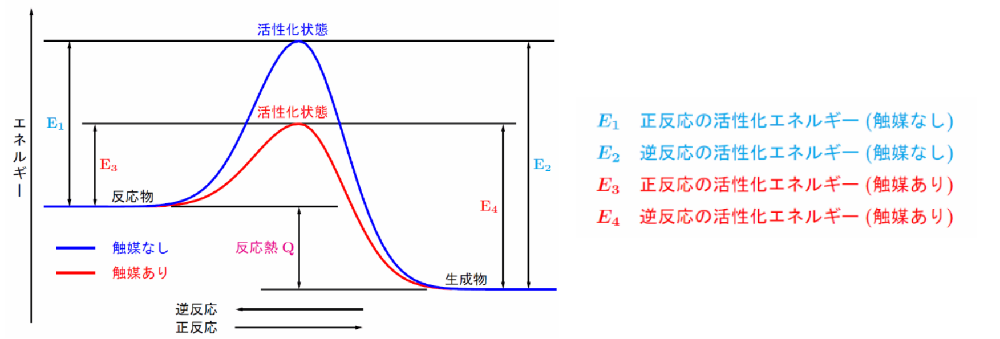

### 反応速度

* **反応速度**：単位時間あたりの物質の変化量。

$$
\text{反応速度}=\dfrac{\text{反応物のモル濃度の減少量}}{\text{反応時間}}=\dfrac{\text{生成物のモル濃度の増加量}}{\text{反応時間}}
$$

$$
\ce{H2 + I2 -> 2HI}\\
\bar v=-\dfrac{\Delta[\ce{H2}]}{\Delta t}=-\dfrac{\Delta[\ce{I2}]}{\Delta t}=\dfrac{1}{2}\dfrac{\Delta[\ce{HI}]}{\Delta t}
$$

* **反応速度式**：反応速度と反応物の濃度の関係式。

**実験的に求められるもので、反応式から単純に判断することはできない**。

反応速度定数 $k$ は反応物の濃度によらない定数である。

ただし、反応の種類によって異なる。また、同じ反応でも温度や触媒によって異なる。
$$
\begin{align}
&\ce{2H2O2 -> 2H2O + O2} &&v=k\ce{[H2O2]}\\
&\ce{H2 + I2 -> 2HI} &&v=k\ce{[H2][I2]}\\
&\ce{HI -> H2 + I2} &&v=k\ce{[HI]^2}\\
&\ce{2NH3 -> N2 + 3H2} &&v=k\\
&\ce{H2 + Br2 -> 2HBr} &&v=\dfrac{k\ce{[H2]}\sqrt{\ce{[Br2]}}}{1+\dfrac{\ce{[HBr]}}{m\ce{[Br_2]}}}\\
\end{align}
$$

### 反応速度の増加条件

1. 濃度を大きくする、表面積を大きくする。（単位時間当たりの衝突回数が増加する。）
2. 温度を高くする。（活性化エネルギー以上のエネルギーを持った分子数が増加する。）
3. 触媒を加える。（活性化エネルギーが減り、それ以上のエネルギーの分子数が増加する。）

## 化学平衡

* **可逆反応**：正反応と逆反応のいずれの方向にも進む反応。
* **不可逆反応**：一方向にしか進まない反応。
* **平衡状態**：正反応と逆反応の反応速度が等しくなり、反応が止まって見える状態。

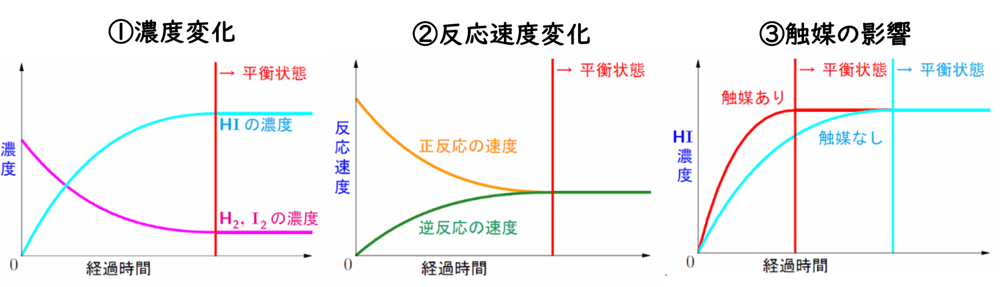

### 濃度平衡定数 $K_c$

可逆反応 $\ce{aA + bB <=> yY + zZ}$ が平衡状態にあるとき、

$$
K_c=\dfrac{\ce{[Y]^y[Z]^z}}{\ce{[A]^a[B]^b}}
$$

単位 $\left(\mol/\text{L}\right)^{(y+z)-(a+b)}$。

濃度平衡定数は温度が同じならば、**濃度によらず**、一定値をとる。

### 圧平衡定数 $K_p$

気体の可逆反応 $\ce{aA + bB <=> yY + zZ}$ が平衡状態にあるとき、
$$
K_p=\dfrac{P_\ce Y^yP_\ce Z^z}{P_\ce A^aP_\ce B^b}
$$
単位 $\left(\text{Pa}\right)^{(y+z)-(a+b)}$。

圧平衡定数は温度が同じならば、**圧力によらず**、一定値をとる。

### 濃度平衡定数と圧平衡定数の関係

$P_\ce AV=n_\ce ART$ より、$\ce{[A]}=\dfrac{n_\ce A}{V}=\dfrac{P_\ce A}{RT}$、
$$
K_c=K_p(RT)^{(a+b)-(y+z)}
$$
特に、 $a+b=y+z$ の時、$K_c=K_p$。

### ルシャトリエの原理

ある可逆反応が平衡状態にあるとする、濃度、圧力、温度などを変えると、平衡はその**変化を緩和する方向**に移動する。

| **外部から与えた変化** | **平衡移動の方向**         |
| ---------------------: | :------------------------- |
|           濃度を増やす | 濃度が減少する方向         |
|           濃度を減らす | 濃度が増加する方向         |
|           圧力を上げる | 気体の分子数が減少する方向 |
|           圧力を下げる | 気体の分子数が増加する方向 |
|           温度を上げる | 吸熱反応が起こる方向       |
|           温度を下げる | 発熱反応が起こる方向       |
|           触媒を加える | 移動しない                 |

#### 濃度

* 濃度（分圧）を増やすとき、濃度（分圧）を減少する方向に移動する：

  $\ce{N2 + 3H2 <=> 2NH3}\quad\Delta H<0$：$\rightarrow$ に移動する；

* 濃度（分圧）を減らすとき、濃度（分圧）を増加する方向に移動する：

  $\ce{N2 + 3H2 <=> 2NH3}\quad\Delta H<0$：$\leftarrow$ に移動する；

#### 圧力

* 圧力を大きくするとき、分子数が減少する（圧力を小さくする）方向に移動する：

  $\ce{N2 + 3H2 <=> 2NH3}\quad\Delta H<0$：$\rightarrow$ に移動する；

* 圧力を小さくするとき、分子数が増加する（圧力を大きくする）方向に移動する：

  $\ce{N2 + 3H2 <=> 2NH3}\quad\Delta H<0$：$\leftarrow$ に移動する；

$\ce{H2 + I2 <=> 2HI}\quad\Delta H<0$：移動しない。

* 圧力一定で希ガスを加える：分圧減少するため、$\leftarrow$ に移動する。
* 体積一定で希ガスを加える：分圧変わらずため、平衡移動しない。

#### 温度

* 温度を高くするとき、熱量を吸収する（温度を下げる）方向に移動する：

  $\ce{N2 + 3H2 <=> 2NH3}\quad\Delta H<0$：$\leftarrow$ に移動する；

* 温度を低くするとき、熱量が発生する（温度を上げる）方向に移動する：

  $\ce{N2 + 3H2 <=> 2NH3}\quad\Delta H<0$：$\rightarrow$ に移動する；

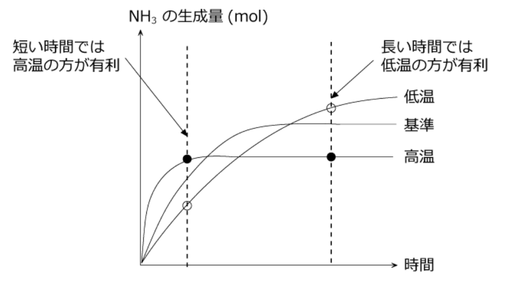

#### 触媒

触媒を加えたとき、平行移動しない（反応速度が大きくなる）。

触媒は、反応の前後で変化しないが、反応に関与する活性化エネルギーの減少によって、反応速度が上がる。

### ハーバー・ボッシュ法

$$
\ce{N2 + 3H2 <-> 2NH3}\quad \Delta H<0
$$

1. 発熱反応（$\Delta H<0$）であるから、**低温にする**と、平衡は右に移動する；
2. 反応式右の方が分子数が少ないから、**高圧にする**と、平衡は右に移動する；
3. 生成した $\ce{NH3}$ を取り出して（生成物の濃度を減らす）、平衡は右に移動する。

ルシャトリエの原理によって、**低温・高圧状態**はが望ましい。

また、適切な触媒 $\ce{Fe3O4}$ が見つけられ、**速度低下**の問題が解決された。

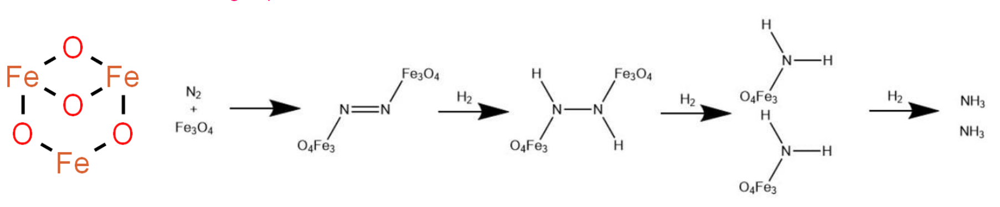

## 電離平衡

### 酸・塩基の電離定数 $K_a/K_b$

**弱酸や弱塩基**は水溶液中で**完全に電離できず**、**電離平衡**に達する。

電離平衡における平衡定数を**電離定数**という。

**温度が一定ならば、電離定数が一定である。**

#### 酸の電離定数

酢酸の電離平衡：
$$
\ce{CH3COOH + H2O <=> CH3COO- + H3O-}
$$
化学平衡の法則より：
$$
K=\dfrac{[\ce{CH3COO-}][\ce{H3O+}]}{[\ce{CH3COOH}][\ce{H2O}]}
$$
希薄溶液では、水は溶媒として多量に存在するため、電離によって消費される水の量は無視できる。したがって、$[\ce{H2O}]$ を一定とみなすと：
$$
K[\ce{H2O}]=\dfrac{[\ce{CH3COO-}][\ce{H3O+}]}{[\ce{CH3COOH}]}
$$
$K[\ce{H2O}]=K_a$ とおき、$[\ce{H3O+}]$ を $[\ce{H+}]$ と表す：
$$
K_a=\dfrac{[\ce{CH3COO-}][\ce{H+}]}{[\ce{CH3COOH}]}
$$
１価の弱酸 $\ce{HA}$ に対して、**酸の電離定数**：
$$
K_a=\dfrac{[\ce{A-}][\ce{H+}]}{[\ce{HA}]}
$$

#### 塩基の電離定数

アンモニア水の電離平衡：
$$
\ce{NH3 + H2O <=> NH4+ + OH-}
$$
化学平衡の法則より：
$$
K=\dfrac{[\ce{NH4+}][\ce{OH-}]}{[\ce{NH3}][\ce{H2O}]}
$$
希薄溶液では、水は溶媒として多量に存在するため、電離によって消費される水の量は無視できる。したがって、$[\ce{H2O}]$ を一定とみなすと：
$$
K[\ce{H2O}]=\dfrac{[\ce{NH4+}][\ce{OH-}]}{[\ce{NH3}]}
$$
$K[\ce{H2O}]=K_b$ とおく：
$$
K_b=\dfrac{[\ce{NH4+}][\ce{OH-}]}{[\ce{NH3}]}
$$
１価の弱塩基 $\ce{BOH}$ に対して、**塩基の電離定数**：
$$
K_b=\dfrac{[\ce{B+}][\ce{OH-}]}{[\ce{BOH}]}
$$

### 電離度が小さいとき

酢酸のモル濃度を $c[\mol/\text{L}]$、電離度を $\alpha$ とする：
$$
K_a=\dfrac{[\ce{CH3COO-}][\ce{H+}]}{\ce{CH3COOH}}=\dfrac{c\alpha\cdot c\alpha}{c(1-\alpha)}=\dfrac{c\alpha^2}{(1-\alpha)}
$$
$\alpha \ll 1$ のとき、$1-\alpha\approx 1$ と近似できる：
$$
K_a\approx c\alpha^2\\
\alpha=\sqrt{\dfrac{K_a}{c}}\\
[\ce{H+}] =c\alpha=\sqrt{cK_a}
$$

---

塩基についても同じである：
$$
K_b\approx c\alpha^2\\
\alpha=\sqrt{\dfrac{K_b}{c}}\\
[\ce{OH-}] =c\alpha=\sqrt{cK_b}
$$

## 加水分解平衡

### 塩の加水分解定数 $K_h$

#### 弱酸と強塩基による正塩

弱酸 $\ce{CH3COOH}$ と強塩基 $\ce{NaOH}$ が中和して正塩 $\ce{CH3COONa}$ ができる。

正塩 $\ce{CH3COONa}$ は水溶液中で加水分解して**塩基性**を示す：

塩の完全電離：
$$
\ce{CH3COONa -> CH3COO- + Na+}
$$
塩の加水分解平衡：
$$
\ce{CH3COO- + H2O <=> CH3COOH + OH-}
$$
化学平衡の法則より：
$$
K=\dfrac{[\ce{CH3COOH}][\ce{H+}]}{[\ce{CH3COO-}][\ce{H2O}]}
$$
$[\ce{H2O}]$ を一定とみなすと：
$$
K[\ce{H2O}]=\dfrac{[\ce{CH3COOH}][\ce{H+}]}{[\ce{CH3COO-}]}
$$
$K[\ce{H2O}]=K_h$ とおく：
$$
K_h=\dfrac{[\ce{CH3COOH}][\ce{OH-}]}{[\ce{CH3COO-}]}
$$
温度が一定ならば、$K_h$ は一定である。

酢酸の電離定数：
$$
K_a=\dfrac{[\ce{CH3COO-}][\ce{H+}]}{[\ce{CH3COOH}]}
$$
よって：
$$
K_aK_h=\dfrac{[\ce{CH3COO-}][\ce{H+}]}{[\ce{CH3COOH}]}\times\dfrac{[\ce{CH3COOH}][\ce{OH-}]}{[\ce{CH3COO-}]}=K_w
$$

$$
K_h=\dfrac{K_w}{K_a}
$$

#### 強酸と弱塩基による正塩

強酸 $\ce{HCl}$ と弱塩基 $\ce{NH3}$ が中和して正塩 $\ce{NH4Cl}$ ができる。

正塩 $\ce{NH4Cl}$ は水溶液中で加水分解して**酸性**を示す：

塩の完全電離：
$$
\ce{NH4Cl -> NH4+ + Cl-}
$$
塩の加水分解平衡：
$$
\ce{NH4+ + H2O <=> NH3 + H_3O+}
$$
化学平衡の法則より：
$$
K=\dfrac{[\ce{NH3}][\ce{H+}]}{[\ce{NH4+}][\ce{H2O}]}
$$
$[\ce{H2O}]$ を一定とみなすと：
$$
K[\ce{H2O}]=\dfrac{[\ce{NH3}][\ce{H+}]}{[\ce{NH4+}]}
$$
$K[\ce{H2O}]=K_h$ とおく：
$$
K_h=\dfrac{[\ce{NH3}][\ce{H+}]}{[\ce{NH4+}]}
$$
温度が一定ならば、$K_h$ は一定である。

アンモニア水の電離定数：
$$
K_b=\dfrac{[\ce{NH4+}][\ce{OH-}]}{[\ce{NH3}]}
$$
よって：
$$
K_bK_h=\dfrac{[\ce{NH4+}][\ce{H+}]}{[\ce{NH3}]}\times\dfrac{[\ce{NH3}][\ce{OH-}]}{[\ce{NH4+}]}=K_w
$$

$$
K_h=\dfrac{K_w}{K_b}
$$

### 加水分解度が小さいとき

$\ce{CH3COONa}$ のモル濃度を $c[\mol/\text{L}]$、加水分解度を $h$ とする：
$$
K_h=\dfrac{[\ce{CH3COOH}][\ce{OH-}]}{\ce{CH3COO-}}=\dfrac{ch\cdot ch}{c(1-h)}=\dfrac{ch^2}{(1-h)}
$$
$h\approx 0$ のとき、$1-h\approx 1$ と近似できる：
$$
K_h\approx ch^2\\
h=\sqrt{\dfrac{K_h}{c}}\\
[\ce{OH-}] =ch=\sqrt{cK_h}
$$

また：
$$
[\ce{H+}]=\dfrac{K_w}{\sqrt{cK_h}}=\sqrt{\dfrac{K_aK_w}{c}}
$$

---

強酸と弱塩基による正塩についても同じである：
$$
K_h\approx ch^2\\
h=\sqrt{\dfrac{K_h}{c}}\\
[\ce{H+}] =ch=\sqrt{cK_h}\\
[\ce{OH-}]=\dfrac{K_w}{\sqrt{cK_h}}=\sqrt{\dfrac{K_bK_w}{c}}
$$

### 加水分解と電離の関係

加水分解は、電離の逆反応とみなすことができる。電離は酸が $\ce{H+}$ を放出する過程であるのに対し、加水分解は酸の陰イオン（共役塩基）が水から $\ce{H+}$ を受け取る過程である。

電離と加水分解は、プロトンの移動方向が逆の現象であり、その平衡定数は互いに逆数の関係（積が $K_w$）になる。
$$
K_w=K_a\cdot K_h\\
K_w=K_b\cdot K_h
$$

### 緩衝液

**緩衝液**：少量の酸や塩基を加えても $\ce{pH}$ をほぼ一定に保つ水溶液。

**弱酸とその塩**の混合溶液や**弱塩基とその塩**の混合溶液がこの作用をもつ。

#### 弱酸とその塩による緩衝液

弱酸 $\ce{CH3COOH}$（濃度が $C_a$、電離度が $\alpha$ である）とその塩 $\ce{CH3COONa}$（濃度が $C_s$）の混合溶液：緩衝作用の仕組み：

$$
\ce{CH3COONa -> CH3COO- + Na+}\\
\ce{CH3COOH <=> CH3COO- + H+}
$$
$\ce{CH3COOH}$ の電離度 $\alpha$ は元々かなり小さい、$\ce{CH3COONa}$ の電離で生じる$\ce{CH3COO-}$ の影響（共通イオン効果、*同离子效应*）で、酢酸の電離平衡は大きく左側に偏る：

よって、酢酸は全く電離していないとみなす（$\alpha \approx 0$）：
$$
\ce{[CH3COOH]} = C_a(1-\alpha) \approx C_a\\
\ce{[CH3COO-]} = C_s + C_a\alpha \approx C_s\\
K_a=\dfrac{\ce{[CH3COO-]}[\ce{H+}]}{\ce{[CH3COOH]}}=\dfrac{C_s[\ce{H+}]}{C_a}\\
[\ce{H+}]=\dfrac{C_a}{C_s}K_a=\dfrac{n_a}{n_s}K_a
$$

---

緩衝作用の仕組み：

混合溶液中には $\ce{CH3COO-}$ と $\ce{CH3COOH}$ が多量に存在している。

混合溶液に酸 $\ce{H+}$ を加える：
$$
\ce{CH3COO- + H+ -> CH3COOH}
$$
$[\ce{H+}]$ の増加が緩和される。

混合溶液に塩基 $\ce{OH-}$ を加える：
$$
\ce{CH3COOH + OH- -> CH3COO- + H2O}
$$
$[\ce{OH-}]$ の増加が緩和される。

$[\ce{H+}]$ や $[\ce{OH-}]$ が増加すると電離平衡が移動し、その影響を緩和するわけである。

#### 弱塩基とその塩による緩衝液

弱酸 $\ce{NH3}$（濃度が $C_b$、電離度が $\alpha$ である）とその塩 $\ce{NH3Cl}$（濃度が $C_s$）の混合溶液：
$$
\ce{NH4Cl -> NH4+ + Cl-}\\
\ce{HN3 + H2O <=> NH4+ + OH-}
$$
$\ce{NH3}$ の電離度 $\alpha$ は元々かなり小さい、$\ce{NH4Cl}$ の電離で生じる$\ce{NH4+}$ の影響（共通イオン効果）で、アンモニア水の電離平衡は大きく左側に偏る：

よって、アンモニア水は全く電離していないとみなす（$\alpha \approx 0$）：
$$
\ce{[NH3]} = C_a(1-\alpha) \approx C_a\\
\ce{[NH4+]} = C_s + C_a\alpha \approx C_s\\
K_b=\dfrac{\ce{[NH4+]}[\ce{OH-}]}{\ce{[NH3]}}=\dfrac{C_s[\ce{OH-}]}{C_b}\\
[\ce{OH+}]=\dfrac{C_b}{C_s}K_b=\dfrac{n_b}{n_s}K_b
$$

---

緩衝作用の仕組み：

混合溶液中には $\ce{NH4+}$ と $\ce{NH3}$ が多量に存在している。

混合溶液に酸 $\ce{H+}$ を加える：
$$
\ce{HN3 + H+ <=> NH4+}
$$
$[\ce{H+}]$ の増加が緩和される。

混合溶液に塩基 $\ce{OH-}$ を加える：
$$
\ce{NH4+ + OH- -> NH3 + H2O}
$$
$[\ce{OH-}]$ の増加が緩和される。

$[\ce{H+}]$ や $[\ce{OH-}]$ が増加すると電離平衡が移動し、その影響を緩和するわけである。

## 溶解平衡

**溶解平衡**：単位時間に溶解する粒子数と析出する粒子数が等しくなり、見かけ上溶解も析出も起こっていないように見える状態。

飽和溶液中では溶解平衡が成立している。

**溶解度積**：溶解平衡における平衡定数 $K_{sp}$ を**溶解度積**という。

**温度が一定ならば溶解度積は一定である。**

### 難溶性塩の溶解度積 $K_{sp}$

塩化銀 $\ce{AgCl}$ の溶解平衡：
$$
\ce{AgCl(s) <=> Ag+ + Cl-}
$$
化学平衡の法則より：
$$
K=\dfrac{[\ce{Ag+}][\ce{Cl-}]}{[\ce{AgCl(s)}]}
$$
$[\ce{AgCl(s)}]$ を一定とみなすと：
$$
K[\ce{AgCl(s)}]=[\ce{Ag+}][\ce{Cl-}]
$$
$K[\ce{H2O}]=K_a$ とおく：
$$
K_{sp}=[\ce{Ag+}][\ce{Cl-}]
$$
$\ce{A_mB_n}$ の難溶性塩に対して、**溶解度積**：
$$
K_{sp}=[\ce{A^n+}]^m[\ce{B^{m-}}]^n
$$

### 沈殿の生成

溶液の最初の各イオンのモル濃度の積と溶解度積を比較すると、沈殿の生成を判定できる。
$$
\ce{AgCl(s) <=> Ag+ + Cl-}
$$

* $[\ce{Ag+}][\ce{Cl-}] > K_{sp}$：沈殿する；
* $[\ce{Ag+}][\ce{Cl-}] = K_{sp}$：平衡状態；
* $[\ce{Ag+}][\ce{Cl-}] < K_{sp}$：沈殿しない。

---

最初の $[\ce{Ag+}][\ce{Cl-}] > K_{sp}$ 場合：

$[\ce{Ag+}][\ce{Cl-}]$ を小さくするため、平衡は左に移動し、$\ce{AgCl}$ が沈殿する。

自然に $[\ce{Ag+}][\ce{Cl-}] = K_{sp}$ に移行できり、 $[\ce{Ag+}][\ce{Cl-}] = K_{sp}$  になった時点で平衡状態。

---
最初の $[\ce{Ag+}][\ce{Cl-}] < K_{sp}$ 場合：

$\ce{AgCl}$ を加えない限り、平衡は右に移動することができない。

自然に $[\ce{Ag+}][\ce{Cl-}] = K_{sp}$ になることがなく、$\ce{AgCl}$ は沈殿しない。
