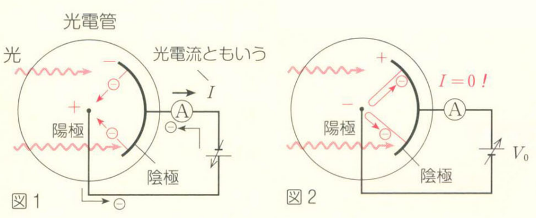
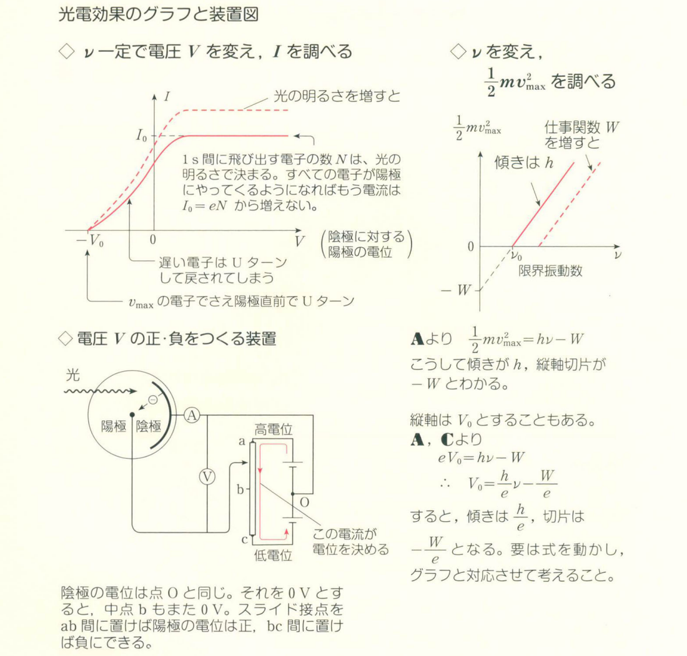
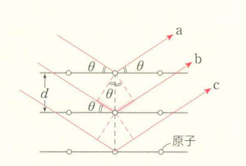
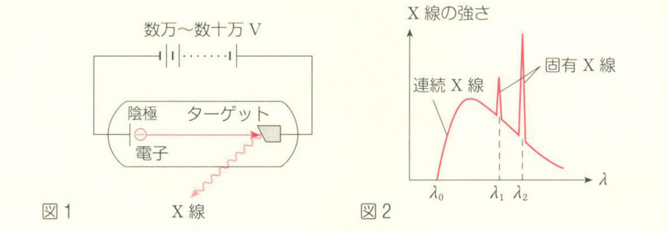
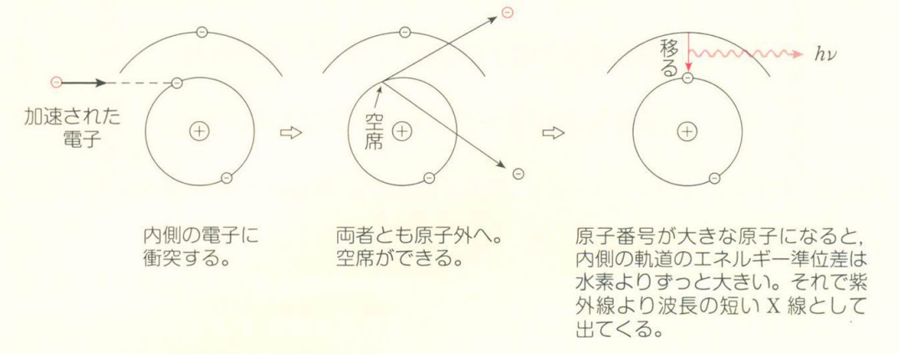

# 原子

## 粒子性と波動性

### 光電効果

光照在金属上，金属会发出电子，这被称为光电效应。

光的粒子性：

每个光子的能量：
$$
E=h\nu
$$
其中 $h$ 是**プランク定数**，$\nu$ 是**光の振動数**。

光子照到金属上，一部分做功 $W$ 用以将电子逸出，剩下的成为电子的动能。因此我们有**光電効果のエネルギー保存則**：
$$
\dfrac{1}{2}mv_{\max}^2=h\nu - W
$$
由于电子逸出所需能量不同，因此这里特指 $v_{\max}$。

本来电子飞出来后会冲向阳极形成电流。现在我们把电池反接，给电子施加一个**阻止電圧**。此时电流为 $0$，电场所做的功和电子的动能相等：
$$
\dfrac{1}{2}mv_{\max}^2=eV_0
$$

### コンプトン効果

光子和电子碰撞，会产生像力学碰撞一样的现象。

动量守恒和能量守恒是成立的：
$$
E=h\nu\\
p=\dfrac{h}{\lambda}=\dfrac{h\nu}{c}
$$
我们尝试推导光子的动量：

由狭义相对论：
$$
E^2=(pc)^2 + (mc^2)^2
$$
由于光子不具有质量，因此：
$$
E=pc
$$
因为：
$$
E=h\nu
$$
因此：
$$
p=\dfrac{h\nu}{c}=\dfrac{h}{\lambda}
$$

### 物質波

$$
\lambda=\dfrac{h}{p}=\dfrac{h}{mv}
$$

### ブラッグ反射

ブラッグ条件：
$$
2d\sin\theta=n\lambda
$$

需要注意，$\theta$ 并不是入射角，而是射线与晶面的夹角。

## 原子構造

### ボーアの水素原子モデル

由粒子性导出：
$$
m\dfrac{v^2}{r}=k\dfrac{e^2}{r^2}
$$
由波动性导出：

为了让电子形成驻波，轨道长度必须是波长的整数倍。因此我们得到量子条件：
$$
2\pi r=n\cdot\dfrac{h}{mv}
$$
其中 $n$ 是主量子数。

综合可得：
$$
r=\dfrac{h^2}{4\pi^2kme^2}\cdot n^2
$$
接下来我们推导电子的力学能量 $E$。

我们有势能：
$$
U=-\dfrac{ke^2}{r}
$$
动能：
$$
E_k=\dfrac{1}{2}mv^2=\dfrac{ke^2}{2r}
$$
于是我们可得：
$$
E=U+E_k=-\dfrac{ke^2}{2r}
$$
在玻尔模型中，电子的动能、电势能、总能量的大小关系永远是 $E_k : U : E = 1 : -2 : -1$。

代入我们之前求出的 $r$：
$$
E=-\dfrac{2\pi^2k^2me^4}{h^2}\cdot\dfrac{1}{n^2}
$$
于是我们可知：
$$
E_n\propto-\dfrac{1}{n^2}
$$
这就是能级：

电子的能量不是连续的，而是只能取一个个离散的值。

$n=1$ 时，能量最低（绝对值最大，负得最多），电子被绑得最紧，这叫**基底状態**。

$n \ge 2$ 时，能量变高（越来越接近 0），这叫**励起状態**。

当 $n \to \infty$ 时，$E \to 0$，电子彻底挣脱束缚，原子被**电离**。

### 電子遷移

振動数条件：电子在不同能级（轨道）之间跳跃时，能量差不能凭空消失，必须以**光子**的形式释放（或吸收）。 根据能量守恒，释放的光子能量 $h\nu$ 刚好等于两个能级之间的能量差：
$$
h\nu = E_{n'}-E_n
$$
放出的光有这几类：

1. ライマン系列：最终能级 $n=1$，紫外线。
2. バルマー系列：最终能级 $n=2$，可见光。
3. パッシェン系列：最终能级 $n=3$，红外线。

### X 線の発生

1. **連続 X 線**：电子被数万伏特的高压加速后，像子弹一样撞击金属靶（阳极）。高速电子在撞击中被猛烈减速。电磁学告诉我们，带电粒子变速运动就会向外辐射电磁波。因为每个电子撞击的方式、减速的程度千差万别，所以释放出的光子能量也是连续分布的。

   虽然波长是连续的，但它有一个绝对的**下限**，即电子在一次撞击中，把全部的动能全部变成了一个光子：
   $$
   eV=\dfrac{1}{2}mv^2=h\nu_0=h\dfrac{c}{\lambda_0}\\
   \lambda_0=\dfrac{hc}{eV}
   $$
   最短波长 $\lambda_0$ 只由加速电压 $V$ 决定，电压越高，$\lambda_0$ 越短。

2. **固有 X 線**：

   

   有些高速电子没被挡住，把金属靶原子**最内层**的电子给撞飞了。 这时，原子内层出现了一个“空席”。外层轨道上的电子就会立刻掉下来填补这个空席。

   因为靶原子的能级差是固定的，所以释放出的 X 射线波长也是极其精确的几个固定值。

   固有 X 射线的波长只由靶材决定，跟加速电压 $V$ 毫无关系。

   

这是一份完全仿照你的笔记风格，为你整理的“原子核”部分的复习大纲。

## 原子核

### 原子核の構造

- **原子核**由带正电的**陽子**（质子）和不带电的**中性子**（中子）构成，它们统称为**核子**。  
- **質量数** $A$ = 质子数 + 中子数。  
- **原子番号** $Z$ = 质子数。  
- 元素符号表示为 ${}_Z^A \text{X}$，其中中子数为 $A - Z$。  
- **同位体 (アイソトープ)**：质子数（原子序数）相同但中子数（质量数）不同的原子互为同位素。它们的化学性质相同，但质量不同。  
- **核力**：核子之间存在的引力。在相邻核子间，核力远大于质子间的库仑斥力，从而使原子核能够稳定存在。  
- **原子質量単位 [u]**：规定 ${}^{12}\text{C}$ 原子的质量精确为 12 u，1 u 大约等于 1 个核子的质量。  

### 放射性崩壊

不稳定的原子核会发生衰变并释放**放射線**。主要有三种类型：  

1. **$\alpha$ 崩壊**：释放出高速的氦原子核（$\alpha$ 射线，即 ${}_2^4 \text{He}$）。衰变后，原子序数减 2，质量数减 4。  
2. **$\beta$ 崩壊**：原子核内的中子突变为质子，同时释放出高速电子（$\beta$ 射线）。衰变后，原子序数加 1，质量数不变。此过程微观上也满足电荷守恒。  
3. **$\gamma$ 崩壊**：原子核有能级分布，从高能级状态跃迁到低能级状态时，释放出极短波长的电磁波（$\gamma$ 射线光子）。通常伴随 $\alpha$ 或 $\beta$ 衰变发生，不改变原子序数和质量数。  

**電離作用と透過力**：放射线的电离作用（将周围原子离子化的能力）和穿透能力成反比关系。  

- $\alpha$ 射线：电离作用大，穿透力小。  
- $\gamma$ 射线：电离作用小，穿透力大。  

**半減期 $T$**： 放射性原子的数量减少到原来一半所需的时间。原子核的衰变是一个概率现象。假设初始原子数为 $N_0$，经过时间 $t$ 后未发生衰变的剩余原子数 $N$ 为：  

$$
N = N_0\left(\frac{1}{2}\right)^{\frac{t}{T}}
$$

由于放射性物质原子数量极大，这在宏观上表现为极其稳定的统计规律。此公式同样适用于放射性物质的质量或辐射强度的计算。  

### 質量欠損と結合エネルギー

#### 質量欠損 $\Delta m$

将原子核拆散成单个核子后的总质量，大于原本原子核的质量，这个质量差就是质量亏损。  

$$
\Delta m = Zm_p + (A-Z)m_n - M
$$

其中 $m_p$ 为质子质量，$m_n$ 为中子质量，$M$ 为原子核质量。在原子核的世界里，传统的质量守恒定律是不成立的。  

#### 質量とエネルギーの等価性

根据相对论，质量是能量的一种形式，质量 $m$ 对应的静止能量 $E$ 公式为：  

$$
E = mc^2
$$

#### 結合エネルギー $\Delta E$

把原子核拆散成独立核子所需的能量（由于分散状态的静止能量大于原子核状态，这个差值即为结合能）。  

$$
\Delta E = \Delta m \cdot c^2
$$

将结合能除以核子数所得的 $\Delta E / A$（单个核子的结合能）是衡量原子核稳定性的指标，值越大说明原子核越稳定。轻核容易发生聚集而变得稳定的**核融合**，重核容易发生分裂而变得稳定的**核分裂**。  

### 原子核反応

#### 原子核反応式

在核反应方程式中，反应前后的**質量数の和**与**原子番号の和**分别保持相等。  

- 质量数之和守恒的背景是核子数守恒。  
- 原子序数之和守恒的背景是电荷守恒。  

#### エネルギー保存則

在核反应中，必须将各粒子的静止能量考虑在内。  

$$
\text{静止能量 } mc^2 + \text{ 动能 } \frac{1}{2}mv^2 = \text{常数}
$$

反应中“产生的能量（発生したエネルギー）”来源于反应前后总质量的减少部分 $\Delta m$。这部分缺失的质量转化为系统增加的动能：  

$$
\text{产生的能量} = \Delta m \cdot c^2
$$

这里 $\Delta m = (\text{反应前总质量}) - (\text{反应后总质量})$。  

#### 運動量保存則

由于核反应在真空中发生，不受外界作用力影响，因此动量守恒定律在此依然完全成立。特别是在静止状态下发生分裂时，产生的两个粒子的动能之比，等于它们质量的反比。  
