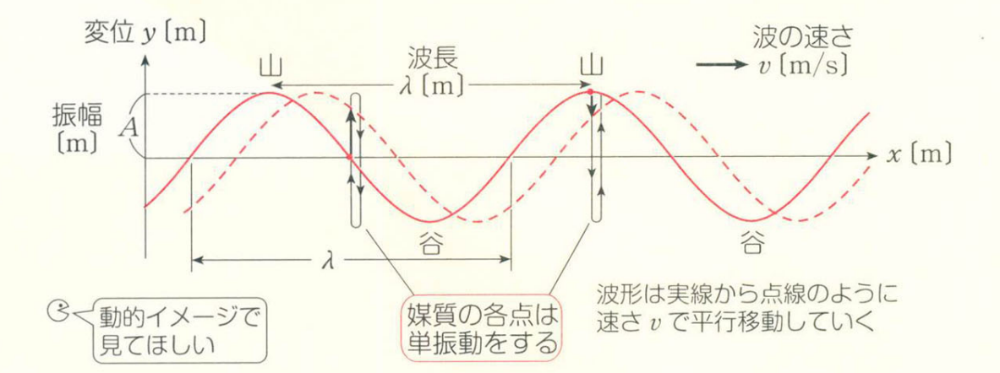
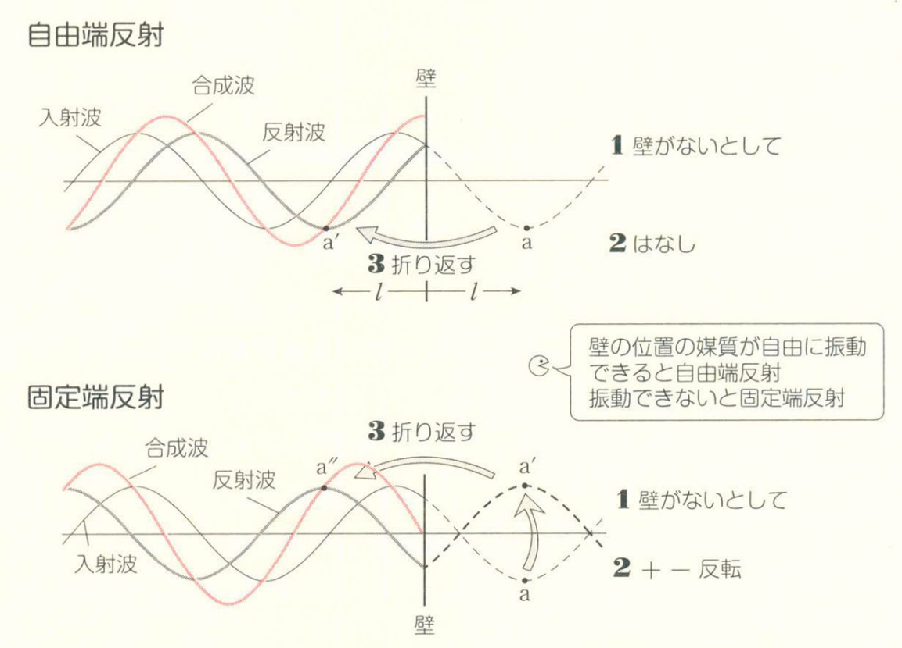
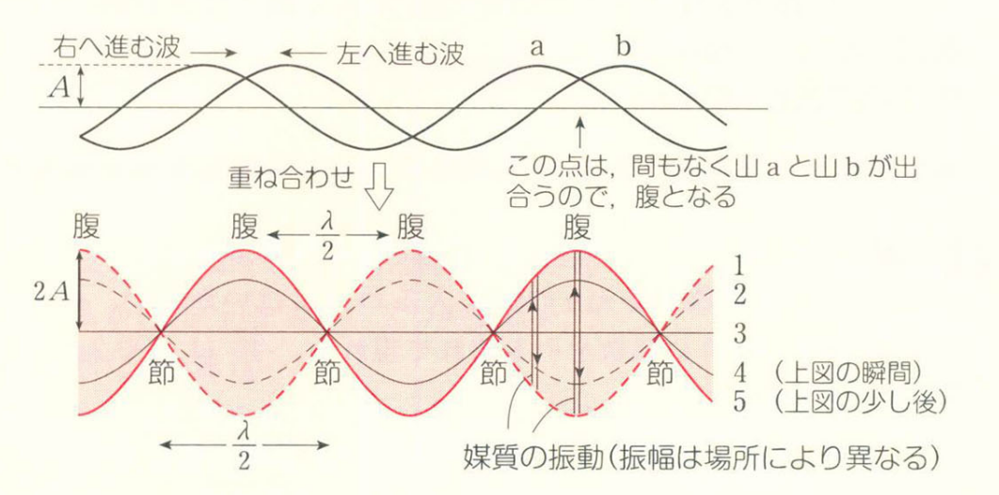
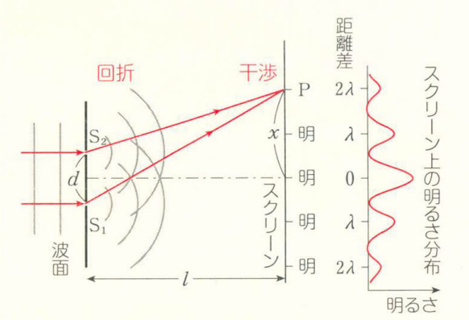

# 波の性質

只研究**正弦波**，介质的各点都在单振动。不同介质在不同相位上单振动，连成的图像就是正弦波。其中：峰与峰（谷与谷）间的最短距离称为波长 $\lambda$，波速记为 $v$，振幅（单个山/单个谷的高度）记为 $A$，振动的周期记为 $T$，频率为 $f$。由此我们可以得到：
$$
v=\dfrac{\lambda}{T}\\
v=f\lambda\\
$$

正弦波通常有两种图像：$y-x$ 图和 $y-t$ 图。其中 $y-x$ 图可以从图上方便地得出 $\lambda$；$y-t$ 图则可以方便地得到 $T$，可以由此求出各种相关量。

需要特别注意方向问题：在 $y-t$ 图中，我们关注的是某单一介质的运动轨迹，因此介质的运动应该是在 $y$ 轴上的，即如果是 $+x$ 方向，那么下一时刻的波形图，初相位应该向 $+y$ 方向移动。换言之，就是 $-x$ 方向。也就是说， $y-t$ 的图像移动方向和传播方向是相反的。

## 横波と縦波

想象一排均匀排列在 $x$ 轴上的介质。所谓**横波**，就是介质的振动方向和波的传播方向相反的波，换言之，单个介质是在 $y$ 方向上做单振动。而**縦波**则是介质的振动方向与波的传播方向相同，即在 $x$ 方向上做单振动。为了用 $y-x$ 图去表示纵波，$y$ 坐标表示 $x$ 上的介质的偏移量 $\Delta x$。

纵波有**疎と密**状态之分。如何判断纵波的疏密呢？对于某一点 $x$，考虑其正负方向的图像，其在 $y$ 轴上的距离就是 $x$ 轴上的距离。因此一般来说，单调递增的零点是疏，单调递减的零点是密。

## 波の反射

波的反射分为**自由端反射**和**固定端反射**。自由端反射，指的是介质可以在反射面上自由移动；而固定端反射指的是介质固定在反射面上。

先说结论：自由端反射，将原来的波延长后直接沿着反射面镜像对称即可得到反射波；固定端反射，将原来的波延长后，先按照 $x$ 轴镜面对称，再沿着反射面镜像对称即可得到反射波。

需要额外注意入射波的样式，它是单个脉冲波还是连续不断的波。

## 波の式

我们考虑一向 $+x$ 方向运动的正弦波。对于在原点介质，它在 $y$ 方向上做单振动。那么我们有它的运动方程：
$$
y_O(t)=A\sin(\omega t)=A\sin\left(\dfrac{2\pi}{T}t\right)
$$
这种形式被称为 $+\sin$ 型。

如何根据这个得到波的表达式呢？我们可以考虑点 $O$ 经过了 $\Delta t$ 的时间，也就是 $\dfrac{x}{v}$ 的时间。假设原来 $O$ 点的运动方程是 $y_O(t)$ 的话，新的运动方程就是 $y_P(t+\Delta t)$。

如果这两个点是同相位的话，我们就可以得到：
$$
y_O(t-\Delta t)=y_P(y)\\
y_P(t)=y_O\left(y-\dfrac{x}{v}\right)=A\sin\left(\dfrac{2\pi}{T}\left(t-\dfrac{x}{v}\right)\right)
$$
又因为 $v=f\lambda=\dfrac{\lambda}{T}$，我们得到波的表达式：
$$
y=A\sin\left(2\pi\left(\dfrac{t}{T}-\dfrac{x}{\lambda}\right)\right)
$$
在实际做题中，通常需要先写出原点的运动方程（注意是在 $y$ 轴上判断），然后再通过 $y=y_O(t-\Delta t)$ 求出答案即可。

# 定常波

**定常波**，中文驻波，是指两个波形相同的波逆向传播形成的一种特殊的波。这种波看不出来传播，只会随着时间变化波幅，而不会改变位置。

其中振幅变化最大的点被称为**腹**，不变化的点被称为**節**。需要注意的是，腹的最大振幅是 $2A$，即原来的波形的两倍（因为是两个一样的波的合成），而腹与腹、节与节之间的距离是 $\dfrac{\lambda}{2}$。

那么如何找腹和节呢？

1. 两个波源：中点是腹。

   两个波源可以产生定常波，在中点的时候应当恰好遇到山+山或者谷+谷，因此振动幅度是最大的。

2. 通过反射形成定常波：自由端是腹、固定端是节。

   自由端会产生同相的波，而固定端会产生反相的波，合成的话就是 $0$。

## 弦の振動

弦的两端都是固定端，因此弦的两端都是节。显然，一根弦振动可以有若干个腹，我们称只有一个腹的情况为**基本振動**，记它的波长为 $\lambda_1$，弦长为 $l$，显然我们有：
$$
l=\dfrac{\lambda_1}{2}\\
f_1=\dfrac{v}{\lambda_1}=\dfrac{v}{2l}
$$
当产生 $n$ 倍振动时显然我们有：
$$
l=\dfrac{\lambda_n}{2}\times n
$$
可得：
$$
f_n=\dfrac{v}{\lambda_n}=\dfrac{nv}{2l}=nf_1
$$
弦传播的横波的速度 $v$ 只和弦的张力 $S$ 与线密度 $\rho$ 决定，实际上，我们有：
$$
v=\sqrt{\dfrac{S}{\rho}}
$$
于是我们可得：
$$
f_n=\dfrac{n}{2l}\sqrt{\dfrac{S}{\rho}}
$$
基本振动，倍振动都被称为**固有振動**。当振动体受到与固有振动数等周期的力时，就会产生很大的振动，这种现象被称为**共振**，也称作**共鳴**。随着振动数增加，音也会变高。

需要注意的是，如果将振动数为 $f$ 的音叉竖直放置，将一根线水平的缠在其中一根音叉上，这根线的振动数是 $\dfrac{f}{2}$。

## 気柱共鳴

音波是纵波。气柱共鸣有闭管、开管之分。

1. 闭管：在进入一段封闭的长管中时，由于底部是封闭的，所以底部是节，对应地口部就是腹。闭管的基本震动是 $l=\dfrac{\lambda_1}{4}$，并且之后奇数倍振动。
2. 开管：两侧都是开放的，因此两侧都是腹。基本震动是 $l=\dfrac{\lambda_1}{2}$，具有整数倍振动。

开口端补正：需要注意的是，在实际情况中，腹可能在管口稍微外侧一点，这段距离被称为开口端补正。

气柱共鸣常用的手法是 $V=f\lambda$，其中 $V$ 是音速，是一个定值，而 $f$ 和音源的振动数一致。

需要注意的是，气柱共鸣虽然常用横波的手法去描绘，但是实质上是纵波。对于纵波来说，节的位置会从疏到密周期性变化，因此是密度/压强变化最大的地方。

## うなり

**うなり**，中文一般叫做拍，或者拍频、差频。当两个振动数接近的声波叠加时，うなり的振动数就是两个声波振动数的差值，即：
$$
f=|f_1-f_2|
$$

# ドップラー効果

多普勒现象，就是由于观测者和波源的相对运动导致观测者实际收到的振动数出现偏差的现象。定性地来说，当观测者和波源相互靠近时，振动数变高；反之振动数变低。

先给出公式：
$$
f=\dfrac{V-u}{V-v}f_0
$$
其中 $v$ 是波源速度，$u$ 是观测者速度，**均以波源到人为正方向**。

接下来我们来推导多普勒公式：

## 人が動く場合

记人的速度是 $u$（以波源到人为正方向），波源的初始振动数为 $f_0$，波长为 $\lambda_0$。

由于 $V=f_0\lambda_0$，假若人是静止的，单位时间后波越过人移动的距离就是 $V$。然而人同时移动了 $u$ 的距离，因此相对距离就是 $V-u$。因此实际观测的振动数就是：
$$
f=\dfrac{V-u}{V}f_0
$$

## 波源が動く場合

记波源的速度是 $v$（以波源到人为正方向），波源的初始振动数为 $f_0$，波长为 $\lambda_0$。

同样，我们先假设波源是静止的，并且假设单位时间内波恰好传播到人，也就是波源和人的距离是 $V$。然而波源同时移动了 $v$ 的距离，因此相对距离是 $V-v$。同时又因为波的个数是不变的，因此实际的波长：
$$
\lambda=\dfrac{V-v}{f_0}
$$
又因为 $V=f\lambda$，因此：
$$
f=\dfrac{V}{\lambda}=\dfrac{V}{V-v}f_0
$$

## 反射板があるとき

我们考虑如下一模型：在人和波源前方有一以速度 $U$ 运动的反射板，人向反射板以 $u$ 的速度移动，波源向反射板以 $v$ 的速度移动，求人听到的振动数。

我们可以将这个模型拆解成两部分：

1. 将反射板当作观测者，得到波源速度 $v$，观测者速度 $U$ 的多普勒公式；
2. 将反射板当作波源，得到波源速度 $U$，观测者速度 $u$ 的多普勒公式。

但是需要尤其注意速度的方向正负。

# 反射と屈折

## ホイヘンスの原理

指示波的行进方向的线叫做**射線**，同相位的点连成的面叫做**波面**。某一时刻最前面的波面就叫做波前。

惠更斯原理：波前的每一点可以认为是产生球面次波的点波源，而以后任何时刻的波前则可看作是这些次波的包络。

显然，波线和波面应当是垂直的。

作图的技法：先入射的会影响速度（即波面之间的距离），根据这个画圆，连接对应的波面即可。

## 反射の法則・屈折の法則

反射的法则：入射角=反射角。

屈折的法则：
$$
n_{12}=\dfrac{v_1}{v_2}=\dfrac{\sin\theta_1}{\sin\theta_2}=\dfrac{\lambda_1}{\lambda_2}
$$
其中 $n_{12}$ 是介质 $1$ 对于介质 $2$ 的屈折率。

全反射：当 $n_{12}<1$，并且 $\theta_2=90\degree$ 时，此时所有的能量都会被反射，这称为全反射。此时的入射角 $\theta_1$ 被称为**臨界角**。

## 光の屈折

光从真空中入射介质的屈折率被称为**絶対屈折率**：
$$
n=\dfrac{c}{v}=\dfrac{\lambda}{\lambda'}
$$
显然，$n>1$。

## レンズ

初中物理，略。
$$
\dfrac{1}{a}+\dfrac{1}{b}=\dfrac{1}{f}
$$
倍率：$\left|\dfrac{b}{a}\right|$。

# 干渉

两个点波源产生的波会互相干涉。

1. 強め合い：山和山/谷和谷重合的地方，振幅为 $2A$。
2. 弱め合い：山和谷重合的地方，振幅为 $0$。

当波源的振动是同相位时：

1. 強め合い：$|r_1-r_2|=m\lambda$；
2. 弱め合い：$|r_1-r_2|=\left(m+\dfrac{1}{2}\right)\lambda$。

如果是逆相位，则山和谷会在中间重合，反过来即可。

## ヤングの実験

如图，当一束平行光照在有两个小孔的平板上时，$S_1,S_2$ 会发生**回折**（衍射），分别作为两个点波源传播光波。这两个点波源会发生干涉，在荧幕上展现出明暗的波纹。显然，这也是一个同相位干涉。那么对于明线，我们有：
$$
S_1P-S_2P=m\lambda
$$
由于 $l\gg d,x$，所以对于明线，我们有：
$$
\dfrac{dx}{l}=m\lambda
$$
暗线：
$$
\dfrac{dx}{l}=\left(m+\dfrac{1}{2}\right)\lambda
$$
下面我们尝试证明此近似值：

以 $S_1,S_2$ 分别向屏幕作垂，利用勾股定理，我们可以得到：
$$
\begin{align*}
S_1P&=\sqrt{l^2+\left(x+\dfrac{d}{2}\right)^2}\\
&=l\left(1+\left(\dfrac{1+\frac{d}{2}}{l}\right)^2\right)^\frac{1}{2}
\end{align*}
$$
进行泰勒一阶展开$(1+a)^n\fallingdotseq+na$“：
$$
S_1P\fallingdotseq l+\dfrac{\left(x+\dfrac{d}{2}\right)^2}{2l}
$$
同理：
$$
S_2P\fallingdotseq l+\dfrac{\left(x-\dfrac{d}{2}\right)^2}{2l}
$$
那么：
$$
S_1P-S_2P=\dfrac{dx}{l}=m\lambda
$$
并且我们发现：
$$
\Delta x=\dfrac{\lambda l}{d}
$$
这说明明暗线是等间距的。

如果中间是折射率为 $n$ 的介质，波长会变成 $\dfrac{\lambda}{n}$，此时有：
$$
\dfrac{dx'}{l}=\dfrac{m\lambda}{n}
$$

## 光路差

在上述实验中，我们发现有几何距离差：$S_1P-S_2P=m\lambda$，同时有 $nS_1P-nS_2P=m\lambda$，那么我们可以定义**光路長**：$r'=nr$，以及**光路差**。

##  回折格子

**回折格子**，中文衍射光栅。可以想象在一块板子上，有无数缝隙（**傷**）可以透过光线，这些缝隙都是一个点波源。这些波源互相之间会干涉，大部分情况下由于相位不同会减弱；但是在特定角度时（从相邻两条狭缝出射的光线到达干涉点的光程差是光的波长的整数倍），两束光线相位相同，就会发生干涉加强现象。因此有这样的方程：
$$
d\sin \theta=m\lambda
$$
其中 $d$ 是**格子定数**，即相邻缝隙的距离。

我们发现，所有衍射出的光线其实光路长都相等。

## 光の反射

光遇到不同折射率的介质会发生反射和折射。当光从折射率大的介质射向折射率小的介质时，可以看作发生自由端反射，相位不变。反之，则发生固定端反射，相位相反。

但是折射、透射相位不变。

## 薄膜

