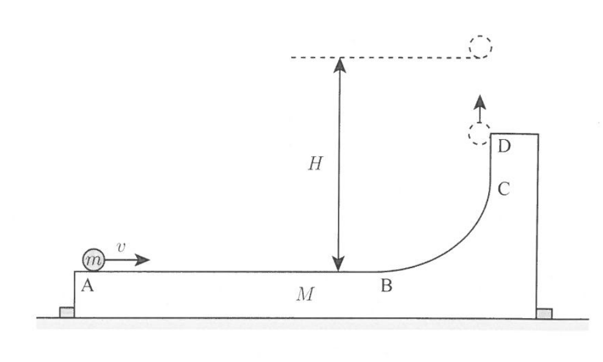
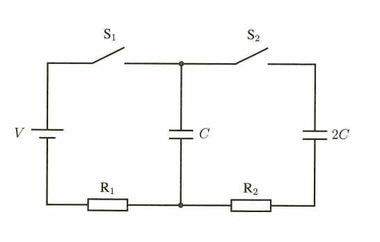
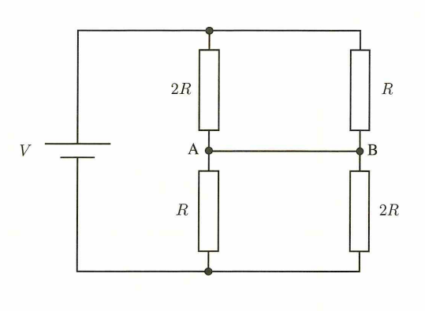
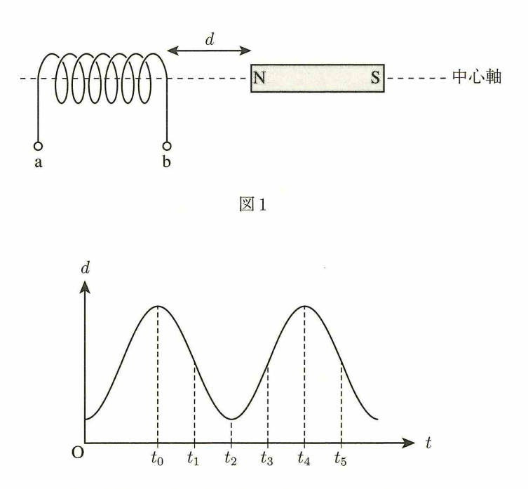

# 力学

## 运动学

### 斜抛运动：16-3

> 在水平地面上的点 O，以与水平方向成 $\theta$ 角、初速度为 $v_0$ 斜向上抛出一个小球。
>
> 已知小球达到的最高点高度为 $H$，落回地面时的水平射程为 $L$。
>
> **求解：** 最高点高度与水平射程的比值 $\dfrac{H}{L}$ 的表达式。

水平方向： 初速度 $v_x = v_0\cos\theta$。

竖直方向： 初速度 $v_y = v_0\sin\theta$，加速度为 $-g$。

水平和竖直方向的关系是 $t$ 相等。因此我们列式：

水平：$L=2tv_0\cos\theta$。

竖直：$2gH=v_0^2\sin^2\theta$。

以及：$gt=v_o\sin\theta$。

求解即可。

## 动量

### 动量守恒与机械能守恒：16-3

>情景1（台子固定）： 质量为 $m$ 的小物体以初速度 $v$ 冲上固定的质量为 $M$ 的台子，从滑道顶端竖直向上飞出，上升的最大高度为 $H$。
>
>情景2（台子不固定）： 台子不固定且地面光滑。小物体仍以初速度 $v$ 冲上台子。由于小物体在曲面上滑，台子也会向右运动。当小物体从顶端竖直（相对于台子）飞出时，其相对于地面的上升最大高度为 $h$。
>
>求解： 两次上升高度的比值 $\frac{h}{H}$。
>
>

情景一很简单，列出机械能守恒：$\dfrac{1}{2}mv^2=mgH$ 即可。

情景二需要列两个：

首先是机械能守恒：$\dfrac{1}{2}mv^2=mgH + \dfrac{1}{2}mv'^2$。

小球在最高点，竖直方向上速度为 0，但是水平方向上与脱离平台时平台的速度相等。由于小球在水平方向不受外力，所以水平方向上动量守恒：$mv=(M+m)v'$。

三个方程联立求解即可。

### 斜碰：16-5

>在光滑水平面上，质量为 $m$ 的小球 A 以速度 $v_0$ 直线运动，与静止的质量为 $2m$ 的小球 B 发生碰撞。
>
>碰撞后，小球 A 顺时针偏转 $\theta$ 角，速度变为 $v_A$；小球 B 反时针偏转 $\theta$ 角，速度变为 $v_B$。
>
>求解： 碰撞后的速度比值 $\dfrac{v_B}{v_A}$ 以及 A 的速度变化比值 $\dfrac{v_A}{v_0}$ 的组合。

**斜碰中，水平方向上和竖直方向上动量分别守恒**。

$0 = 2m v_B\sin\theta + mv_A\sin\theta$。

## 简谐运动

### 简谐振动的速度：24-4

> 情景1： 质量为 $m$ 的物体挂在弹簧上静止时，弹簧伸长 $L$（平衡位置）。若从弹簧原长处静止释放，物体做简谐运动，求运动过程中的最大速度 $v_1$。
>
> 情景2： 将物体取下，从静止开始自由落体，求下落距离为 $L$ 时的瞬时速度 $v_2$。
>
> 求解： 两个速度的比值 $\dfrac{v_2}{v_1}$。

在平衡位置，弹力与重力平衡：$F=kL=mg \Rightarrow k=\dfrac{mg}{L}$。

通过简谐运动性质可知：振幅 $A=L$，**角频率**：
$$
\omega=\sqrt{\dfrac{k}{m}}
$$
可得 $\omega=\sqrt{\dfrac{g}{L}}$。再通过**最大速度**：
$$
v_\max=\omega A
$$
即可得出 $v_1=\sqrt{gL}$。

或者可以用能量守恒：
$$
mgL = \dfrac{1}{2}kL^2+\dfrac{1}{2}mv^2
$$
也可得出。

## 天体物理

### 万有引力的势能：25-6

> 已知地球绕太阳做半径为 $R$ 的匀速圆周运动，线速度为 $V$。另一个小天体从距太阳无限远处由静止开始，仅在太阳万有引力作用下直线向太阳下落。求当小天体到太阳的距离也为 $R$ 时，其瞬时速度 $v$ 与地球速度 $V$ 的比值 $\dfrac{v}{V}$。

**万有引力的势能：**
$$
U=-G\dfrac{Mm}{R}
$$
考虑小天体能量守恒：$E=\dfrac{1}{2}mv^2 + (-G\dfrac{Mm}{R}) = 0$。

# 热力学

## p-V 图

### 热效率与气体摩尔比热：24-9

> 一定质量的理想气体经历 $A \to B \to C \to D \to A$ 的矩形循环过程。其中 $A \to B$ 和 $C \to D$ 是定容变化，$B \to C$ 和 $D \to A$ 是定压变化。
>
> 已知：状态 A 的 $(p_0, V_0)$、状态 B 的压力 $2p_0$、状态 C 的体积 $2V_0$、定容摩尔比热 $C_V$、气体常数 $R$。
>
> 求解： 该热机循环的热效率 $e$。

首先，热效率：
$$
\eta=\dfrac{W_{\text{正味}}}{Q_{\text{in}}}
$$
其中 $W_{\text{正味}}$ 就是循环围成的面积。那么问题在于如何计算吸收的净热量。

**在 p-V 图中，向右上的过程吸热，左下的过程放热。**如果是具体地对四个方向的话：正上（定积升压）吸热、正右（定压膨胀）吸热；正下（定积降压）放热、正左（定压压缩）放热。

因此气体仅在 $A \to B$（定积升压）和 $B \to C$（定压膨胀）过程中吸热。

我们知道气体定积摩尔比热 $C_V$，那么根据：
$$
Q=nC_V\Delta T
$$
可以求出 $A \to B$ 阶段的热量。

同时我们知道：
$$
C_P=C_V+R
$$
可以求出求出 $B\to C$ 阶段的热量。

# 波动

## 波的干涉

### 干涉减弱点的数量：13-11

> 在水面上相距 $11.0\text{ cm}$ 的两个波源 $S_1$ 和 $S_2$ 正在发出同相、同振幅的圆形波，波长 $\lambda = 3.0\text{ cm}$。
>
> 求解： 连接 $S_1$ 和 $S_2$ 的线段上，水面几乎不振动的点（即干涉减弱点/节线交点）共有多少个？

同相波源的减弱（振动最小）条件：
$$
|\Delta x|=\left(m+\dfrac{1}{2}\right)\lambda
$$
由于 $x_1+x_2=11$，我们可以得到 $x_2=11-x_1$。

$|x_2-x_1|=|2x_2-11|=3(m+\dfrac{1}{2})$。

$m$ 可以取 $1\sim 4$，由于绝对值，答案应当是 $8$（即对称）。

### 劈尖干涉：18-12

> 两块平面玻璃板一端紧贴，另一端夹入厚度为 $D$ 的薄膜，在两板间形成空气劈尖。从上方垂直照射波长为 $\lambda$ 的单色光，观察到间距为 $\Delta x$ 的明暗相间的干涉条纹。
>
> 已知：玻璃板长度 $L = 10\text{ cm} = 0.10\text{ m}$，光波长 $\lambda = 5.0 \times 10^{-7}\text{ m}$，明暗条纹间距 $\Delta x = 0.50\text{ mm} = 5.0 \times 10^{-4}\text{ m}$。
>
> **求解：** 薄膜的厚度 $D$ 是多少毫米（$\text{mm}$）。

设距离紧贴端为 $x$ 处的空气层厚度为 $d$。由几何相似性可知：$\dfrac{d}{x}=\dfrac{D}{L} \implies d = \dfrac{D}{L}x$。

相邻两条暗纹对应的空气层厚度差为半个波长 $\Delta d = \dfrac{\lambda}{2}$。

因此，相邻暗纹的间距 $\Delta x$ 满足：$\dfrac{\lambda}{2} = \dfrac{D}{L}\Delta x \implies \Delta x = \dfrac{\lambda L}{2D}$。

## 多普勒效应

### 反射板的情况：24-11

> 观测者和音源在一条直线上静止，反射板以 $v = 1\text{ m/s}$ 的速度向远离音源的方向运动。
>
> 已知：音源频率 $f = 682\text{ Hz}$，声速 $V = 340\text{ m/s}$。
>
> 求解： 观测者同时听到“音源直接传来的音”和“经反射板反射回来的音”，求其形成的拍频 $n$（每秒响起的次数）。

**需要特别注意，反射板会发生两次多普勒。**

第一次将反射板视为观测者，反射板以 $v$ 的速度远离：$f_1=\dfrac{V-v}{V}f$。

第二次将反射板视为音源，反射板以 $v$ 的速度远离：$f_2=\dfrac{V}{V+v}f_1=\dfrac{V-v}{V+v}f$。

之后求出拍频即可。

### 波速不变：13-12

> 频率 $f = 500\text{ Hz}$ 的音源 S 以 $v = 20\text{ m/s}$ 的速度，向静止的观测者 O 直线靠近。声速 $V = 340\text{ m/s}$.
>
> 求解：观测者 O 观测到的音波波长 $\lambda'$ 和频率 $f'$ 分别是多少。

通过多普勒效应可以求出频率：$f'=\dfrac{V}{V-v}f=530\text{Hz}$。

**同介质下，声速不变**。

因此可以求得波长：$\lambda'=\dfrac{V}{f'}=0.64\text{m}$。

## 光的折射

### 曲折率：25-12

> 一个圆柱状光导纤维由中心部（屈折率 $n_1$）和周边部（屈折率 $n_2$）构成，空气的屈折率为 $1$。光线从空气中以入射角 $\theta$ 射入中心轴垂直的端面，当且仅当 $\theta < \theta_0$ 时，光线在中心部与周边部的交界面发生全反射，从而仅在中心部向前传播。求周边部屈折率 $n_2$ 的表达式。

**需要注意曲折率之比与角度之比是相反的关系：**
$$
\dfrac{\sin\theta_1}{\sin\theta_2}=\dfrac{n_2}{n_1}
$$

# 电磁学

## 电容

### 电容的能量：25-14

> 电路包含电动势为 $V$ 的电池，电容分别为 $C$ 和 $2C$ 的两个未充电电容器，电阻 $R_1, R_2$ 以及开关 $S_1, S_2$。
>
> 1. 先闭合 $S_1$，充分时间后电容器 $C$ 充电完毕，随后断开 $S_1$。
>
> 2. 在 $S_1$ 保持断开的状态下闭合 $S_2$，电容器 $C$ 开始向 $2C$ 充电，直到电阻 $R_2$ 中不再有电流流过。
>
>    求在闭合 $S_2$ 到电流停止的整个过程中，电阻 $R_2$ 上产生的焦耳热。
>
> 

**电容的能量**：
$$
U=\dfrac{1}{2}CV^2=\dfrac{1}{2}QV = \dfrac{1}{2}\dfrac{Q^2}{V}
$$
第一个过程中，电容的电荷 $Q=CV$。

接下来第二个过程，**没有电源提供电压，要想达到平衡状态，电荷需要在两个电容中分配使得电压相等**。假设平衡时候的电压是 $V'$，电荷量不变：$CV'+2CV'=CV$。

焦耳热通过能量守恒求得即可。

## 电路

### 电势分析与基尔霍夫定律：25-15

> 电路中包含一个电动势为 $V$ 的理想电池（内部抵抗忽略），两个阻值为 $R$ 的电阻，以及两个阻值为 $2R$ 的电阻，连接方式如图所示。求流过端子 A 和端子 B 之间导线的电流 $I$ 的表达式。 
>
> 规定：电流从 $A \rightarrow B$ 的方向时 $I > 0$，从 $B \rightarrow A$ 的方向时 $I < 0$。
>
> 

**由于 A 与 B 通过导线直接相连，因此电势必然相等**。此时电路上半部分和下半部分完全等效，因此 $V_A=V_B=\dfrac{1}{2}V$。然后通过基尔霍夫定律求解即可。

## 电场

### 偏转电场：16-16

> 质量为 $m$、电荷量为 $q$ 的粒子以初速度 $v$ 垂直射入长度为 $L$、场强为 $E$ 的匀强电场中。
>
> 粒子离开电场时，在垂直于入射方向上（电场方向）偏转了距离 $d$（重力忽略不计）。
>
> 求解：粒子初速度 $v$ 的表达式。

**偏转电场公式**：
$$
\begin{cases*}
x=v_ot\\
y=\dfrac{1}{2}\dfrac{qE}{m}t^2
\end{cases*}
$$
下面进行推导：

$F=ma=qE\Rightarrow a=\dfrac{qE}{m}$。求解即可。

## 电磁感应

### 等效电源模型：25-18

> 一个固定的螺线管线圈，左端为端子 a，右端为端子 b。一根条形磁铁的 N 极指向线圈，在中心轴上做周期性往复运动。磁铁 N 极与线圈右端的距离 $d$ 随时间 $t$ 的变化曲线如图 2 所示。求在 $t_0$ 到 $t_5$ 的时间段内，端子 a 的电位高于端子 b 的电位（即线圈内部感应电动势方向由 b 指向 a）的时间范围。
>
> 

分析 $t_0\sim t_2$ 时间：

根据楞次定律，磁铁靠近线圈，线圈受到向左磁通量增加，诱导产生 b 端等效 N 极的磁场。根据右手螺旋定则，电流流向是 b 流向 a。

**处于开路（或看作等效电源）状态下的线圈，内部电流从低电位流向高电位（由负极流向正极）**。在本题中，由于感应电流在内部由 b 流向 a，因此 a 端相当于电源的正极，电位高于 b 端。

接下来解释为什么可以等效看作电源：

我们知道磁通量变化会产生感生涡旋电场，感生涡旋电场会产生感生电动势：$V=-N\dfrac{\Delta\Phi}{\Delta t}$。

然后我们考虑到，这个感生电场其实是做功的，它会搬运电子，因此算是非静电力：$W=qV=Fl=qE(r)\cdot2\pi r$。

由于是非静电力做功，因此这个和电池是相同的原理。电池是靠化学能产生非静电力搬运电子。

然后我们考虑电势。感生电场是没有电势的，只有电动势。把电子从 a 搬向 b 的过程中，a 会积累正电荷，b 会积累负电荷，a 和 b 之间会产生静电场，就是我们所求的电势。那么，显然 a 的电势高于 b。

# 原子

## 普朗克常数

### 加速电压与 X 线：24-19

> 在加速电压为 $V$ 的X射线管中，电子（电荷量为 $e$）经电场加速后撞击金属靶，释放出X射线。
>
> 已知普朗克常数为 $h$，光速为 $c$。
>
> 求解： 放出X射线的最短波长 $\lambda_0$ 的表达式。

电子的动能：$E_k=eV$。

当电子所有动能都在碰撞中转换为光子时，光子能量最大，波长最短。

**光子的能量：**
$$
E=h\nu=\dfrac{hc}{\lambda}
$$
因此可以得到：$eV=\dfrac{hc}{\lambda_0}$。
